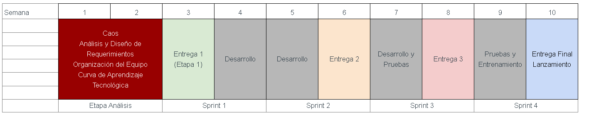

# TC2007B - Integración de seguridad informática en redes y sistemas de software.

## Reto
[Descripción de Reto](https://docs.google.com/document/d/12nZ1qbT4GDq9uWYvZXYNcMZ_70WpESA9OkysxWUXYEc/edit?usp=sharing)

## Plan de Evaluación Reto

- Etapa Análisis y Presentación del Plan de Solución a Socios Formadores (28 feb)
- Sprint 1 (12 mar)
- Presentación de Avance Socios Formadores (28 mar)
- Sprint 2 (2 abr)
- Presentación de Avance Socios Formadores (18 Abr)
- Sprint 3 (23 abr)
- Sprint 4 (Entrega Final) 4 May
- Presentación Final Socios Formadores (Semana 1-5 May)

### **Total de la calificación Final: 47%**

## Link Discord
[Discord](https://discord.gg/Ny5FnnfSh9)

## Backlog y Sprint de la Clase
[Proyecto](https://github.com/orgs/TC2007B/projects/1/views/1)

## Index
[Módulo 3 - Móviles (DAM)](/mobile/README.md)

[Módulo 4 - Ingeniería de Software (IS)](/software_engineering/README.md)

[Módulo 5 - Administración de Proyectos (ADM)](/project_admin/README.md)