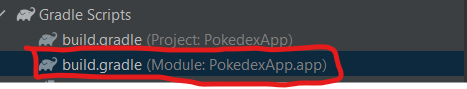
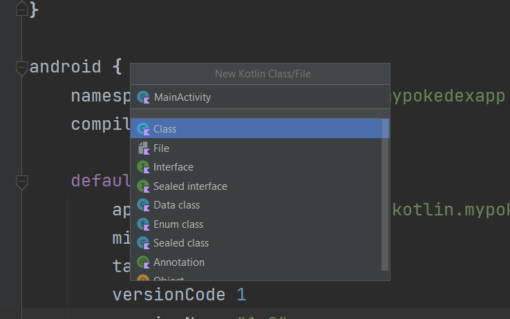
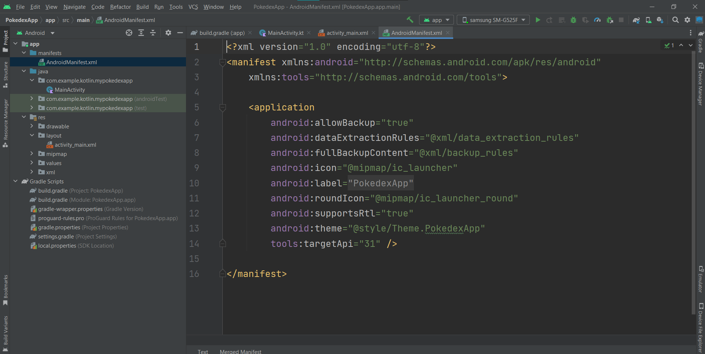
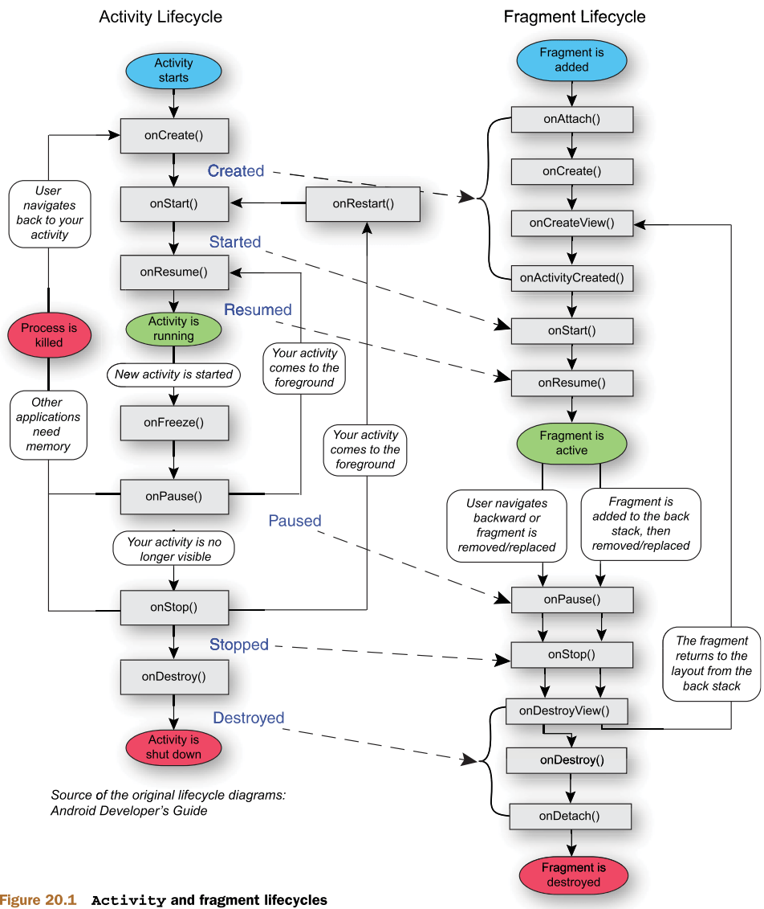
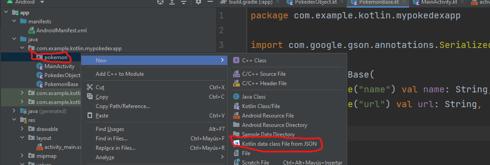

# Data Classes y RecyclerView

## Objetivo

En este laboratorio aprenderemos la estructura básica de una aplicación utilizando el desarrollo de listas.

Para este laboratorio vamos a desarrollar un Pokedex, que es una unidad de información para el mundo Pokemon. Esta aplicación nos mostrara los datos de cada criatura y desde ahí podremos generar un detalle.

Esta aplicación utiliza el concepto básico de actividades e irá evolucionando hasta que incorporemos la arquitectura en el mismo.

## Instrucciones

Sigue los pasos descritos en la siguiente práctica, si tienes algún problema no olvides que tus profesores están para apoyarte.

## API
Para este laboratorio estaremos utilizando el API de [PokeAPI](https://pokeapi.co/) los endpoints con los que vamos a comenzar son los siguientes:

```
GET https://pokeapi.co/api/v2/pokemon/?limit=1279
GET https://pokeapi.co/api/v2/pokemon/{number_pokemon}/
```

## Laboratorio
### Paso 1 Creación del Proyecto

Vamos a empezar creando un proyecto desde 0, por lo que vamos a abrir Android Studio y vamos a realizar las siguientes configuraciones.


Después vamos a seleccionar un proyecto en blanco o el que dice **no activity**.


Los siguientes parámetros los añadiremos de la siguiente forma:

```
Name: PokedexApp
Package Name: com.example.kotlin.mypokedexapp
Save Location: {Tu eliges en donde}
Language: Kotlin
Minimum SDK: API 21: Android 5.0 (Lollipop)
```


Con esta configuración base damos clic en **Finish** y dejamos que el proyecto empiece a crearse.

Para este punto del curso ya debes tener listo tu Android Studio configurado y un dispositivo o emulador corriendo para poder avanzar. En cualquier caso si necesitas configurar todavía algo no olvides revisar la sección de materiales del repositorio para ayudarte a terminar con estos pasos.


Una vez que haya finalizado de configurarse deberemos ver algo como lo siguiente:


Para esta ocasión vamos a notar lo siguiente de nuestra estructura de proyecto.

1. El Manifest esta creado sin mayor inconveniente esperando a que añadamos vistas.
2. El package principal del proyecto estará vacío puesto que el proyecto seleccionado es el que está en blanco.
3. En la carpeta **res** no contaremos con la carpeta de **layouts**.
4. En la sección de **Gradle Scripts** contaremos con nuestros archivos **build.gradle** del proyecto.
	1. El primer **build.gradle** corresponde a la configuración de todo el proyecto.
	2. El segundo **build.gradle** corresponde a la configuración de la aplicación.

**Nota: Si te estás preguntando cual es la diferencia entre la configuración del proyecto y la aplicación, es que android utiliza un desarrollo por módulos, esto permite añadir las librerías de terceros o incluso que nuestro proyecto sea una librería, en esencia significa que tu proyecto puede ser incluido de manera directa a otros proyectos para el uso de sus clases. Esto da un potencial muy interesante en Android que revisaremos más adelante en el curso.**

### Paso 2 Configuración del Proyecto

Para este paso vamos a proceder a abrir el segundo archivo **build.gradle** o en este caso el que esta marcado como module del proyecto.



Si llegar a hacerte bolas en cual de los 2 es cual, recuerda que el del Proyecto contiene la configuración base, y el segundo contiene las dependencias o librerías que usaremos en el proyecto.

Con esto dicho vamos a navegar dentro del archivo hasta la sección de hasta abajo justo a la parte **dependencies**.


En esta sección de **dependencies** verás que ya tenemos agregadas varias librerías por default, esto puede variar de cada versión de Android Studio tanto en número como las librerías pero nota lo que vimos en la clase anterior con las formas de declarar las librerías.

- **implementation** - Es la directiva para usar una librería en nuestro proyecto.
- **testImplementation** - Es la directiva para usarlo en el package de pruebas básicas del proyecto.
- **androidTestImplementation** - Es la directiva para usarlo en el package de pruebas de instrumentación del proyecto.

Lo que vamos a hacer ahora es añadir las librerías que necesitamos para este proyecto.

#### Retrofit

Esta librería es una de las más comunes en el mundo de Android para hacer conexiones con APIS y HTTP, es de las más ampliamente documentadas en tutoriales por lo que es la que recomiendo que utilices para el proyecto.

**Nota: Puedes hacer el uso de cualquier librería pero recuerda que es una mala práctica hacer conexiones a las Bases de Datos de manera directa, para ello se recomienda el uso de APIs para trabajar en ello o el uso de capas diferentes para acceso a la información.**

Dicho lo anterior, dentro de los **dependencies** vamos a agregar lo siguiente:

```
//Retrofit
implementation 'com.squareup.retrofit2:retrofit:2.9.0'
implementation 'com.squareup.retrofit2:converter-gson:2.9.0'
```

El resultado es algo como lo siguiente:


#### Glide

Esta librería nos ayudará para poder cargar imágenes de Internet, es ampliamente usada por que resuelve problemas comunes pero dificiles de manejar como que la imagen venga girada por default y evita que tengamos que hacer más procesamiento o en su defecto sus extensiones permiten agregar efectos como **blur**, imágenes circulares, entre otros.

Siguiendo la misma idea de la librería de **Retrofit**, vamos a añadir lo siguiente debajo de las líneas que agregamos.

```
//Glide  
implementation 'com.github.bumptech.glide:glide:4.12.0'  
annotationProcessor 'com.github.bumptech.glide:compiler:4.12.0'  
implementation 'jp.wasabeef:glide-transformations:4.3.0'
```

#### Corrutinas

Esta librería es esencial hoy en día en Android para el manejo de peticiones asíncronas. En Android casi todo se maneja a través de callbacks pero estos utilizan el hilo de ejecución de la aplicación para trabajar. Las corrutinas permiten trabajar con ese computo paralelo sin trabajar con Threads propiamente. Dentro del laboratorio veremos la forma directa de integrarlos al proyecto pero vale la pena que te des un clavado para entender más sobre el tema en el siguiente [link.](https://kotlinlang.org/docs/coroutines-overview.html#documentation)

Lo que deberemos agregar ahora es lo siguiente:

```
//Corrutinas  
implementation 'org.jetbrains.kotlinx:kotlinx-coroutines-android:1.6.1'
```

#### Librerías adicionales Google

Como te mencioné en la clase anterior, el uso de Android ha cambiado mucho y es por ello que casi todo en Android ya es una librería, desde el mismo lenguaje que es Kotlin, como ahora las diferentes clases principales, si bien no es absolutamente necesario bajarlos, puesto que por default el SDK ya cuenta con las clases base, estas clases adicionales que vamos a añadir al proyecto nos permiten tener un mejor impacto de retrocompatibilidad puesto que las clases del SDK están enfocadas a las últimas versiones y estas que añadiremos están pensadas para todos los dispositivos.

Dicho de otra forma piensa que en Android tienen un equipo que es el encargado de llevar las últimas versiones del SDK o de su última versión. Y tienen otro equipo que es el encargado de mantener vivas las versiones anteriores lo más que se pueda.

Las librerías son las siguientes:

```
//Fragment  
implementation "androidx.fragment:fragment-ktx:1.5.0"  
//Activity  
implementation "androidx.activity:activity-ktx:1.5.0"
//Databinding
implementation 'androidx.databinding:databinding-runtime:7.1.2'
```

El resultado final deberá verse algo como:


**Nota: Si puedes observar hay varias librerías que nos pone en amarillo, esto es por que existe una versión de la librería más actualizada, de momento podemos dejarlo así y no afectará nuestro resultado final. Recuerda mi comentario sobre trabajar con los últimos valores de las versiones de una librería puesto que un solo cambio puede llegar a afectar tu proyecto enormemente incluso o sin importar que sea una librería oficial.

Por último vamos a sincronizar gradle dando clic en la parte superior del archivo o en su defecto en el botón del elefante que viene en la parte superior.


Esperamos un momento a que las librerías se descarguen y listo.

Un último comentario a las librerías es que una vez que se descargan están dentro de nuestro proyecto en el caché, si por alguna razón la librería deja de existir, siempre y cuando no borres el proyecto esta se mantiene. Pero al igual que en NodeJS con el package.json y los node_modules, al momento de subirlo al repositorio estos datos no se suben siempre y cuando tengas el [.gitignore](https://github.com/github/gitignore/blob/main/Android.gitignore) de un proyecto de Android.

Antes de finalizar con el archivo **build.gradle**  vamos a revisar si el view binding esta activo. Encima de la declaración de **dependencies** deberás tener una declaración **android**, dentro de esta en la parte de hasta abajo revisa que tengas las siguientes líneas.

```
buildFeatures {  
    viewBinding true  
}
```


Nuevamente sincronizamos gradle y ahora un último punto a considerar que dependiendo de tu versión de Android puede ya estar o no configurado es hasta arriba de la declaración **android** revisa que estes compilando el API 33, esto por declarativas de Android de tener siempre la última versión actualizada.


Ahora sí, en caso de que hayas modificado algo has una última sincronización de Gradle y ya estamos listos para comenzar.

### Paso 3 Creación de una vista completa

Ahora vamos a proceder a crear nuestra vista inicial en donde abriremos nuestro proyecto.

Para ello necesitaremos realizar el siguiente checklist

- Crear el Activity en nuestro package
- Crear el layout al que estará conectado nuestro Activity
- Declararlo en el manifest para que la aplicación sepa que existe.
	- Declarar el permiso de internet en el manifest para poder hacer peticiones.

#### Crear el activity en nuestro package

Para comenzar iremos a nuestro package principal y daremos clic derecho y seleccionaremos lo siguiente:




El nombre que daremos al archivo será **MainActivity** y desde aquí empieza a ver la sintaxis del nombrado de archivos. Si recuerdas para los layouts te comenté que el nombre debía ser activity_main.xml, observa que para las clases de nuestro package el nombre se invierte, esto es por que tenemos el paquete para ir agrupando las funcionalidades por lo que si bien es importante detectar que son por ejemplo: activity,es más importante detectar la función o vista que representan.

De las opciones que tienes para elegir de momento puedes seleccionar la default, conforme vayamos avanzando verás cuando se usan las otras.


Ya que creamos nuestro archivo lo abriremos en el editor y observaremos que contiene lo siguiente:

```
package com.example.kotlin.mypokedexapp  
  
class MainActivity {  
    
}
```

**Nota: Si pudiste observar al momento de crear archivos, tienes las opciones rápidas de por ejemplo crear un Activity al dar clic derecho en el package, estas opciones son útiles si trabajamos con la estructura de Google, lo cual no siempre es así, lo malo de hacerlo de esta forma es que puede agregarnos archivos adicionales que no queremos, en el caso de un activity nos agregaría archivos Fragment, un navgraph y otros elementos que de momento no son necesarios. El beneficio es que nos añade esto al manifest directamente, pero por cuestiones de aprendizaje lo haremos manualmente.

Vamos a modificar el código de nuestro Activity añadiendo justamente la herencia necesaria para indicar que esta clase que estamos declarando es una Activity como tal. Para ello modificaremos el código como sigue:

```
package com.example.kotlin.mypokedexapp  
  
class MainActivity:Activity {  
  
}
```

Y esto en el IDE nos mostrará lo siguiente:


Como puedes ver nos marca en rojo el Activity, esto es por que no hemos importado la librería correspondiente, siempre que tengas estos errores de importación es muy fácil de corregirlos.

Coloca el cursor sobre la librería que quieres importar y después usa **alt+enter** para desplegar el menú de acciones de Android Studio, por último selecciona **import** y en automático se agregará la librería al inicio en la sección de imports quedando como sigue:

```
package com.example.kotlin.mypokedexapp  
  
import android.app.Activity  
  
class MainActivity: Activity {  
  
}
```


Ahora observaremos que nos marca un nuevo error subrayando el nombre de la clase, si pones el cursor sobre donde nos marca el subrayado rojo podrás ver con detenimiento, esto en Android Studio es útil ya que nos permite ver fácilmente los errores, en nuestro caso lo que hace falta es declarar la clase a modo constructor que no es más que añadir **()** al final de la declaración.

Por lo tanto la última versión funcional del código es la siguiente:

```
package com.example.kotlin.mypokedexapp  
  
import android.app.Activity  
  
class MainActivity: Activity() {  
  
}
```

De momento dejaremos nuestro **MainActivity** de esta forma y seguiremos con el siguiente punto.

#### Crear el layout al que estará conectado nuestro Activity

- ~~Crear el Activity en nuestro package~~
- Crear el layout al que estará conectado nuestro Activity
- Declararlo en el manifest para que la aplicación sepa que existe.
	- Declarar el permiso de internet en el manifest para poder hacer peticiones.

Cuando creamos el proyecto en blanco te comenté que la carpeta de layouts no estaba creada, previo a crear nuestro layout vamos a trabajar en crear esta carpeta.

Así como hicimos en la carpeta del package para crear el **MainActivity** ahora vamos a dar clic derecho en la carpeta **res** del proyecto y seleccionaremos la opción en **New>Android Resource Directory**


Dentro de la vista que nos aparece tenemos lo siguiente:


Tenemos un select **Resource type**, la lista que nos despliega son las diferentes carpetas que podemos crear. Observa que al declarar un **Android Resource Directory** tenemos una opción limitada de opciones no dando la oportunidad de generar una propia, esto es por que son las carpetas básicas que puede tener un proyecto Android, si necesitas una carpeta propia se puede crear pero debe ser a través de una carpeta especial de assets que deberemos crear en la estructura de nuestro proyecto.

Si bien esta carpeta de assets se puede crear no es muy común hacerlo, entonces de momento nos limitaremos a seleccionar la carpeta de layout que necesitamos. De momento podemos dar clic en ok y terminar, pero, ¿qué sucede con las opciones que tenemos debajo?, como te comenté en la clase anterior, las carpetas de recursos podemos configurarlas a tener variedades como por ejemplo en el caso de los **drawables** añadir las diferentes resoluciones de pantalla, en el caso de los **strings** tener la traducción en varios idiomas, etc. Un caso que pudiéramos tener en los layouts, es tener layout predeterminados para ciertos tamaños de pantalla como por ejemplo distinguir entre teléfonos y tablets. O también layouts entre orientaciones verticales (portrait) u horizontales (landscapes).

En este aspecto es un rango muy amplio y la cantidad de combinaciones que se pueden realizar, en mi experiencia es raro llegar a mucho detalle puesto que esto implica más esfuerzo en el desarrollo así sea solo crear las imágenes por resolución de pantalla a lo cual aprovecho para dejarte el [link](https://www.appicon.co/#image-sets) donde puedes generar tus assets de imágenes, otra página que puedes usar para obtener iconos para tu app es la [siguiente](https://romannurik.github.io/AndroidAssetStudio/)

Regresando a lo que nos interesa, no añadiremos ninguna configuración especial solo daremos clic en Ok para que se pueda crear nuestra carpeta de **layout**, dejando un resultado como el siguiente.


Una vez creada nuestra carpeta ahora si podemos crear nuestro archivo xml. Dando clic en la carpeta **layout**.


Al igual que cuando creamos la carpeta **layout** se nos vuelve a abrir la misma ventana de creación con el panel para configuraciones especiales, pero ahora observa que si podemos declarar el nombre del archivo.

Sin añadir más configuraciones solo le colocaremos de nombre **activity_main**, no es necesario agregar la extensión xml.

Como resultado tendremos nuestro layout creado y listo para empezar a trabajarlo, no olvides dar clic en el modo **Split** para trabajar con la previsualización y modificar directamente el código xml.


Para asegurarnos de que nuestra aplicación funcione desde el inicio vamos a empezar haciendo algunas modificaciones al código del layout. En primera instancia vamos a cambiar el **ConstraintLayout** default que trae el proyecto y cambiarlo por un **RelativeLayout**.

```
<?xml version="1.0" encoding="utf-8"?>  
<RelativeLayout   
	xmlns:android="http://schemas.android.com/apk/res/android"  
    android:layout_width="match_parent"  
    android:layout_height="match_parent"  
    >  
  
</RelativeLayout>
```

Ahora añadiremos un **TextView**, muy simple para saber que estamos llegando hasta esta vista, este lo vamos a declarar de la siguiente manera:

```
<?xml version="1.0" encoding="utf-8"?>  
<RelativeLayout  
    xmlns:android="http://schemas.android.com/apk/res/android"  
    android:layout_width="match_parent"  
    android:layout_height="match_parent"  
    >  
  
    <TextView       
	    android:layout_width="match_parent"  
        android:layout_height="wrap_content"  
        android:text="Pokedex"  
        android:textStyle="bold"  
        android:textSize="18sp"  
        android:gravity="center"  
        android:layout_centerInParent="true"  
        />  
</RelativeLayout>
```

Nota que el **RelativeLayout** tiene propiedades para centrar elementos en posiciones absolutas entre ellas al inicio, al centro o al fin de la pantalla. Si quieres ahondar más revisa las propiedades **above** y **below**.

De momento será todo lo que necesitamos de nuestra interfaz y de nuestro layout para seguir trabajando.

#### Declararlo en el manifest para que la aplicación sepa que existe

- ~~Crear el Activity en nuestro package~~
- ~~Crear el layout al que estará conectado nuestro Activity~~
- Declararlo en el manifest para que la aplicación sepa que existe.
	- Declarar el permiso de internet en el manifest para poder hacer peticiones.

Ahora vamos a proceder a abrir nuestro manifest, recuerda que lo encontramos en nuestra estructura de proyecto en la parte superior dentro de una carpeta **manifest**



Como ya te mencione en varias ocasiones, es necesario declarar cada vista que tenemos dentro de nuestro archivo **manifest** y como espero ya te hayas dado cuenta a estas alturas, una vista en Android se conforma de un archivo java o kotlin que hereda de la clase **Activity** y un archivo **xml** que funge de interfaz.

Ahora bien, ¿cómo declaramos esta vista dentro de nuestro manifest?, en primer lugar vamos a abrir la etiqueta de **application** esto le indica a Android que nuestra App va a contener vistas.

```
<?xml version="1.0" encoding="utf-8"?>  
<manifest xmlns:android="http://schemas.android.com/apk/res/android"  
    xmlns:tools="http://schemas.android.com/tools">  
  
    <application        android:allowBackup="true"  
        android:dataExtractionRules="@xml/data_extraction_rules"  
        android:fullBackupContent="@xml/backup_rules"  
        android:icon="@mipmap/ic_launcher"  
        android:label="@string/app_name"  
        android:roundIcon="@mipmap/ic_launcher_round"  
        android:supportsRtl="true"  
        android:theme="@style/Theme.PokedexApp"  
        tools:targetApi="31" >  
  
  
    </application>  
</manifest>
```

Ahora vamos a añadir lo siguiente:

```
<?xml version="1.0" encoding="utf-8"?>  
<manifest xmlns:android="http://schemas.android.com/apk/res/android"  
    xmlns:tools="http://schemas.android.com/tools">  
  
    <application        android:allowBackup="true"  
        android:dataExtractionRules="@xml/data_extraction_rules"  
        android:fullBackupContent="@xml/backup_rules"  
        android:icon="@mipmap/ic_launcher"  
        android:label="@string/app_name"  
        android:roundIcon="@mipmap/ic_launcher_round"  
        android:supportsRtl="true"  
        android:theme="@style/Theme.PokedexApp"  
        tools:targetApi="31" >  
  
        <activity            
	        android:name=".MainActivity"  
            android:exported="true"  
            android:theme="@style/Theme.PokedexApp.NoActionBar"  
            android:screenOrientation="portrait"  
            />  
  
    </application>  
</manifest>
```

Como puedes ver añadimos la declaración de un Activity dentro de Application, y observa las propiedades que lo acompañan:

**android:name=".{Activity}"** - contiene la ubicación con notación **.** de donde se encuentra el archivo dentro de nuestro package, como no hemos añadido ningún paquete adicional entonces lo podemos encontrar en la raíz.
**android:exporte=true** - Añadido para Android 12 te recomiendo que tus vistas lo incluyan ya que permite al SO detectar funciones de datos particulares.
**android:theme="@style/Theme.PokedexApp.NoActionBar"** - De momento debe aparecer en rojo, puesto que no hemos creado este estilo, será el siguiente paso, pero aquí le decimos a la vista que adopte un diseño particular, visto desde CSS es añadirle que clase queremos que use en diseño.
**android:screenOrientation="portrait"** - Ayuda a definir si si queremos bloquear nuestra vista a una orientación particular, si tu app no necesita girar la pantalla bloquéala, de lo contrario deberás hacer el diseño adaptativo para evitar que no funcione.

Existen más propiedades que se pueden aplicar pero al menos normalmente estas son las que más se utilizan.

Vamos a proceder a crear el estilo que nos marca en rojo, ahora no necesitamos crear nada nuevo pero debemos ubicar el archivo de temas.


El código que vamos a añadir es el siguiente:

```
<style name="Theme.PokedexApp.NoActionBar">  
    <item name="windowActionBar">false</item>  
    <item name="windowNoTitle">true</item>  
</style>
```

El estilo que estamos declarando permite que no exista ninguna **toolbar** default ya que si lo dejamos así, se crear automáticamente, por experiencia es mejor llevar el control de estos componentes, entonces estos los podemos declarar en el layout de nuestro xml como hicimos en el ejemplo de la clase anterior.

Por tanto el resultado final de nuestro archivo **themes** es el siguientes:

```
<resources xmlns:tools="http://schemas.android.com/tools">  
    <!-- Base application theme. -->  
    <style name="Theme.PokedexApp" parent="Theme.MaterialComponents.DayNight.DarkActionBar">  
        <!-- Primary brand color. -->  
        <item name="colorPrimary">@color/purple_500</item>  
        <item name="colorPrimaryVariant">@color/purple_700</item>  
        <item name="colorOnPrimary">@color/white</item>  
        <!-- Secondary brand color. -->  
        <item name="colorSecondary">@color/teal_200</item>  
        <item name="colorSecondaryVariant">@color/teal_700</item>  
        <item name="colorOnSecondary">@color/black</item>  
        <!-- Status bar color. -->  
        <item name="android:statusBarColor">?attr/colorPrimaryVariant</item>  
        <!-- Customize your theme here. -->  
    </style>  
  
    <style name="Theme.PokedexApp.NoActionBar">  
        <item name="windowActionBar">false</item>  
        <item name="windowNoTitle">true</item>  
    </style></resources>
```

Te había mencionado del archivo **themes** para la versión **night mode** de la aplicación, si recuerdas igualmente te mencioné que si Android no detecta una configuración en los archivos de configuración especiales busca al menos tenerlo en el archivo default y ya en caso de no tenerlo mandaría error.

Para esta configuración en particular, no es necesario tenerla en el **night mode** puesto que aplica para todo el proyecto indistintamente, si tuviera alguna peculiaridad distintiva del **night mode** entonces deberíamos declararlo.

Con eso en mente podemos volver a nuestro **manifest** y ya no debería marcar ningún error.

De momento todo está correcto, si fuera una vista normal con esto sería suficiente. Pero casualmente estamos lidiando con la primera vista de la aplicación, por tanto es necesario decirle a Android que esta es nuestra vista de arranque.

Ahora vamos a modificar el código de nuestro **activity** y así como realizamos en el **application** vamos a abrir la etiqueta de la siguiente forma:

```
<activity  
    android:name=".MainActivity"  
    android:exported="true"  
    android:theme="@style/Theme.PokedexApp.NoActionBar"  
    android:screenOrientation="portrait"  
    >
    
</activity>
```

Lo siguiente que haremos no es tan común pero existen vistas que tienen comportamientos especiales, en este caso ser la primera, en otros son vistas que reciben o exportan información, ya sea adentro o fuera de la misma aplicación. Lo que debemos agregar ahora es un **intent filter** y un **category** y este en particular es muy lineal en el aspecto que define a nuestro **activity** como el primero y el que al ejecutar la aplicación deberá iniciar todo. 

```
<activity  
    android:name=".MainActivity"  
    android:exported="true"  
    android:theme="@style/Theme.PokedexApp.NoActionBar"  
    android:screenOrientation="portrait"  
    >  
		<intent-filter>        <action android:name="android.intent.action.MAIN" />  
        <category android:name="android.intent.category.LAUNCHER" />  
    </intent-filter></activity>
```

Como puedes ver el formato de estas etiquetas es prácticamente el de palabras o secuencias reservadas para indicar acciones.

Con esto, al fin tenemos declarada nuestra vista en la aplicación.

Antes de finalizar con el manifest habíamos dejado una última acción en el checklist inicial.

- ~~Crear el Activity en nuestro package~~
- ~~Crear el layout al que estará conectado nuestro Activity~~
- ~~Declararlo en el manifest para que la aplicación sepa que existe.~~
	- Declarar el permiso de internet en el manifest para poder hacer peticiones.

Aprovechando que nos encontramos en el manifest vamos a declarar el permiso de Internet para que podamos empezar a trabajar de lleno en la aplicación.

Los permisos tienen un formato muy específico para declararse, el que utilizaremos se ve de la siguiente manera: 

```
<uses-permission android:name="android.permission.INTERNET" />
```

Un ejemplo alternativo sería la cámara que debe tener el siguiente formato:

```
<uses-permission android:name="android.permission.CAMERA" />
```

Podrás encontrar la lista de permisos y sus usos existentes en Android en el siguiente [link](https://developer.android.com/reference/android/Manifest.permission)

En las versiones antiguas en Android era suficiente con declarar los permisos en el **manifest** pero hoy en día ya no es así, existen permisos que por seguridad  se requiere preguntar al usuario si los quiere usar o no, esta restricción obliga al desarrollador a lanzar un modal para preguntar al usuario si quiere dar un permiso. Si bien no son todos, al menos los de hardware o de acceso a información sensible del usuario son necesarios, en su momento cuando intentas usar una funcionalidad por ejemplo la cámara en el código Android te avisa que es necesario pedir el permiso.

De momento no entraremos en más detalle de los permisos en tiempo real puesto que el de Internet, afortunadamente, no requiere de solicitud al usuario, pero toma en cuenta que más adelante será necesario manejarlo.

**Nota: Los permisos en tiempo real necesitan estar también declarados en el Manifest**

Regresando a nuestra actividad el código resultante del **manifest** es el siguiente:

```
<?xml version="1.0" encoding="utf-8"?>  
<manifest xmlns:android="http://schemas.android.com/apk/res/android"  
    xmlns:tools="http://schemas.android.com/tools">  
  
    <uses-permission android:name="android.permission.INTERNET" />
      
        <application  
        android:allowBackup="true"  
        android:dataExtractionRules="@xml/data_extraction_rules"  
        android:fullBackupContent="@xml/backup_rules"  
        android:icon="@mipmap/ic_launcher"  
        android:label="@string/app_name"  
        android:roundIcon="@mipmap/ic_launcher_round"  
        android:supportsRtl="true"  
        android:theme="@style/Theme.PokedexApp"  
        tools:targetApi="31" >  
  
        <activity            android:name=".MainActivity"  
            android:exported="true"  
            android:theme="@style/Theme.PokedexApp.NoActionBar"  
            android:screenOrientation="portrait"  
            >  
            <intent-filter>                <action android:name="android.intent.action.MAIN" />  
                <category android:name="android.intent.category.LAUNCHER" />  
            </intent-filter>        </activity>  
    </application>  
</manifest>
```

Con esto podemos dar por finalizado la configuración de nuestro proyecto y vistas.

Como resumen de este paso podemos destacar que la creación de una vista implica los pasos de:

1. Crear el activity
2. Crear el layout xml
3. Declararlo en el manifest

**Nota: En el caso de los fragmentos no es necesario agregarlos al manifest, pero casi siempre siguen el mismo camino de declarar el fragment y después su correspondiente layout xml.

### Paso 4 Conexión de Activity con layout

Aún no es posible ejecutar nuestra aplicación, puesto que si recuerdas nuestro **MainActivity** está vacío.

Este paso consistirá en hacer la conexión entre el layout y nuestro activity.

Para comenzar vamos a agregar en nuestro archivo **MainActivity** lo siguiente

```
package com.example.kotlin.mypokedexapp  
  
import android.app.Activity  
import android.os.Bundle  
  
class MainActivity: Activity() {  
  
    override fun onCreate(savedInstanceState: Bundle?) {  
        super.onCreate(savedInstanceState)  
          
    }  
      
}
```

Ahora vamos a hablar del método **onCreate()**, y más en concreto del ciclo de vida de las aplicaciones. Todo en Android sigue un ciclo de vida que veremos más en detalle en la parte teórica de la clase, por ahora debemos entender que en Android todo va de lo general a lo específico.

Esto quiere decir que inicialmente tenemos una clase **Application** de donde parte todo, inicializa los elementos básicos de la aplicación y después parte a la vista que está ejecutándose actualmente que sería el **Activity**, sigue su proceso de inicialización hasta llegar a un estado activo y en caso de que lo tuviera pasaría al  **Fragment** que volvería a inicializar sus propios componentes y así consecutivamente.

Desde ahí podemos ver que los métodos entre **Application**, **Activity** y **Fragment** son parecidos sino es que en nombre son los mismos, dependiendo la clase que tomemos pueden contenerse algunos adicionales pero básicamente el proceso es el mismo.



De inicio parece mucho, pero verás que es como una máquina de estados que nos ayuda a identificar como se encuentra nuestra aplicación, nuestra visa y nuestros fragmentos. Más información acerca del ciclo de vida puedes consultarla en el siguiente [link](https://developer.android.com/guide/components/activities/activity-lifecycle?hl=es-419)

También verás con la experiencia que no se utilizan todos los estados, de hecho solo declaramos en lo que tenemos que realizar acciones, el más común es el método **onCreate().**

Ya que entendimos un poco esta parte del ciclo de vida continuemos con nuestro código.

```
package com.example.kotlin.mypokedexapp  
  
import android.app.Activity  
import android.os.Bundle  
  
class MainActivity: Activity() {  
  
    private lateinit var binding: ActivityMainBinding  
      
    override fun onCreate(savedInstanceState: Bundle?) {  
        super.onCreate(savedInstanceState)  
  
        initializeBinding()  
    }  
  
}
```

Vamos por partes para entender el código.

En primer lugar vamos a declarar la variable **binding**, la cual estamos añadiendo la propiedad **private lateinit var**. 


```
private lateinit var binding: ActivityMainBinding  
```

La propiedad **private** viene del paradigma Orientado a Objectos **POO** donde tenemos variables de tipo private, public y protected. Para Android lo más común es declarar las variables en **private** a menos obviamente que su comportamiento sea diferente.

La siguiente propiedad como su nombre indica **lateinit** nos permite declarar una variable sin iniciarla, esto en Kotlin nos sirve para estar declarando variables en nulo, pero ojo, **si declaramos algo como lateinitit significa que en algún momento debemos inicializarlo, en caso contrario, al momento de compilar, Android detectará esto y nos marcará un error de compilación**.

Y por último como vimos en el laboratorio de Kotlin **var** nos dice que es una variable mutable, y aquí complementamos que las variables **lateinit** obligan a declarar siempre en tipo **var**, y revisando un poco tiene sentido por que no podemos declarar algo inmutable **val** que después vayamos a inicializar **lateinit**, esto no tendría sentido, si lo intentas incluso sin compilar Android Studio empezará a protestar.

Por último el tipo de esta variable es **ActivityMainBinding**, y si declaraste en el **build.gradle** no tendrás problema, en caso de que no, regresa a revisar este paso. Pero estas clases **Binding** se generan automáticamente cuando declaramos nuestros layouts y convierten el snake case del nombre en camel case añadiendo la palabra binding. 

Si hiciéramos algunos ejemplos serían los siguientes:

activity_main = ActivityMainBinding
fragment_profile = FragmentProfileBinding
item_course = ItemCourseBinding
dialog_confirmation_selection = DialogConfirmationSelectionBinding

Con esto podemos notar que la traducción automática elimina el espacio y convierte el caracter inmediato en mayúscula añadiendo la palabra reservada **Binding**.

Ahora vamos con **initializeBinding()** esta es una función propia, pero en general es una buena práctica no declarar todo en el **oncreate()** conforme vayamos avanzando veras a que me refiero.

Ahora añadimos la función de la siguiente forma:

```
private fun initializeBinding() {  
    binding = ActivityMainBinding.inflate(layoutInflater)  
    setContentView(binding.root)  
}
```

Si aún te marca en rojo los **ActivityMainBinding** usa el **alt+enter** para importarlos.

El código final del **MainActivity** será el siguiente

```
package com.example.kotlin.mypokedexapp  
  
import android.app.Activity  
import android.os.Bundle  
import com.example.kotlin.mypokedexapp.databinding.ActivityMainBinding  
  
class MainActivity: Activity() {  
  
    private lateinit var binding: ActivityMainBinding  
  
    override fun onCreate(savedInstanceState: Bundle?) {  
        super.onCreate(savedInstanceState)  
  
        initializeBinding()  
    }  
  
    private fun initializeBinding() {  
        binding = ActivityMainBinding.inflate(layoutInflater)  
        setContentView(binding.root)  
    }  
  
}
```

Con estas configuraciones ahora sí, por fin podemos proceder a ejecutar nuestro proyecto.

**Nota: Recuerda tener conectado tu dispositivo o en su defecto inicializado el emulador**


Como ya podemos ver el **TextView** que añadimos a nuestro layout entonces significa que todo salió bien y podemos empezar a avanzar nuestro Pokedex.

### Paso 5 Data Classes en Android

Para comenzar a trabajar con la conexión a nuestro API, necesitamos establecer algunas bases.

Si bien podemos conectarnos directamente al API y obtener el JSON respuesta, nuevamente debemos establecer que esto no es una buena práctica, ya que los sistemas y arquitecturas modernos deben ser capaces de poder probar la capa que están utilizando, en este caso en un nivel muy elemental de MVC (Modelo, Vista, Controlador) la capa del Modelo que es la encargada de los datos necesita poder validar todas las posibles respuestas que se den.

Es en este sentido que una de las peticiones de Retrofit pero que debe permearse a cualquier implementación de la capa de Modelos es que debemos mapear el objeto respuesta en objetos propios para mantener la unicidad de la arquitectura.

Aquí es donde entran los objetos de tipo **data class** que no son otra cosa que los objetos mapeados de respuesta de nuestros elementos ya sean bases de datos locales, APIs u otros que pudieran existir en nuestra aplicación.

Con eso en mente vamos a tomar una muestra de la respuesta a la llamada del API.

```
GET https://pokeapi.co/api/v2/pokemon/?limit=1279
```

```
{
	"count": 1279,
	"next": null,
	"previous": null,
	"results": 
		[
			{
				"name": "bulbasaur",
				"url": "https://pokeapi.co/api/v2/pokemon/1/
			},
			{
				"name": "ivysaur",
				"url": "https://pokeapi.co/api/v2/pokemon/2/"
			}
		]
}
```

Lo que debemos hacer con nuestro data clase es mapear nuestro objeto para obtener toda la información útil del JSON.

Para comenzar vamos crear una nueva clase a la que llamaremos **PokedexObject**

**Nota: La construcción de conexión con el API ejemplo es un poco diferente a lo normal puesto que sus datos se obtienen mediante muchas llamadas, esto puede afectar el rendimiento del lado del servidor, por tanto para tu proyecto asegúrate que el API construida sea funcional y óptima tanto para la app como para tu servidor.**


Al crear nuestro archivo de tipo data class notaremos que la única diferencia cuando creamos nuestro Activity es la forma de declaración.

```
class MainActivity: Activity() { ...
data class PokedexObject()
```

**Nota: Si no seleccionas el data class desde el selector al momento de crear el archivo y se por ejemplo para un data class lo adaptas agregando la palabra data previo al class, sigue siendo válido como tipo, esto aplica para todos los tipos de archivo que se pueden crear en Kotlin.**

La diferencia de una **class** con un **data class** en cuestión de sintaxis son las llaves **{ }**, si puedes ver en el código generado no vienen las llaves como tal, y esto es por que toda la construcción del objeto se realiza dentro de los paréntesis **( )**, esto simulando como si el objeto recibiera parámetros.

Lo que debemos hacer es definir cada uno de los parámetros de nuestra API que vamos a utilizar dentro de nuestro objeto **data class**.

Para empezar vamos a agregar el siguiente código

```
package com.example.kotlin.mypokedexapp  
  
import com.google.gson.annotations.SerializedName  
    
data class PokedexObject(  
    @SerializedName("count") val count: Int,  
    @SerializedName("results") val results: ArrayList<PokemonBase>,  
)
```

Nuestros parámetros están dento de los **( )**  para revisar los parámetros tenemos:

```
@SerializedName("count") val count: Int
```

En android cuando usamos por ejemplo **@SerializedName** se conoce como anotaciones y ayudan a realizar algunas directivas al compilador para hacer más fácil este proceso. No entraremos todavía en mucho detalle pero es probable que las veas repartidas por el código. En esta en particular nos ayuda a identificar el campo que se utiliza en el API. Si regresamos la respuesta JSON:

```
{
	"count": 1279,
	...
}
```

Entonces notaremos la correlación entre el **count** devuelto por el API y el **count** declarado en el **@SerializedName**, ahora bien siguiendo con la instrucción viene la declaración de **val count: Int** esto lo hacemos para poder definir el nombre de la variable que contendrá el valor, lo más común es que sea el mismo que la respuesta pero en ocasiones las API mal construidas no dan suficiente información.

Es preferible tener bien identificada la variable con un nombre suficientemente descriptivo a no saber ni siquiera que hace ese campo. También identifica el uso de **val** en la declaración como una variable inmutable debido a que en este caso la respuesta del API no debería de ser modificada en ningún aspecto.

Para la línea:

```
@SerializedName("results") val results: ArrayList<PokemonBase>,
```

Tenemos algo similar pero aquí es donde empezamos a combinar arreglos con respuestas de datos dentro de nuestras APIs, **ArrayList** es la clase más utilizada en ese aspecto ya que ofrece el control suficiente de crear listas, si bien en el curso de Kotlin vimos el método **listof** este a veces se queda un poco corto al momento de iterar o crear las mismas.

Por último estamos declarando un objeto **PokemonBase** el cual de momento no lo tenemos pero es el siguiente paso a realizar.

Aprovecha este momento para hacerlo por ti mismo y trata de incorporar los datos que hacen falta de la llamada al API.

Pasos:
1 Crear archivo **PokemonBase** de tipo data class.
2 Agregar los campos **name** y **url** del API del tipo correspondiente

El resultado debería quedar algo como lo siguiente:

```
package com.example.kotlin.mypokedexapp  
  
import com.google.gson.annotations.SerializedName  
  
data class PokemonBase(  
    @SerializedName("name") val name: String,  
    @SerializedName("url") val url: String,  
)
```


Ya tenemos la base general de nuestro Pokemon, pero el API que tenemos en vez de regresarnos la información de un Pokemon, solo nos regresa el nombre y una url que es la que contiene todo el detalle, incluido imágenes, habilidades entre otras cosas.

Para el ejemplo solo necesitaremos la imagen, pero te enseñare a poder abstraer fácilmente toda la información de un objeto para APIs complejas, sin la necesidad de estar creando manualmente todos los datos.

Para ello utilizaremos un plugin para Android Studio. Abriremos la opción **File > Settings**


Y seleccionaremos la opción **plugins**


Después nos vamos a asegurar que tenemos seleccionada la opción de **Marketplace**


En el buscador agregaremos **Kotlin** y el resultado debe aparecer algo como lo siguiente


El plugin que buscamos es el de **JSON to Kotlin Class**, seleccionamos la opción **Install** y una vez instalado damos en **Ok** para cerrar la ventana.

Para saber que se instaló correctamente, vamos a tratar de abrir siguiendo los pasos para crear un nuevo archivo. Clic derecho en el package del proyecto, New, y deberíamos poder ver la opción del plugin.


Antes de crear las clases que nos faltan, vamos a crear un nuevo package para contenerlo ya que como dije antes, un Pokemon contiene mucha información, entonces para no perder nuestra estructura con tantos archivos vamos a organizarlo.

Desde ahí mismo donde estás en el menú de **New** dale clic a package.


Para el nuevo package vamos a agregar el nombre **pokemon** y daremos un enter.


Con esto en nuestra estructura de proyecto tendremos el nuevo package creado.


Ahora sí, dando clic derecho desde este nuevo package de **pokemon** vamos a seleccionar la opción de nuestro plugin recién instalado.



**Nota: Antes de seguir revisa bien que seleccionaste desde el package de pokemon y no desde la raíz del proyecto ya que repito se crearán muchos archivos de golpe.**

Ahora vamos a tomar el segundo link del API para nuestro laboratorio 

```
GET https://pokeapi.co/api/v2/pokemon/1/
```

Si revisamos este link en nuestro navegador o en postman, o en cualquier herramienta de visualización de APIs de tu preferencia podrás ver a lo que me refiero con toda la información del pokemon.

En este caso es solo del primero **charmander** pero la estructura es la misma para todos los demás.

Lo que haremos es copiar todo el JSON que aparece en esta respuesta del API y lo copiaremos en la ventana que se abrió de nuestro plugin de Android Studio.


Deberías poder ver algo como lo anterior, y es más observa que la pura respuesta son**11452** líneas, a esto me refiero con tener cuidado en la selección.

Dentro de **Class Name** agregaremos el nombre que tendrá el **data class** base que para nuestro caso será **Pokemon**, y por último daremos clic en **Generate**.

Puede tardar un momento en cargarse pero una vez hecho observa la estructura de nuestro proyecto.


Para saber por donde empezar debemos de buscar nuestra clase base que **Pokemon** y desde ahí cada una de las propiedades nos deberían llevar hacia cada clase específica creada.


Usando el plugin es muy fácil obtener la información necesaria.

**Nota: Existe debate entre que es lo ideal, si obtener toda la información del API, o solo obtener la información necesaria, lo que va a usar la app, si bien no existe una respuesta correcta, mi recomendación es por seguridad y optimización trata de usar solo lo necesario pero en ocasiones deberás usar o almacenar los objetos completos cuando se trate con bases de datos locales.**

Con esto hemos terminado de configurar nuestras **data classes** del laboratorio, en los siguientes paso empezaremos a configurar una lista en Android antes de hacer nuestra conexión con el API.

### Paso 6 RecyclerView en Android

Para continuar el laboratorio debemos mencionar uno de los aspectos fundamentales en el desarrollo móvil.

El concepto de lista->detalle.

Más que un concepto teórico es una forma de visualizar las aplicaciones tratando de encasillar cada una en un tipo ya sea una lista o un detalle.

Por ejemplo:

Un inicio de sesión, una vista de ver un video un menú principal podemos categorizarlas como **Detalles**.

Las películas que se tienen disponibles, los usuarios de un sistema, los cursos disponibles o en nuestro caso el conjunto de Pokemon podemos categorizarlos como **Listas**.

Otro beneficio de este concepto es que eso nos permite hacer toda la navegación de una aplicación por ejemplo:

Un inicio de sesión que lleva a una lista de elementos que al dar clic abre el detalle de ese elemento particular podemos pensarlo traducirlo.

Detalle ->Lista -> Detalle

Poder identificar cada uno de estos permite cuantificar la complejidad de las vistas, por lo general los detalles son más complejos puesto que requieren más trabajo de diseño o incluso contienen componentes complejos.

Para el caso de las listas se requiere de la lista y el diseño de la celda que casi siempre es básico, aunque como todo diseño siempre se puede complicar.

También en las aplicaciones más modernas podemos tener Detalles que contienen listas, pero en estos casos siguen siendo detalles puesto que el nivel de complejidad del diseño son elementos básicos de UI más aparte la lista que los compone.

Por último una vista de tipo Lista que incluye componentes como búsquedas y filtros podemos considerarlas todavía como Listas ya que los elementos de complejidad no son de interfaz son más de cuestión lógica.


En el ejemplo anterior tenemos una lista y un detalle, si abstraemos la celda de la lista podemos ver que en complejidad es mucho más simple que el detalle completo.

Una vez que entendemos estos conceptos básicos te puedo decir que lo único que hace falta para hacer **Detalles** es practicar e implementar diseños diferentes para entender bien los diferentes componentes y sus propiedades.

Para el caso de las **Listas** necesitamos cubrir su implementación hasta llegar al diseño de la celda en donde podemos seguir practicando así como con los **Detalles** los diferentes componentes y sus propiedades.

En Android tenemos un antes y un después en el concepto de **Listas**, la vieja implementación se realizaba con algo conocido como **ListView** hoy en día algunos tutoriales en internet todavía lo utilizan, y no que sea mala práctica o que este deprecado pero ya no es tan natural teniendo la solución actual, el **RecyclerView.**

El **RecyclerView** es una lista con esteroides pues como su nombre lo indica va reciclando los objetos de la lista para mejorar el rendimiento de la memoria del celular.

Pensemos en una app como Netflix, la cual tiene muchas películas, guardar todas las celdas de golpe como lo hace el **ListView** no es la manera más óptima puesto que aquí depende del programador mejorar su implementación ya sea con paginación, con lazy loading, o tener su propio algoritmo para evitar que la memoria se acabe.

Incluso celdas muy complejas en ciertas listas pueden llevar a implementaciones difíciles, en ese aspecto el **RecyclerView** reduce todo el trabajo.


Con la imagen anterior podemos ver un poco que es lo que pasa, al momento de hacer Scroll, la celda que está hasta arriba se "elimina" por lo que al dejar de estar visible libera sus recursos para que la celda de hasta abajo pueda ser cargada y mantener equilibrio en el uso de recursos.

Este equilibrio se hace con 2 celdas más allá de la actual, no solo con lo que está visible en pantalla.

En una situación de ganar ganar si una celda es muy compleja y por tanto muy grande solo cargaría pocas celdas en la lista para permitir la cantidad de recursos disponibles en lo que está disponible en pantalla.

Ahora bien ya que entendemos sobre el **RecyclerView**, ¿Qué necesitamos para implementarlo? El proceso es bastante lineal y sencillo aunque involucra la creación de varios archivos adicionales, pero los veremos con detenimiento.

Proceso de implementación de RecyclerView:
1. Declarar el RecyclerView en la vista que lo va a contener
2. Crear los métodos de llamada dentro del Activity
3. Mandar la lista de datos desde el Activity al Adapter
4. Crear un Adapter para manejar el comportamiento de la Lista
5. Crear un layout a modo de celda para desplegarlo en la Lista
6. Crear un ViewHolder para conectar el layout al Adapter

#### Declarar el RecyclerView en la vista que lo va a contener

Este paso es bastante simple pero de aquí empieza todo.

En nuestro proyecto ve al archivo **layout** **activity_main** y dentro del mismo vamos a sustituir el **TextView** que teniamos de muestra y vamos a dejar el código como a continuación:

```
<?xml version="1.0" encoding="utf-8"?>  
<RelativeLayout  
    xmlns:android="http://schemas.android.com/apk/res/android"  
    android:layout_width="match_parent"  
    android:layout_height="match_parent"  
    >  
  
    <androidx.recyclerview.widget.RecyclerView       
	    android:layout_width="match_parent"  
        android:layout_height="match_parent"  
        android:id="@+id/RVPokemon"  
        />  
</RelativeLayout>
```

Vamos a ver que declaramos el **RecyclerView**, algunos puntos a destacar es el uso de **androidx.recyclerview.widget** algunos componentes de Android hacen el uso de **AndroidX** para ser retrocompatibles y funcionar en dispositivos anteriores a la versión de Android actual.

Por último vamos a revisar esta nueva propiedad fundamental no solo para el **RecyclerView** sino para todo Android.

```
android:id="@+id/RVPokemon"  
```

Esta es la forma de declarar el id de un componente, al declarar un componente podemos conectarlo a nuestro código a través del **binding**, hoy en día no hay diferencia entre el uso de snake_case o camelCase para la declaración de los nombres, pero una práctica común es colocar el tipo de componente en este caso **RV** haciendo referencia a **RecyclerView** y de ahí igual que con los Activity la función que representan.

Otra cosa a notar es la sintáxis de declaración

```
@+id/
```

Este elemento siempre debe existir ya que es lo que indica al compilador que se trata de un id y más aún en el **binding** poder crear la tabla de ids de la vista.

Todo lo anterior encerrado a forma de String  dentro o = a la propiedad **id**.

Para este primer paso es lo único que necesitamos.

Proceso de implementación de RecyclerView:
1. ~~Declarar el RecyclerView en la vista que lo va a contener~~
2. Crear los métodos de llamada dentro del Activity
3. Mandar la lista de datos desde el Activity al Adapter
4. Crear un Adapter para manejar el comportamiento de la Lista
5. Crear un layout a modo de celda para desplegarlo en la Lista
6. Crear un ViewHolder para conectar el layout al Adapter

#### Crear los métodos de llamada dentro del Activity y Mandar la lista de datos desde el Activity al Adapter

Para continuar nos debemos ir a nuestro archivo **ActivityMain**, y en la parte superior, debajo de la declaración de la variable **binding** vamos a declarar lo siguiente:

```
private val adapter : PokemonAdapter = PokemonAdapter()  
private lateinit var data:ArrayList<PokemonBase>
```

El **adapter** ya mencionamos que es el que maneja la lógica de la lista, y el **data**  va a contener la información que queremos desplegar, por lo general después de hacer la llamada a la BD, los datos obtenidos son los que se almacenan aquí ya que son los que se le pasan directamente al adapter para pintarlos en la lista.

Ahora en la parte de hasta abajo de nuestro **MainActivity** vamos a declarar la función **setUpRecyclerView()** para hacer todos los ajustes necesarios para nuestra lista.

```
private fun setUpRecyclerView(dataForList:ArrayList<PokemonBase>){  
    binding.RVPokemon.setHasFixedSize(true)  
    val linearLayoutManager = LinearLayoutManager(  
        this,  
        LinearLayoutManager.VERTICAL,  
        false)  
    binding.RVPokemon.layoutManager = linearLayoutManager  
    adapter.CommonsAdapter(dataForList)  
    binding.RVPokemon.adapter = adapter  
}
```

Dentro de **setupRecyclerView()** recibimos como parámetro la lista de datos e inicializamos una lista, en este caso usamos un **LinearLayoutManager** para definir como se demuestra una lista, como ya vimos el LinearLayout ya conoces más o menos su funcionamiento que es una lista continua de elementos donde su punto más importante es su orientación **Vertical** u **Horizontal**

Para que tengas una comparativa el otro existente es un **GridLayoutManager** y este permite generar Grids o **Tablas** con la misma lista, donde la parte importante define el número de columnas disponibles.

De momento no lo vamos a ver pero de aquí viene la configuración del **RecyclerView**.

El siguiente punto es inicializar nuestro adapter pasándole la lista como habíamos mencionado.

De manera temporal vamos a crear la siguiente función para probar fácilmente los datos.

Agrega lo siguiente:

```
private fun testData():ArrayList<PokemonBase>{  
    var result = ArrayList<PokemonBase>()  
      
    result.add(PokemonBase("bulbasaur",""))  
    result.add(PokemonBase("charmander",""))  
    result.add(PokemonBase("squirtle",""))  
      
    return result  
}
```

Ahora en el **onCreate()** agrega la inicialización del recyclerView y crea los datos de prueba.

```
...
initializeBinding()
setUpRecyclerView(testData())
...
```

El resultado final del **ActivityMain** es el siguiente:

```
package com.example.kotlin.mypokedexapp  
  
import android.app.Activity  
import android.os.Bundle  
import androidx.recyclerview.widget.LinearLayoutManager  
import com.example.kotlin.mypokedexapp.databinding.ActivityMainBinding  
  
class MainActivity: Activity() {  
  
    private lateinit var binding: ActivityMainBinding  
    private val adapter : PokemonAdapter = PokemonAdapter()  
    private lateinit var data:ArrayList<PokemonBase>  
  
    override fun onCreate(savedInstanceState: Bundle?) {  
        super.onCreate(savedInstanceState)  
  
        initializeBinding()  
        setUpRecyclerView(testData())  
    }  
  
    private fun initializeBinding() {  
        binding = ActivityMainBinding.inflate(layoutInflater)  
        setContentView(binding.root)  
    }  
  
    private fun testData():ArrayList<PokemonBase>{  
        var result = ArrayList<PokemonBase>()  
  
        result.add(PokemonBase("bulbasaur",""))  
        result.add(PokemonBase("charmander",""))  
        result.add(PokemonBase("squirtle",""))  
  
        return result  
    }  
  
    private fun setUpRecyclerView(dataForList:ArrayList<PokemonBase>){  
        binding.RVPokemon.setHasFixedSize(true)  
        val linearLayoutManager = LinearLayoutManager(  
            this,  
            LinearLayoutManager.VERTICAL,  
            false)  
        binding.RVPokemon.layoutManager = linearLayoutManager  
        adapter.PokemonAdapter(dataForList)  
        binding.RVPokemon.adapter = adapter  
    }  
  
}
```

Hasta el momento solo **PokemonAdapter** no debería ser reconocido pero es nuestro siguiente paso.

Proceso de implementación de RecyclerView:
1. ~~Declarar el RecyclerView en la vista que lo va a contener~~
2. ~~Crear los métodos de llamada dentro del Activity~~
3. ~~Mandar la lista de datos desde el Activity al Adapter~~
4. Crear un Adapter para manejar el comportamiento de la Lista
5. Crear un layout a modo de celda para desplegarlo en la Lista
6. Crear un ViewHolder para conectar el layout al Adapter

#### Crear un Adapter para manejar el comportamiento de la Lista

Lo siguiente que haremos es crear la clase Adapter, esta clase se usa únicamente en las listas y es la que sirve de medio de conexión entre los datos que pasamos y el layout xml de la celdar.

Para el ejemplo que alcanzaremos en este laboratorio solo vamos a desplegar el nombre de los 3 Pokemon básicos.

Para comenzar vamos a crear el archivo **PokemonAdapter**, este paso ya lo conoces entonces empezaré a omitir las capturas de pantalla para retarte a que vayas haciendo más cosas por tu cuenta. Recuerda esta es una clase normal entonces es de tipo **Class**

Al crear el archivo el contenido es el siguiente 

```
package com.example.kotlin.mypokedexapp  
  
class PokemonAdapter {  

}
```

El siguiente paso es empezar con la herencia del Adapter para centralizar nuestra clase.

Modificaremos la declaración del Class a lo siguiente:

```
class PokemonAdapter: RecyclerView.Adapter<PokemonViewHolder>() {
```

Por default veras que se marca en rojo el class PokemonAdapter si colocas el cursor encima te dirá que falta implementar algunos métodos.

Al igual que cuando importamos las librerías podemos aplicar el **alt+enter** para importar los métodos que hacen falta. Seleccionamos implement members y debe aparecer la siguiente ventana.


Selecciona los 3 métodos que aparecen y luego Ok.

Aparecerán los 3 métodos necesarios que conforman el RecyclerView. Ajusta tu código a que quede de la siguiente manera.

```
package com.example.kotlin.mypokedexapp  
  
import android.view.LayoutInflater  
import android.view.ViewGroup  
import androidx.recyclerview.widget.RecyclerView  
  
class PokemonAdapter: RecyclerView.Adapter<PokemonViewHolder>() {  
  
    override fun onBindViewHolder(holder: PokemonViewHolder, position: Int) {  
        val item = data[position]  
        holder.bind(item)  
    }  
    override fun onCreateViewHolder(parent: ViewGroup, viewType: Int): PokemonViewHolder {  
        val binding = ItemPokemonBinding.inflate(LayoutInflater.from(parent.context),parent,false)  
        return PokemonViewHolder(binding)  
    }  
    override fun getItemCount(): Int {  
        return data.size  
    }  
}
```

Empecemos a explicar cada uno delos métodos y cual es su función

```
override fun onBindViewHolder(holder: PokemonViewHolder, position: Int) {  
	val item = data[position]  
	holder.bind(item)  
} 
```

El **onBindViewHolder** es el encargado de pintar la celda, utiliza el ViewHolder que es literalmente el encargado de conectar los componentes de una celda con el dato particular de la lista. Observa que para eso tenemos la variable **item** que se obtiene para ajustar la posición de la lista y encuadrar lo que vemos con el elemento correspondiente.

```
override fun onCreateViewHolder(parent: ViewGroup, viewType: Int): PokemonViewHolder {  
    val binding = ItemPokemonBinding.inflate(LayoutInflater.from(parent.context),parent,false)  
    return PokemonViewHolder(binding)  
}
```

El **onCreateViewHolder** le dice al RecyclerView que layout vamos a utilizar, e igualmente observa que utilizamos la forma del binding para cargar los componentes de la vista.

```
override fun getItemCount(): Int {  
    return data.size  
}
```

El **getItemCount** parece el método más insignificante puesto que solo regresa la cantidad de datos de la lista, pero da la casualidad que es el más importante por que a partir de esto el RecyclerView obtiene los parámetros necesarios para funcionar reciclando las celdas y por tanto los recursos.

Lo siguiente que necesitamos es declarar una variable global de nuestra clase para almacenar la lista de datos que recibimos del **MainActivity**.

```
var data:ArrayList<PokemonBase> = ArrayList()
```

Y con esto solo nos faltan 2 pasos que es crear el layout de la celda y crear el ViewHolder para conectar todo.

Proceso de implementación de RecyclerView:
1. ~~Declarar el RecyclerView en la vista que lo va a contener~~
2. ~~Crear los métodos de llamada dentro del Activity~~
3. ~~Mandar la lista de datos desde el Activity al Adapter~~
4. ~~Crear un Adapter para manejar el comportamiento de la Lista~~
5. Crear un layout a modo de celda para desplegarlo en la Lista
6. Crear un ViewHolder para conectar el layout al Adapter

#### Crear un layout a modo de celda para desplegarlo en la Lista

Para crear este layout nos iremos a la carpeta **res** y como en el **activity_main** vamos a crear el **item_pokemon**.

Vamos a sustituir el **ConstraintLayout** por un **LinearLayout**

Para la celda debemos considerar un punto **muy importante** y es que la propiedad **layout_height** está marcada como **match_parent** para una celda en una lista no es el caso ideal ya que las celdas son continuas, y si lo dejamos como esta la celda abarcara toda la pantalla, funcionará, pero se vera extraño.

Por tanto modificaremos la propiedad a **wrap_content**.

Además agregaremos la propiedad **orientation** para definir que la dirección del layout es vertical.

El resultado será algo como lo siguiente.

```
<?xml version="1.0" encoding="utf-8"?>  
<LinearLayout  
    xmlns:android="http://schemas.android.com/apk/res/android"  
    android:layout_width="match_parent"  
    android:layout_height="wrap_content"  
    android:orientation="vertical"  
    >  
  
</LinearLayout>
```

Ahora vamos a proceder a maquetar nuestra celda, para ello vamos a realizar algo muy sencillo agregando una imagen que en el próximo laboratorio sustituiremos por la imagen del Pokemon y un texto para desplegar el nombre.

Por el momento sustituye el contenido a este:

```
<?xml version="1.0" encoding="utf-8"?>  
<LinearLayout  
    xmlns:android="http://schemas.android.com/apk/res/android"  
    android:layout_width="match_parent"  
    android:layout_height="wrap_content"  
    android:orientation="vertical"  
    android:padding="16dp"  
    >  
  
    <ImageView        android:layout_width="120dp"  
        android:layout_height="120dp"  
        android:src="@mipmap/ic_launcher"  
        android:layout_gravity="center"  
        android:id="@+id/IVPhoto"  
        />  
    <TextView        android:layout_width="match_parent"  
        android:layout_height="wrap_content"  
        android:textSize="18sp"  
        android:textColor="@color/black"  
        android:gravity="center"  
        android:layout_marginTop="16dp"  
        android:text="Nombre"  
        android:id="@+id/TVName"  
        />  
</LinearLayout>
```

Con más calma revisa las diferentes propiedades que estamos utilizando para que vayas aprendiendo las que son más comúnmente usadas al momento de generar una interfaz.

**Nota: Las propiedades del xml son como css son con la práctica y la necesidad las iras conociendo**

Ya tenemos nuestra celda ahora terminemos conectando todo con el ViewHolder.

Proceso de implementación de RecyclerView:
1. ~~Declarar el RecyclerView en la vista que lo va a contener~~
2. ~~Crear los métodos de llamada dentro del Activity~~
3. ~~Mandar la lista de datos desde el Activity al Adapter~~
4. ~~Crear un Adapter para manejar el comportamiento de la Lista~~
5. ~~Crear un layout a modo de celda para desplegarlo en la Lista~~
6. Crear un ViewHolder para conectar el layout al Adapter

#### Crear un ViewHolder para conectar el layout al Adapter

Antes de seguir avanzando regresa al **PokemonAdapter** e importa el **ItemPokemonBinding** ya deberías poder hacerlo.

Ahora vamos a crear el archivo **PokemonViewHolder** como lo hemos estado haciendo.

```
package com.example.kotlin.mypokedexapp  
  
class PokemonViewHolder {  

}
```

Vamos a sustituir esta declaración inicial con la herencia del ViewHolder para darle a nuestra clase las capacidades necesarias con lo siguiente:

```
package com.example.kotlin.mypokedexapp  
  
import androidx.recyclerview.widget.RecyclerView  
import com.example.kotlin.mypokedexapp.databinding.ItemPokemonBinding  
  
class PokemonViewHolder(private val binding: ItemPokemonBinding) : RecyclerView.ViewHolder(binding.root) {  
  
}
```

Ahora vamos a añadir la función bind que une a nuestros datos con el layout

```
fun bind(item: PokemonBase){  
      
}
```

Y adentro de esta función vamos a cargar por ahora el nombre del Pokemon con la línea.

```
binding.TVName.text = item.name
```

Ya con todo, nuestra clase **ViewHolder** deberá parece como lo siguiente

```
package com.example.kotlin.mypokedexapp  
  
import androidx.recyclerview.widget.RecyclerView  
import com.example.kotlin.mypokedexapp.databinding.ItemPokemonBinding  
  
class PokemonViewHolder(private val binding: ItemPokemonBinding) : RecyclerView.ViewHolder(binding.root) {  
  
    fun bind(item: PokemonBase){  
        binding.TVName.text = item.name  
    }  
}
```

Con esto ya tendremos toda la configuración de la lista, pero antes de terminar regresaremos a nuestro **MainActivity**, dentro del método **setUpRecyclerView** todavía hay algo en rojo, el método **PokemonAdapter**, que bien podría manejarse como constructor, pero por facilidad algunos desarrolladores en Android lo hacen de esta manera.

Por tanto vamos a nuestro **PokemonAdapter** y aquí añadiremos lo siguiente

```
fun PokemonAdapter(basicData : ArrayList<PokemonBase>){  
    this.data = basicData  
}
```

Como puedes notar aquí solo pasamos la lista de datos y la conectamos directamente con nuestro Adapter.

El resultado del Adapter deberá quedar como se muestra

```
package com.example.kotlin.mypokedexapp  
  
import android.view.LayoutInflater  
import android.view.ViewGroup  
import androidx.recyclerview.widget.RecyclerView  
import com.example.kotlin.mypokedexapp.databinding.ItemPokemonBinding  
  
class PokemonAdapter: RecyclerView.Adapter<PokemonViewHolder>() {  
    var data:ArrayList<PokemonBase> = ArrayList()  
  
  
    fun PokemonAdapter(basicData : ArrayList<PokemonBase>){  
        this.data = basicData  
    }  
  
    override fun onBindViewHolder(holder: PokemonViewHolder, position: Int) {  
        val item = data[position]  
        holder.bind(item)  
    }  
    override fun onCreateViewHolder(parent: ViewGroup, viewType: Int): PokemonViewHolder {  
        val binding = ItemPokemonBinding.inflate(LayoutInflater.from(parent.context),parent,false)  
        return PokemonViewHolder(binding)  
    }  
    override fun getItemCount(): Int {  
        return data.size  
    }  
}
```

Si volvemos al **MainActivity** ya debería estar todo en orden y nada marcado en rojo.

Proceso de implementación de RecyclerView:
1. ~~Declarar el RecyclerView en la vista que lo va a contener~~
2. ~~Crear los métodos de llamada dentro del Activity~~
3. ~~Mandar la lista de datos desde el Activity al Adapter~~
4. ~~Crear un Adapter para manejar el comportamiento de la Lista~~
5. ~~Crear un layout a modo de celda para desplegarlo en la Lista~~
6. ~~Crear un ViewHolder para conectar el layout al Adapter~~

El camino ha sido largo pero si hacemos un resumen tenemos lo siguiente:

1. Proyecto configurado con sus librerías correspondientes
2. Vista principal **ActivityMain** lista y conectada con un layout y al **MANIFEST**
3. Permiso de Internet agregado para ejecutar las llamadas al API
4. Modelos **data class** ajustados a las respuestas de nuestro API
5. Una **RecyclerView** completo con su **Adapter** y **ViewHolder** para desplegar un conjunto de datos de prueba.

### Paso 7 Corrección de detalles

Cuando intentamos correr el proyecto nos marcará error, esto por que nuestos **data classes** tienen unos problemas de sintaxis.

Por ejemplo:

El **GenerationI** tiene el siguiente código

```
package com.example.kotlin.mypokedexapp.pokemon  
  
data class GenerationI(  
    val red-blue: RedBlue,  
    val yellow: Yellow  
)
```

Por sintáxis **red-blue** no es una declaración válida, pero si recuerdas esto se soluciona facilmente, agregando la anotación **@SerializedName** por lo tanto modificamos la línea a lo siguiente.

```
@SerializedName("red-blue") val red_blue: RedBlue,
```

Esto vamos a tener que realizarlo con los parámetros que tengan conflicto en los modelos.

**Ejercicio corrige los detalles del @SerializedName**

Una vez corregidos estos errores deberia desplegarte algo como lo siguiente.


Si quieres ver como funciona mejor, intenta añadiendo más elementos a la lista de pruebas de los Pokemon.

De momento llegaremos hasta aquí en este laboratorio, en el próximo vamos a terminar la conexión con el API y ver el despliegue de la información.