# Consumiendo APIs

## Objetivo

En este laboratorio aprenderemos sobre conexión a sistemas externos.

Para este laboratorio vamos a desarrollar un Pokedex, que es una unidad de información para el mundo Pokemon. Esta aplicación nos mostrara los datos de cada criatura y desde ahí podremos generar un detalle.

Esta aplicación seguirá evolucionando conforme avancemos.

**Nota: Al final de este laboratorio te recomiendo que generes una copia para que en los próximos tengas un punto de comparación sobre lo que se va avanzando.

## Instrucciones

Sigue los pasos descritos en la siguiente práctica, si tienes algún problema no olvides que tus profesores están para apoyarte.

## API
Para este laboratorio estaremos utilizando el API de [PokeAPI](https://pokeapi.co/) los endpoints con los que vamos a comenzar son los siguientes:

```
GET https://pokeapi.co/api/v2/pokemon/?limit=1279
GET https://pokeapi.co/api/v2/pokemon/{number_pokemon}/
```

## Laboratorio
### Paso 1 Configuración de Retrofit

En el laboratorio anterior nos quedamos con una aplicación con una lista cargada desplegando los 3 Pokemon básicos.

De momento nuestra aplicación no carga Imágenes y tampoco muestra datos reales devueltos desde nuestra aplicación.

Cuando estuvimos configurando el proyecto agregamos varias librerías para el proyecto, una de las librerías de terceros habíamos visto que es Retrofit.

Como mencionamos Retrofit es una librería que permite la incorporación de peticiones HTTP mediante API REST. Esto es en palabras simples la incorporación de APIs y conexión de datos con nuestra aplicación.

Este paso es elemental para poder cargar cualquier dato de Internet en la aplicación.

Puede que tengas la tentación de buscar un tutorial para conectarte directamente con tu DBMS siendo por ejemplo: MySQL, SQLLite, Postrgess, MongoDB, etc.

Recuerda que hacer la conexión directa a la base de datos genera riesgos y problemas de seguridad importantes por lo que en un nivel básico de protección se recomienda el uso de APIs para la conexión con datos. Plataformas como Firebase nos ayudan a hacer esto de manera más automática puesto a que tenemos una base de datos particular y Firebase nos ofrece un SDK el cual genera un API brindando esa capa de seguridad que necesitamos.

Actualmente existen varios servicios tipo Firebase cada uno con sus particularidades. Este concepto se conoce como **BAAS (Backend As A Service)**. Y hacen más fácil el desarrollo de ciertos elementos hacia las aplicaciones, las limitantes es que no tenemos acceso completo a las configuraciones de los servidores o en su defecto no tenemos completo control sobre la información que creamos, esto puede ser bueno o malo, dependiendo lo que busquemos realizar con nuestra aplicación. Para desarrolladores que no quieren meterse mucho en el tema de configuración son una buena opción, aquí lo más importante como cualquier plataforma es poner las características de la tecnología y ver si son realmente las que le convienen al proyecto de acuerdo a su necesidad y sus objetivos.

Para empezar a configurar la librería de Retrofit, vamos a identificar los pasos necesarios para hacerlo.

1. Crear Interfaz de servicio
2. Crear repositorio de llamadas al API
3. Crear configuración de la librería
4. Implementar métodos iniciales de conexión

#### Crear interfaz de servicio

Para este paso vamos a crear un nuevo archivo en nuestro **package** del proyecto, este será de tipo Interfaz.

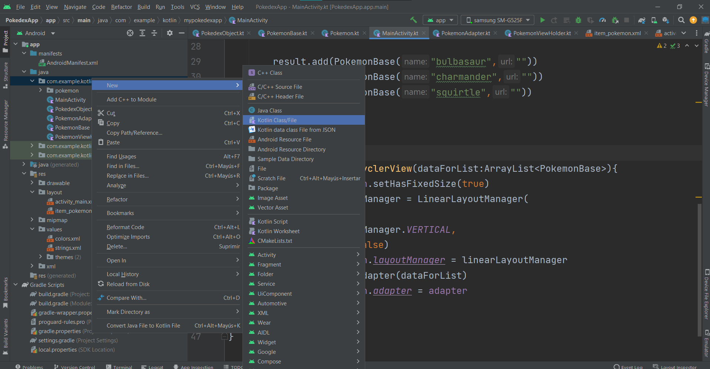

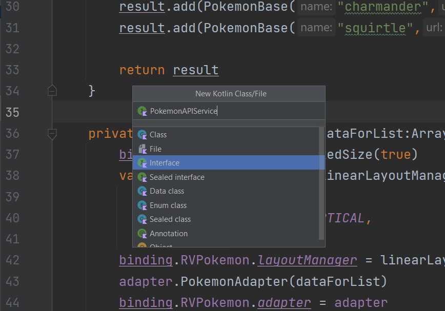

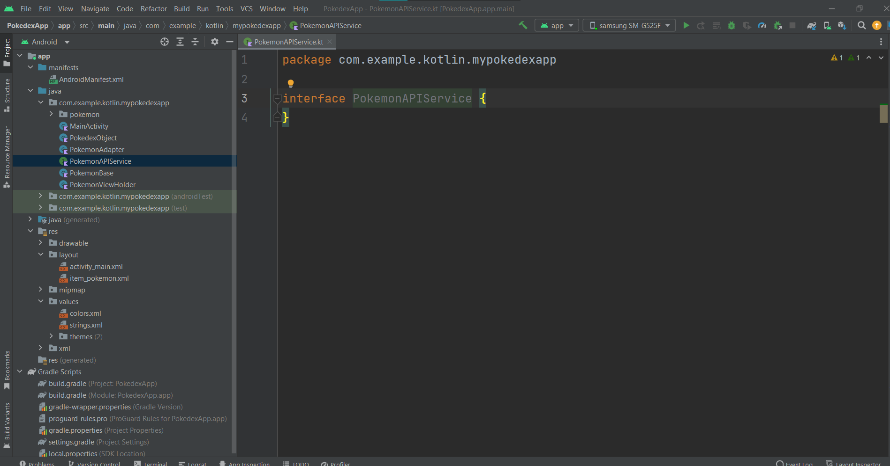

Este archivo de interfaz nos ayudará para mapear el API. Lo que hacemos en este archivo es definir todas las conexiones o URL que necesitamos conectar. Como es un archivo de interfaz no podemos escribir código funcional, eso lo haremos más adelante.

Para comenzar vamos a definir el primer método de la siguiente forma

```
//https://pokeapi.co/api/v2/pokemon/?limit=1279  
@GET("pokemon")  
suspend fun getPokemonList(  
    @Query("limit") limit:Int  
): PokedexObject  
```

En la línea 1 de este pedazo de código tenemos solo como muestra la url que estamos mapeando en nuestra interfaz para hacer más claro el ejemplo.

Primero debemos identificar cual es la raíz de toda el API para poder manejarla, esto es, cual es la constante que tendremos que pasar a cada método cada vez que llamemos al API para evitar duplicar la URL en el código, dicho en otras palabras la **URL Base.**

```
https://pokeapi.co/api/v2/pokemon/?limit=1279  
https://pokeapi.co/api/v2/pokemon/{number_pokemon}/

https://pokeapi.co/api/v2/ //URL BASE
```

Tomando nuestras 2 APIs de referencia vamos a ver que la parte que se repite es justamente { https://pokeapi.co/api/v2/ }, cuidado con incluir la parte de **pokemon** ya que esta es solo una parte del API, más no es para todo. Si lo queremos ver de otra forma uno de los módulos que incluye la PokeAPI es la del módulo **pokemon** y esta contiene varias URL que nos devuelven información.

Una vez identificada nuestra **URL Base** vamos a identificar el código

```
@GET("pokemon")  
suspend fun getPokemonList(  
    @Query("limit") limit:Int  
): PokedexObject  
```

La línea **@GET("pokemon")** nos define con una anotación de Kotlin el tipo de llamada que vamos a hacer y la ruta que debe seguir. Para este primer caso tenemos:

https://pokeapi.co/api/v2/pokemon/?limit=1279  

BASE_URL + pokemon/?limit=1279

Realmente lo único que contiene nuestra URL es el módulo de **pokemon** puesto que lo demás son parámetros dentro del mismo **GET**.

Entonces **@GET("pokemon")** nos va a permitir definir cualquier URL. Retrofit en ese sentido nos permite agregar cualquier método de API REST en esta sección por ejemplo pudieramos tener alternativas como las siguientes

```
@GET("pokemon") 
@POST("pokemon")
@PUT("pokemon")
@DELETE("pokemon")
```

Según sea el caso del API, para ver más a fondo que otras formas se pueden definir y sus parámetros consulta la documentación oficial de [Retrofit](https://square.github.io/retrofit/)

Ahora para la línea

```
suspend fun getPokemonList( ... )
```

Vamos a añadir la palabra reservada **suspend** esto va a funcionar para las funciones que tengan un comportamiento asíncrono. Viéndolo desde node es el mismo caso de definir una **async function**. Cuando declaramos este tipo de funciones es por que en algún punto se va a hacer la llamada a un método que puede tomar mucho tiempo en devolver la información como lo son llamadas a Internet, procesamiento de alta duración, o Escritura/Lectura de archivos. 

Veremos más adelante como manejar estas funciones pero de momento solo es importante saber que si hacemos una llamada a Internet es muy probable que necesitemos declarar esta función como **suspend**.

Ahora igual que en el **data class** observa que la función **getPokemonList()** no tiene un cuerpo dentro de las llaves **{ }**, sino que se reciben solo los parámetros adentro de los paréntesis **( )**. Lo cual nos lleva a la siguiente línea:

```
@Query("limit") limit:Int
```

Esta parte de los parámetros va a variar según lo que se pida en el API, no vamos a ahondar en como se detalla API REST en este curso, pero retomaremos las bases de la siguiente forma.

**GET**
Utiliza el **query** como parámetros, esto es todo lo que va adelante de la url después de **?** y va en la forma **param=valor** separados cada uno por un **&**. Un ejemplo sería como tenemos el API.

```
?limit=1279
```

Si tuviéramos más parámetros sería por ejemplo

```
?limit=1279&offset=0
```

**GET/POST PATH**
El **path** se puede utilizar en cualquiera de los métodos y sirve para pasar un parámetro desde la misma URL.

En el ejemplo de la segunda API tenemos el caso donde

```
/pokemon/{number_pokemon}/
```

**{ number_pokemon }** es el parámetro que estamos pasando, en este caso un número Entero.

**POST**
Para el **POST** lo más común es utilizar el **BODY** de la petición HTTP, en este caso no es posible verlo desde la URL ya que como el nombre lo indica va decodificado dentro del paquete. Casi siempre en estos casos y para el Retrofit existe una forma de codificar el **BODY** y pasarlo a la URL.

Retomando nuestro método tendríamos la última línea

```
): PokedexObject  
```

Que nos indica que regresamos un **PokedexObject** y en este caso es nuestro modelo que ya tenemos creado. Aquí es donde entran los **data class** puesto que la respuesta mapeada que ya teníamos en **PokedexObject** será la que se reciba inmediatamente como respuesta al hacer la llamada al API.

Nuevamente el código que tenemos es el siguiente

```
@GET("pokemon")  
suspend fun getPokemonList(  
    @Query("limit") limit:Int  
): PokedexObject  
```

Que como resumen tenemos, una llamada **GET** a **/pokemon** que recibe un **query param** de la variable **limit** de tipo **Int** y como resultado nos da un objeto **PokedexObject**.

Si aún te cuesta trabajo entenderlo, no te preocupes en la práctica debería quedarte más claro.

Ahora vamos a añadir el segundo método para manejar la segunda API, que deberá quedar de la siguiente manera:

```
//https://pokeapi.co/api/v2/pokemon/{number_pokemon}/  
@GET("pokemon/{numberPokemon}")  
suspend fun getPokemonInfo(  
    @Path("numberPokemon") numberPokemon:Int  
) :Pokemon
```

Nuevamente tenemos, una llamada **GET** a **/pokemon** que recibe un **path param** de tipo **Int** que en este caso es el número de Pokemon y como resultado nos regresa un objeto **Pokemon**. 

Este es el **data class** que tenemos en el package de **pokemon** y es la línea base de todos los **data class** que autogeneramos el laboratorio anterior.

El resultado actual de la interfaz **PokemonAPIService** será

```
package com.example.kotlin.mypokedexapp  
  
import com.example.kotlin.mypokedexapp.pokemon.Pokemon  
import retrofit2.http.GET  
import retrofit2.http.Path  
import retrofit2.http.Query  
  
interface PokemonAPIService {  
  
    //https://pokeapi.co/api/v2/pokemon/?limit=1279  
    @GET("pokemon")  
    suspend fun getPokemonList(  
        @Query("limit") limit:Int  
    ): PokedexObject  
  
    //https://pokeapi.co/api/v2/pokemon/{number_pokemon}/  
    @GET("pokemon/{numberPokemon}")  
    suspend fun getPokemonInfo(  
        @Path("numberPokemon") numberPokemon:Int  
    ): Pokemon  
}
```

Y listo, con esto ya tenemos configurado el primer paso.

1. ~~Crear Interfaz de servicio~~
2. Crear repositorio de llamadas al API
3. Crear configuración de la librería
4. Implementar métodos iniciales de conexión

#### Crear repositorio de llamadas al API

Para este paso ha llegado el momento de incorporar uno de los elementos primordiales que hacen que un proyecto de Android este bien estructurado hoy en día.

Esto es un **Patrón de Diseño**, estos los verás en mayor detalle en tu clase de Ingeniería de Software. Para entrar de lleno cubriremos el patrón **Repository**, este patrón nos ayuda a abstraer la capa de datos para hacer más fácil el manejo de la información y no hacerlo todo por ejemplo en el **MainActivity**

Vamos a crear un nuevo archivo **class** normal que se llame **PokemonRepository**

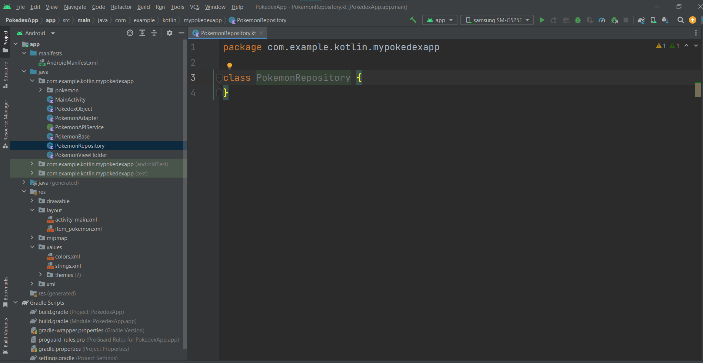

Esta clase es la que se conectará a nuestra Interfaz y a partir de ella se podrán cargar los datos hacia el **MainActivity.**

Lo primero que necesitamos entonces es declarar una variable de nuestro **PokemonAPIService**.

```
private lateinit var api:PokemonAPIService
```

Si te marca error en la clase no olvides iniciar el constructor 

```
class PokemonRepository() {
```

Ahora vamos a definir una función con los mismos datos y nombre que en nuestro **PokemonAPIService** esto por estándar de unicidad.

```
suspend fun getPokemonList(limit:Int):PokedexObject?{  
      
}
```

Con esto debe quedar claro que cada método que definimos en nuestra interfaz deberá tener su correspondiente en el **PokemonRepository** para introducir la lógica de llamar el API y manejar su resultado.

Otro punto que puedes notar en esta declaración es el **PokedexObject?**. El signo de interrogación nos indica que esta función puede devolver un **null**, aquí depende mucho como sea el manejo de errores dentro de tu aplicación, para este ejemplo va a ser algo muy básico pero en **aplicaciones dedicadas deberías tener un mejor control de los errores.**

Siendo así, entonces el código que va a ir dentro de la función **getPokemonList()** será el siguiente:

```
//todo: Inicializar variable api  
return try{  
    api.getPokemonList(limit)  
}catch (e:java.lang.Exception){  
    e.printStackTrace()  
    null  
}
```

De momento no vamos a inicializar la variable **api** esto lo realizaremos en el siguiente paso de la configuración con Retrofit.

Después tenemos un **try-catch** que como te mencione es para un manejo muy básico de errores, para tu proyecto se espera el manejo adecuado de errores de tipo 2XX,4XX,5XX al menos. Con sus propias retroalimentaciones al usuario.

Por último nota el **return** fuera del **try-catch** que es una nueva forma de Kotlin de escribir cada vez el **return** en cada bloque de código, esta misma forma la podemos aplicar con **if-else** y **when (switch)**.


Ahora pasaremos al segundo método que implica la segunda API de nuestro proyecto.

```
suspend fun getPokemonInfo(numberPokemon:Int): Pokemon? {  
    //todo: Inicializar variable api  
    return try{  
        api.getPokemonInfo(numberPokemon)  
    }catch (e:java.lang.Exception){  
        e.printStackTrace()  
        null  
    }  
}
```

Bastante similar a lo anterior solo ajustando la llamada de **api** a **getPokemonInfo** y cambiando el objeto de retorno a **Pokemon?** nuevamente nota el **?** para entender que puede regresar un objeto **null**.

Con esto el resultado de nuestro **Repository** es el siguiente.

```
package com.example.kotlin.mypokedexapp  
  
import com.example.kotlin.mypokedexapp.pokemon.Pokemon  
  
class PokemonRepository() {  
    private lateinit var api:PokemonAPIService  
  
    suspend fun getPokemonList(limit:Int):PokedexObject?{  
        //todo: Inicializar variable api  
        return try{  
            api.getPokemonList(limit)  
        }catch (e:java.lang.Exception){  
            e.printStackTrace()  
            null  
        }  
    }  
  
    suspend fun getPokemonInfo(numberPokemon:Int): Pokemon? {  
        //todo: Inicializar variable api  
        return try{  
            api.getPokemonInfo(numberPokemon)  
        }catch (e:java.lang.Exception){  
            e.printStackTrace()  
            null  
        }  
    }  
}
```

**Nota: Si pusiste atención ambos métodos incorporan la palabra reservada suspend y esto es un pequeño camino, mientras no se defina donde empieza la posición asíncrona a llamarse, todo debe seguir la estructura suspend en este caso el Repository y el APIService.

1. ~~Crear Interfaz de servicio~~
2. ~~Crear repositorio de llamadas al API~~
3. Crear configuración de la librería
4. Implementar métodos iniciales de conexión

#### Crear configuración de la librería

Ahora que tenemos nuestro **PokemonAPIService** y que tenemos un **PokemonRepository** para llamar al API, nos falta definir en lo más básico nuestra **BASE_URL** y por tanto como se configura mágicamente Retrofit para hacer las llamadas a los métodos que ya configuramos.

Para comenzar vamos a crear un nuevo archivo llamado **NetworkModuleDI**, el **DI** es un acrónimo de **Data Instance** y por lo general es el estándar para definir la configuración de las conexiones HTTP, en este caso para Retrofit pero puede ser cualquier otra librería.

Este nuevo archivo será de un tipo nuevo que no hemos manejado hasta el momento que es el tipo  **Object**.

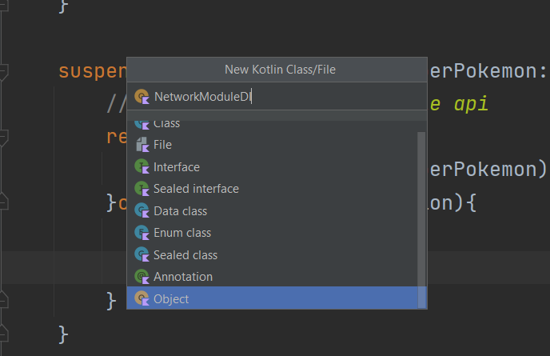

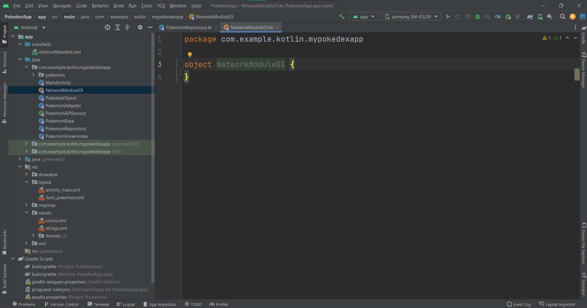

Lo primero que vamos a hacer es definir nuestras variables globales que básicamente nos ayudan a hacer las llamadas con HTTP y convertir las respuestas en objetos JSON funcionales.

```
private val gsonFactory:GsonConverterFactory = GsonConverterFactory.create()  
private val okHttpClient: OkHttpClient = OkHttpClient()
```

Después vamos a declarar una función que tal vez no hayas escuchado antes **invoke**, esta función es una forma de llamar este método al momento de inicializar una clase o una instancia de esta misma, si bien no es un constructor nos ayuda a pasar un segundo paso y ejecutar este método para dejar más claro el código.

```
operator fun invoke(): PokemonAPIService {

}
```

Vamos a ver el uso de la palabra reservada **operator** para el uso del **invoke** ya que es un operador especial y no confundirlo con una función cualquiera que podamos definir como **invoke**. El resultado de este método nos regresará un **PokemonAPIService** pero ojo que no será solo la interfaz, sino ya contendrá toda la configuración necesaria.

El contenido del método es el siguiente:

```
return Retrofit.Builder()  
    .baseUrl(Constants.BASE_URL)  
    .client(okHttpClient)  
    .addConverterFactory(gsonFactory)  
    .build()  
    .create(PokemonAPIService::class.java)
```

El contenido del **invoke** no es más que la forma en que Retrofit nos solicita inicializar la librería, existen algunos parámetros que se pueden agregar pero eso ya va variando de aplicación en aplicación. Revisa si necesitas añadir algo más para tu proyecto en la documentación oficial.

Todo debería estar en orden excepto por el **Constants.BASE_URL** y si recuerdas esta es la URL común del API { https://pokeapi.co/api/v2/ }. Si bien podemos agregar el **String** directamente, te puedo decir que como buena práctica lo ideal es **NO hardcodear ningún String dentro del código fuente**, para esto tenemos de 2 formas:

1. Utilizar el archivo **res->strings.xml** lo cual significa que es información que se despliega al usuario.
2. Utilizar un archivo de constantes con información que no se muestra al usuario pero que se puede compartir a las diferentes clases del proyecto puesto que es única.

Para ello vamos a crear este archivo simple que será también de tipo **Object** y lo llamaremos tal cual **Constants**.

Su contenido es el siguiente

```
package com.example.kotlin.mypokedexapp  
  
object Constants {  
    const val BASE_URL = "https://pokeapi.co/api/v2/"  
}
```

No es necesario entrar en mucho detalle más que ver como se declaran las constantes en Kotlin como **const val**, siguiendo la lógica es una variable inmutable con la palabra reservada const para que el compilador haga más fácil su trabajo, y siguiendo el estándar de JAVA el nombre se debe declarar en mayúsculas.

Regresando a **NetworkModuleDI** ya podremos importar **Constants** y finalizar la configuración de Retrofit.

1. ~~Crear Interfaz de servicio~~
2. ~~Crear repositorio de llamadas al API~~
3. ~~Crear configuración de la librería~~
4. Implementar métodos iniciales de conexión

#### Implementar método iniciales de conexión

Ya hemos pasado la base de la configuración de Retrofit y el API, ahora solo nos hace falta hacer una llamada y probar que efectivamente estemos obteniendo la lista de Pokemon.

Para ello abre tu **MainActivity**, y ve al método que teníamos de **testData()**, aún no lo borraremos pero debajo de este vamos a crear un método que se llame **getPokemonList()** como hicimos en el **PokemonRepository** y en el **PokemonAPIService**, y sigue observando que por unicidad mantenemos los mismos nombres, esto nos ayuda a que en caso de error podamos identificar el proceso que se va siguiendo y luego identificar la capa en donde sucede el error más facilmente.

```
private fun getPokemonList(){

}
```

¿Cuál va a ser la diferencia de este **getPokemonList()**? El uso de **suspend**, ahora vamos a declararlo directamente como  **private fun**, a diferencia del **Repository** y del **APIService** aquí es donde empieza la llamada asíncrona.

Desde otro punto de vista en el **MainActivity** estamos en la interfaz y es desde aquí donde haremos la llamada a Internet.

Para poder manejar estas llamadas asíncronas recuerda en **NodeJS** el uso del **async/await**, para Android como te mencione tenemos las **Coroutines** o Corrutinas.

La Corrutina no es más que iniciar una especie de thread virtual que permite manejar información de este tipo. Existe todo un concepto detrás de las corrutinas y algo que es muy importante es que **no son threads**, si bien se pueden crear en Kotlin y en Java son muy usados los threads tienen un riesgo de consumo de recursos,  en contraparte las corrutinas son elementos virtuales que además de estar optimizadas en recursos para las peticiones por su naturaleza permiten trabajar mejor esta parte.

Un ejemplo tan solo 1 thread en comparación con 1000 corrutinas, siguen teniendo mayor rendimiento las corrutinas que el thread.

Esto te lo comento por si ves en Internet alguna implementación con Threads, al menos a nivel móvil es muy costoso en comparación al uso de Corrutinas. Y también es importante no confundir con las Corrutinas de Unity y C# que en ese caso son más parecidos a los Threads.

Para seguir con nuestro código vamos a implementar la función de la siguiente forma:

```
private fun getPokemonList(){  
    CoroutineScope(Dispatchers.IO).launch {  
     
	}  
}
```

La declaración de la Corrutina es muy especial, y cuando veas este tipo de declaraciones piensa que se está generando un proceso paralelo, para este caso es desde el UI se crea un proceso paralelo donde vamos a hacer algo, en este caso llamar al **PokemonRepository**.

Por último tenemos lo que recibe el **CoroutineScope** y esto es el Scope de la Corrutina. Los **Scopes** no son más que entornos pensados para ejecutar cierto tipo de acciones asíncronas, actualmente contamos con 4 que es imporante saber para que sirven:

Dispatchers.Main -> Es el contexto principal de la aplicación, puedes pensarlo como el de la UI
Dispatchers.IO -> Es el contexto para llamadas a Internet o para escritura/lectura de archivos
Dispatchers.Default -> Es el contexto default de las corrutinas, no tiene una optimización particular
Dispatchers.Unconfined -> Es el contexto para operaciones de alto impacto y consumo de recursos, no es muy habitual el usarla

**Nota: Ten cuidado como ejecutas el Scope, puesto que cuando cambies de contexto, por ejemplo cambiar a IO, y si en este mismo intentas llamar la UI, la app tendrá un crash debido a que no se encuentra el contexto de la UI, que como te mencione es el MAIN, para poder volver a tocar la interfaz es necesario regresar al contexto necesario.

**Nota 2: La corrutina existe mientras se ejecuta el código en su interior, una vez finalizado, se destruye y se liberan los recursos necesarios.**

Dentro del Scope de la corrutina vamos a crear la variable del **PokemonRepository** y llamar nuestro método.

```
val pokemonRepository = PokemonRepository()  
val result:PokedexObject? = pokemonRepository.getPokemonList(Constants.MAX_POKEMON_NUMBER)  
Log.d("Salida", result?.count.toString())
```

Ahora añadiremos una nueva constante **MAX_POKEMON_NUMBER**. En el archivo **Constants** agrega.

```
const val MAX_POKEMON_NUMBER = 1279
```

Para probarlo vamos al método **onCreate()** del **MainActivity** y debajo de **setUpRecyclerView(testData())** vamos a llamar nuestro método **getPokemonList()**.

```
override fun onCreate(savedInstanceState: Bundle?) {  
    super.onCreate(savedInstanceState)  
  
    initializeBinding()  
    setUpRecyclerView(testData())  
    getPokemonList()  
}
```

Vamos a tratar de correr la aplicación y ver que resultado estamos obteniendo.

De momento no estamos cargando los datos en la lista del **RecyclerView**, pero estamos haciendo una llamada a **Log.d()** esta clase nos permite ver información en el logcat del dispositivo.

Para abrir el logcat basta con abrir la opción que se encuentra en la parte inferior de Android Studio.

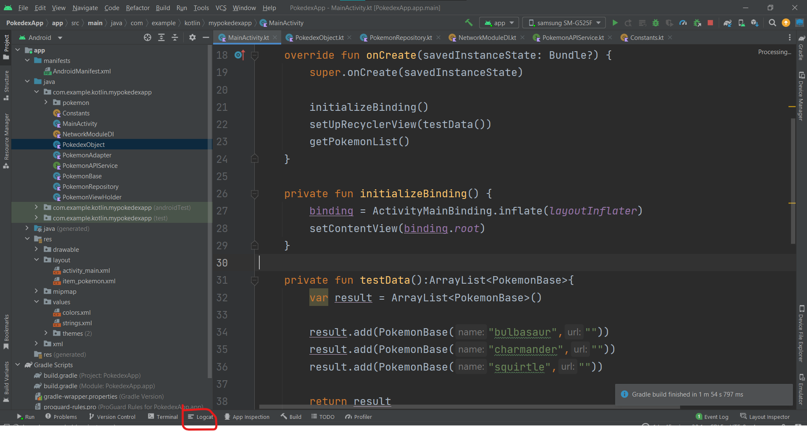

La línea del **Log.d ()** recibe 2 parámetros, el primero es una etiqueta para poder filtrar de manera sencilla lo que queremos desplegar, y el segundo es el valor como tal.

Para visualizarlo realiza lo siguiente.

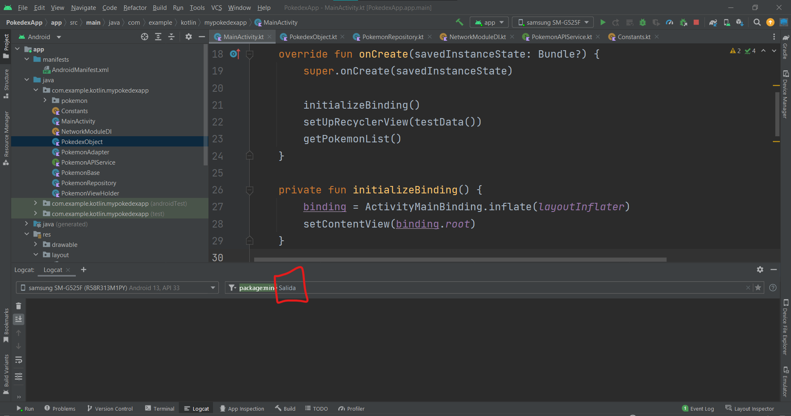

Asegurándonos que la aplicación corre debería aparecer lo siguiente.

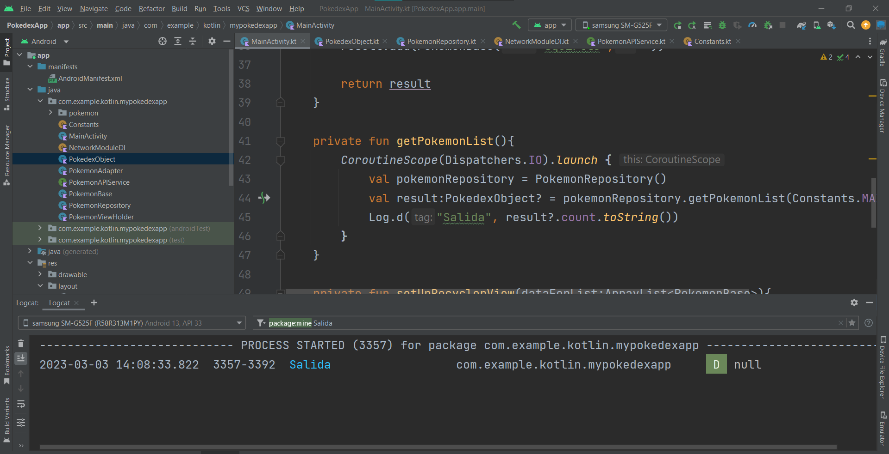

Y aparentemente se está ejecutando todo bien, pero observa que el resultado que estamos obteniendo es un **null**, parece ser que hemos terminado toda nuestra configuración pero ahora es momento de debugear los errores.

1. ~~Crear Interfaz de servicio~~
2. ~~Crear repositorio de llamadas al API~~
3. ~~Crear configuración de la librería~~
4. ~~Implementar métodos iniciales de conexión~~

### Paso 2 Identificando el error

A la hora de desarrollar cualquier sistema, vamos a encontrarnos que no todo es miel, casi siempre encontraremos problemas, errores aunque sigamos las mejores prácticas de desarrollo.

Una habilidad muy importante de cualquier desarrollador es tener la capacidad de encontrar errores, y esto no es ver el código por horas hasta detectar que falla.

Un buen ingeniero de software sabe usar las herramientas a su favor para identificar más fácilmente los errores.

A diferencia de Web, en Android es más fácil hacer todo el camino y empezar a detectar errores para llegar a posibles soluciones.

La implementación de tantos archivos que tenemos en nuestro código fuente nos permite como te mencione a separar en capas y visualizar de manera más sencilla que es lo que puede fallar.

El error que tenemos hasta este punto es algo muy sencillo pero vamos a hacerlo visible desde Android Studio.

Dentro del logcat vuelve a correr el proyecto y elimina el texto de **Salida** que agregamos, esto quitará el filtro y nos mostrará todo lo que tiene el proyecto.

**Nota: Antes de cualquier cosa revisa que tu dispositivo tenga Internet, ya que si no lo tiene no te dirá el error**

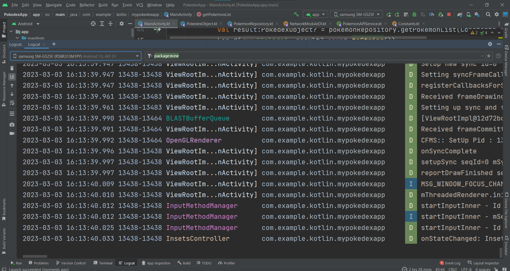

Vamos a extender el logcat y como ya no tenemos filtro se nos empezará a mostrar todo lo que sea **package:name** o lo que en otras palabras nuestra aplicación. Si quitamos el **package:name** veremos todo lo que sucede en el dispositivo y quizás al momento de desarrollar no sea necesario ver todo.

Es importante identificar con el **logcat** los tipos de errores que nos regresa puedes ver algunas etiquetas marcadas en colores, que significan lo siguiente:

D -> Debug, estos textos solo se imprimen en modo debug, si la aplicación está en modo Release no se muestran.
I -> Info, estos textos son de información, suelen ser de apoyo y no son importantes.
V -> View, son acerca de los gráficos desplegados, por lo general no son importantes.
W-> Warning, estos textos son los warnings que se pueden generar del proyecto, a veces son importantes otras veces no.
E -> Error, estos textos son los errores detectados, si crashea la aplicación seguramente aquí aparecerá el problema

Voy a mostrarte mi **logcat** quizás el tuyo pueda variar ya que recuerda que depende del dispositivo o del emulador.

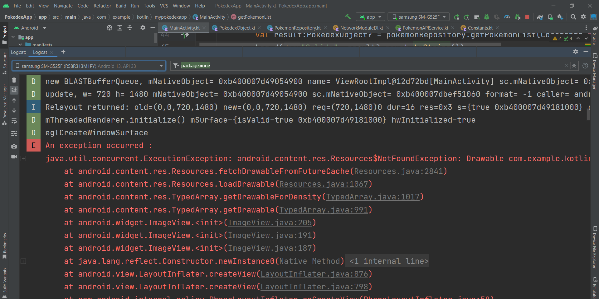

Este error que me aparece si bien es error, se da por la carga de la celda con la imagen default que agregamos, esto por un error interno que no es importante en este momento en Android.

Ahora si quisiera entrar más en detalle con este error, verás que se extiende bastante, y que me marca las cosas en rojo como errores, y tiene secciones en gris hacia algunas clases en particular.

Si damos clic en estos links en gris se abrirá en el editor la clase correspondiente, como Android nos imprime todo el Stack hasta ese momento estas clases son las involucradas en el error pero ninguna es relevante.

Para poder debuguear en Android tenemos que ver la primera línea que es la que nos describe el error.

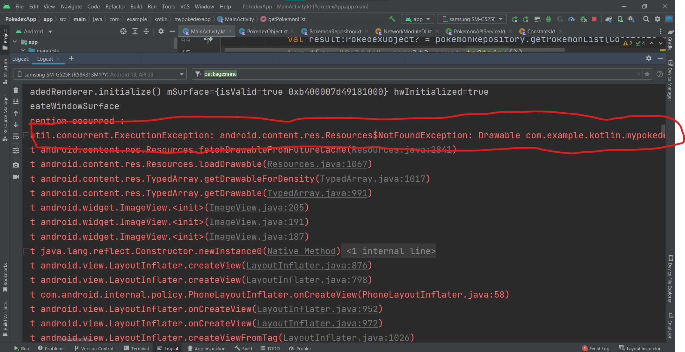

Generalmente esto es suficiente para identificar que estamos haciendo mal, el siguiente paso es identificar donde se produce exactamente el error.

Para ello debemos hacer scroll hasta encontrar el primer link en azul.

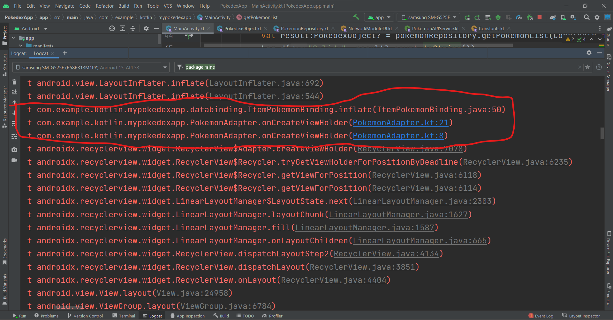

Casi siempre el primer link nos dice la clase de nuestro código donde se está generando el problema y la línea, en caso de que el primer link no sirva revisamos el segundo y de ahí hacia adelante.

Otro tip que te puede servir es que la línea arriba del primer link azul en ocasiones también describe el error, entonces esto puede servirte de apoyo a orientación de que es lo que sucede.

Como mencioné aunque este es un error no es lo que nos está bloqueando entonces vamos a seguir buscando en el logcat.

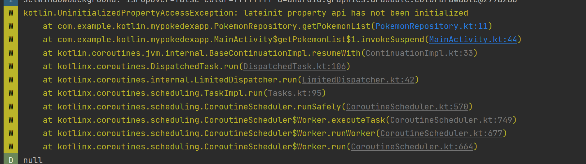

Y nos encontraremos con este Warning, en particular con esta línea

```
 lateinit property api has not been initialized
```

Si abrimos el link del **PokemonRepository** en donde nos marca nos llevará aquí

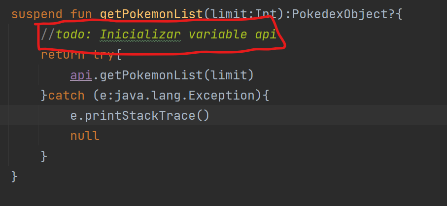

Y con toda razón, olvidamos inicializar la variable **api**, el Warning no aparece por el **todo** que dejamos, pero recuerdas que te dije que si no iniciamos las variables **lateinit** no hay un crash directo ya que el compilador lo maneja pero suceden comportamientos extraños.

Si en Android Studio donde seleccionamos para abrir el **logcat** vemos las opciones adicionales veremos la de **todo** Y veremos algo interesante.

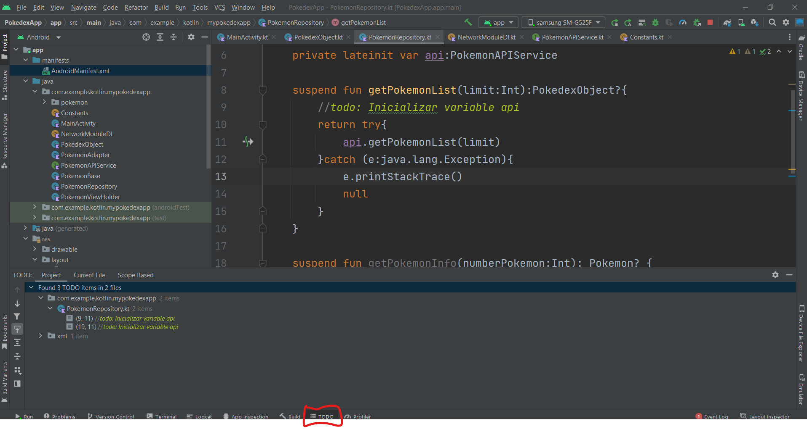

Podemos ver los **to-dos** que tenemos declarados en el proyecto.

Esto nos puede ayudar a organizar información con nuestro equipo para declarar que nos hace falta por trabajar.

De momento vamos a corregir los errores inicializando en los 2 métodos sustituyendo los **todo** con las variables:

```
api = NetworkModuleDI()
```

Volvemos a ejecutar la aplicación y veremos nuevamente en el **logcat** el resultado filtrando **Salida**

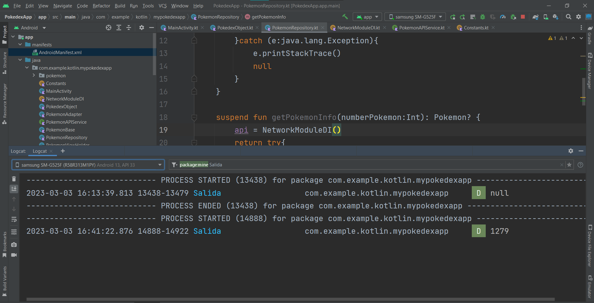

Y como resultado ahora sí debemos ver el número que nos regresa el API. Con esto hemos resuelto el problema sin hacer tanto esfuerzo, cuando todo este proceso no sea suficiente quizás necesites manejar **breakpoints**, de momento no cubriremos esta parte pero puedes revisar más [aquí](https://developer.android.com/studio/debug?hl=es-419).

### Paso 3 Viendo en el RecyclerView los nombres de todos los Pokemon

Es momento de ver en nuestro **MainActivity** el método **testData()**, ya no lo necesitamos por lo que es hora de eliminarlo.

Después vamos a modificar **getPokemonList()** Después del **log.d()** necesitamos recuperar nuestro **Scope** de la corrutina, esto lo hacemos nuevamente lanzando el **Scope**, dado que **Main** siempre está corriendo no pasa nada.

```
private fun getPokemonList(){  
    CoroutineScope(Dispatchers.IO).launch {  
        val pokemonRepository = PokemonRepository()  
        val result:PokedexObject? = pokemonRepository.getPokemonList(Constants.MAX_POKEMON_NUMBER)  
        Log.d("Salida", result?.count.toString())  
        CoroutineScope(Dispatchers.Main).launch {   
setUpRecyclerView(result?.results!!)  
        }  
    }}
```

En concreto lo que añadimos es lo siguiente:

```
CoroutineScope(Dispatchers.Main).launch {  
    setUpRecyclerView(result?.results!!)  
}
```

Como dijimos abrir esta corrutina nos dice que regresamos al **Scope** de **Main** y llamamos nuestro método que inicializa el **RecyclerView**, lo que mandamos de parámetro es la lista de datos obtenidos.

```
result?.results!!
```

**result** es nuestra variable pero recuerda que puede ser nula, de momento estamos obviando que no va a fallar, pero pueden darse muchas razones por las cuales puede fallar que debemos validar como:

- No tener conexión a internet
- El servidor no recibió la petición correcta
- El servidor dejó de funcionar correctamente

La sección **.results!!** y en particular el **!!** es una forma de decirle al compilador, estoy seguro de lo que estoy haciendo, si algo falla yo me encargo, esta es la última línea de defensa de la implementación si después de esto nuestro código falla es culpa nuestra y no del compilador, cuida que siempre estas llamadas estén protegidas y validadas para evitar errores inesperados.

Por último vamos a eliminar del **onCreate** la llamada a **setUpRecyclerView(testData())**

Vamos a ejecutar nuevamente la aplicación.

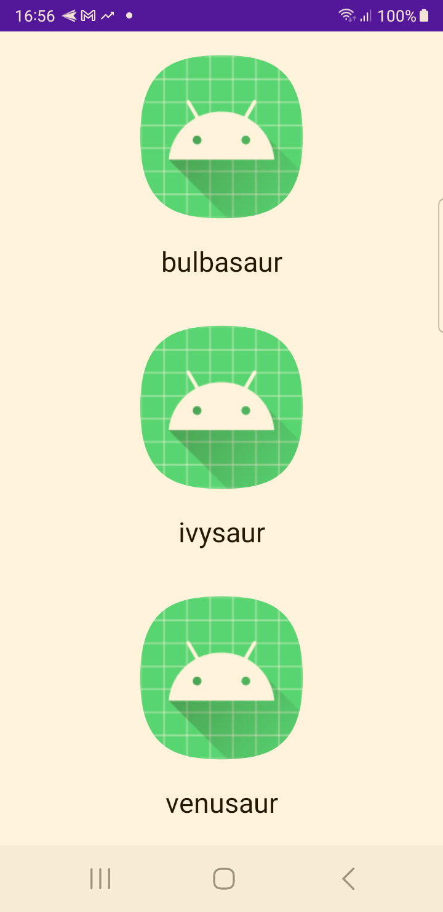

De entrada cambian los Pokemon que teníamos, pero el cambio real es empezar a hacer scroll en la lista veras como ya tiene muchos datos para mostrar.

### Paso 4 Cargando las imágenes de los Pokemon

Una API normal debería de traer la imagen a la par del nombre, pero en particular esta API, tiene todo un camino para obtenerla, si recuerdas el resultado de esta primera lista de Pokemon, es el nombre y la URL de su detalle.

Este caso no es ideal, puesto que para cargar la imagen vamos a tener que hacer una llamada al servidor cada vez que carguemos una celda, si pensamos en procesamiento al servidor esto es un poco crítico, pero dado que el servicio no es nuestro no nos preocuparemos.

Para tu proyecto evita que sucedan este tipo de detalles.

Con eso dicho vamos a abrir nuestro **PokemonViewHolder**. Así como hicimos en el caso anterior vamos a declarar la corrutina para mandar llamar el API.

Vamos declarando este método adicional dentro del **PokemonViewHolder**

```
private fun getPokemonInfo(url:String, imageView:ImageView,context:Context){
    //"https://pokeapi.co/api/v2/pokemon/23/"  
    var pokemonStringNumber:String = url.replace("https://pokeapi.co/api/v2/pokemon/","")  
    pokemonStringNumber = pokemonStringNumber.replace("/","")  
    val pokemonNumber:Int = Integer.parseInt(pokemonStringNumber)  
  
    CoroutineScope(Dispatchers.IO).launch {  
        val pokemonRepository = PokemonRepository()  
        val result: Pokemon? = pokemonRepository.getPokemonInfo(pokemonNumber)  
        CoroutineScope(Dispatchers.Main).launch {  
            //todo:Agregar imagen  
        }  
    }}
```

En la primera parte estamos obteniendo el id del Pokemon, esto es más en como declaramos nuestra API, donde lo que recibe es el id directamente, pero bien podríamos ajustar a recibir la URL, ahí es más a gusto de cada uno.

La parte donde definimos la Corrutina es prácticamente la misma que la del **getPokemonList()** haciendo la llamada al API y obteniendo el resultado.

Para modificar el **todo** de agregar la imagen vamos a sutituirlo por lo siguiente:

```
val urlImage = result?.sprites?.other?.official_artwork?.front_default.toString()  
  
val requestOptions =  RequestOptions()  
    .centerCrop()
    .diskCacheStrategy(DiskCacheStrategy.ALL)  
    .fitCenter()  
    .priority(Priority.HIGH)  
  
Glide.with(context).load(urlImage)  
    .apply(requestOptions)  
    .into(imageView)
```

Primero definimos la URL de la imagen, aquí es donde entran en juego todos los **data class** autogenerados para poder obtener la imagen oficial del Pokemon.

Ahora vamos a empezar a trabajar con la librería de imágenes **Glide**, esta es una poderosa librería de carga de imágenes asíncronas o lazy loading. Para el uso de **Glide** tenemos 2 pasos, primero añadir las opciones de request que nos ayudan a revisar como cargar la imagen añadiéndole parámetros especiales como añadirle una escala específica, que hacer en caso de que la imagen no cargue entre otras opciones, revisa la [documentación oficial](https://github.com/bumptech/glide) para ver que puedes hacer con las opciones.

Entonces en el código definimos las **requestOptions** y después mandamos llamar **Glide** para cargar la imagen.

Todo este código debería funcionar correctamente.

Ahora vamos a pasar a la función **bind()** de nuestro archivo **PokemonViewHolder** y debajo de la llamada a la asignación del nombre.

```
getPokemonInfo(item.url,binding.IVPhoto,context)
```

Y ahora nos aparecera que la variable **context** está en rojo.

Hablando del **Context** en Android estamos viendo uno de los elementos más importantes de una aplicación y en particular de una vista, teniendo el **context** a la mano podemos realizar cualquier operación que involucre Android. En esencia el **context** es la vista que tenemos activa pero vista desde otra forma, de hecho si tenemos **MainActivity** y hacemos un cast al **context** esto es válido.

```
val context:Context = (mainActivity as Context)
```

El **context** nos permite acceder a la carpeta de **res** desde el código de Kotlin. Nos permite mandar operaciones de vistas, cargar fragmentos, usar todas las funciones de android que usan el **context** que de inicio son bastantes.

Tener el **context** a la mano a nivel de interfaz es muy importante, pero ojo **nunca consideres enviar el context al Repository por ejemplo puesto que son capas diferentes, esto lo veremos más en detalle cuando lleguemos a arquitectura.**

Para pasar el **context** a nuestro código vamos a hacer lo siguiente.

Vamos a modificar la declaración del **PokemonViewHolder** en la función del **bind** a lo siguiente

```
fun bind(item: PokemonBase,context:Context){
```

Esto va a provocar un efecto en cadena donde tenemos que abrir nuestro archivo **PokemonAdapter** y en **onBindViewHolder** vamos a modificar **holder.bind** a

```
holder.bind(item,context)
```

Esto nos llevará a agregar una variable global de **context**

```
lateinit var context: Context
```

Y vamos a modificar la función **PokemonAdapter()** a lo siguiente

```
fun PokemonAdapter(basicData : ArrayList<PokemonBase>,context:Context){  
    this.data = basicData  
    this.context = context  
}
```

Por último en el **MainActivity** en **setUpRecyclerView()** vamos a modificar **adapter.PokemonAdapter()** a

```
adapter.PokemonAdapter(dataForList,this)
```

El **this** hace referencia a **MainActivity** pero recuerda lo que te dije que el **Activity** es el **Context**, por lo tanto es válido.

Ahora ejecutamos la aplicación y el resultado final será

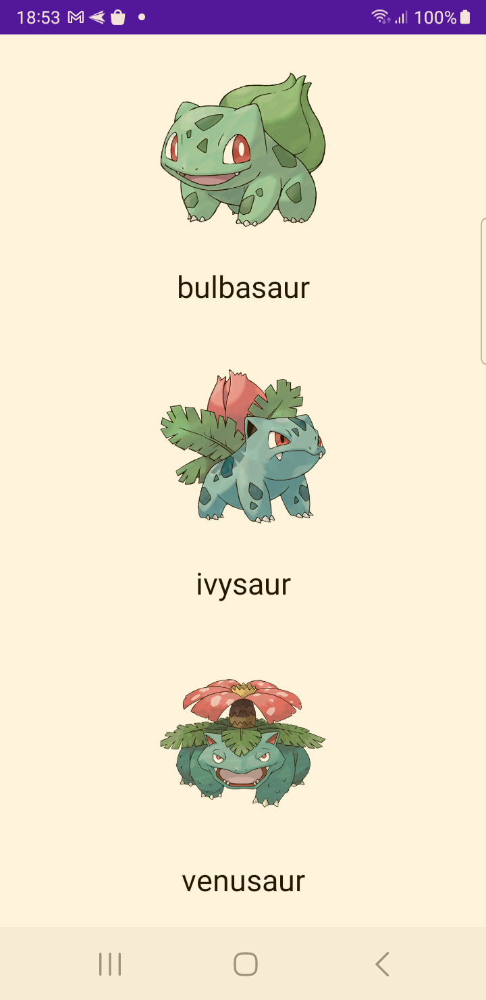

Si empezamos a hacer scroll veremos todos los Pokemon disponibles en este caso lo 1279.

Con esto ya tenemos una lista completa con datos desde nuestra API, el proyecto ya cuenta con muchos archivos, es momento de empezar a aplicar Arquitectura.

Esto lo haremos en el próximo laboratorio por lo que trata que el resultado final sea hasta donde vamos, si tienes dudas pide una asesoría.

**Nota: Al final de este laboratorio te recomiendo que generes una copia para que en los próximos tengas un punto de comparación sobre lo que se va avanzando.**