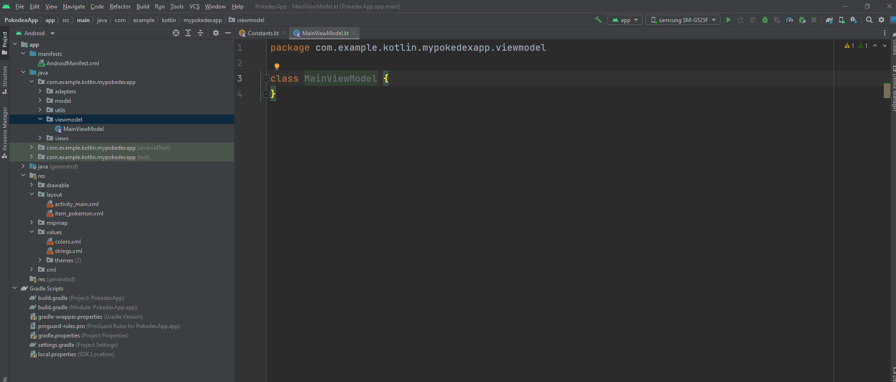

# Arquitectura MVVM y Clean Architecture

## Objetivo

En este laboratorio aprenderemos sobre arquitectura de software en Android.

Para este laboratorio vamos a desarrollar un Pokedex, que es una unidad de información para el mundo Pokemon. Esta aplicación nos mostrara los datos de cada criatura y desde ahí podremos generar un detalle.

Esta aplicación seguirá evolucionando conforme avancemos.

**Nota: Al final de este laboratorio te recomiendo que generes una copia para que en los próximos tengas un punto de comparación sobre lo que se va avanzando.

## Instrucciones

Sigue los pasos descritos en la siguiente práctica, si tienes algún problema no olvides que tus profesores están para apoyarte.

## API
Para este laboratorio estaremos utilizando el API de [PokeAPI](https://pokeapi.co/) los endpoints con los que vamos a comenzar son los siguientes:

```
GET https://pokeapi.co/api/v2/pokemon/?limit=1279
GET https://pokeapi.co/api/v2/pokemon/{number_pokemon}/
```

## Laboratorio
### Paso 1 Introducción a MVVM

Hace algunos años el uso de Arquitecturas en Android no era algo común de ver, y quedaba más del lado de los desarrolladores, viéndolo más como un lujo que como una necesidad.

En aquel entonces las aplicaciones eran mas "simples" y si bien nunca ha sido la mejor práctica solo los desarrolladores veteranos explotaban estas capacidades usando los patrones comunes de desarrollo web como una arquitectura MVC con la cual deberías estar familiarizado. Te dejaré aquí un [link](https://devexperto.com/curso-arquitecturas-android/) con recursos sobre diferentes tutoriales sobre Arquitectura en Android para que veas que existen muchas formas de implementarlo.

Ahora bien, antes de mencionar la teoría del MVVM, por que es la que estamos seleccionando habiendo tantas posibles arquitecturas en el mundo de desarrollo. En primera instancia por que es la arquitectura oficial de Google. Hoy en día no podemos pensar de un proyecto básico en Android si no hablamos mínimo de el uso de una arquitectura MVVM. Segundo por que Google ya nos da muchas cosas hechas para hacer más fácil la implementación en lugar de otras arquitecturas donde los patrones tenemos que construirlos nosotros mismos. Por último esta arquitectura esta orientada a alcanzar buenos niveles de calidad y que el código en si mismo sea testeable uno de los principios fundamentales de la calidad.

Como último paso puedo mencionarte con mucha seguridad que de lejos MVVM sea la mejor arquitectura del mundo, y tampoco es única a Android, es más todas estas arquitecturas son muy viejas comprobando que las bases de la computación se mantienen hasta hoy en día. Si bien MVVM tiene sus pro también tiene sus contras y como todo en la comunidad hay quienes están a favor y en contra.

Como siempre mi recomendación es aprende, luego juzga. Una forma de hacer algo mejor es entender las bases de lo que ya existe, quien sabe tal vez a partir de esto puedas crear mejores prácticas que hagan innovación en el mundo de desarrollo de software.

#### ¿Qué es MVVM?

El **Model-View-ViewModel** ó **Modelo-Vista-Modelo de Vista** es una arquitectura  que se volvió popular cuando Google la convirtió en su arquitectura oficial al lanzar la [guía de arquitecturas](https://developer.android.com/jetpack/guide)

Para el uso de **MVVM** vamos a hacer uso de 3 módulo que si tomamos como referencia el Modelo-Vista-Controlador **MVC** veremos que son en cierto modo similares. La diferencia vendrá entre el **Controlador** y el **View Model**.

**Model**
Representa la parte de datos, es decir, cuando recuperamos de una base de datos o de un servicio web, toda esa información la almacenaremos en el modelo de datos.

En nuestro laboratorio anterior esta parte es abarcada por los **data classes** el archivo de configuración de Retrofit **NetworkModuleDI** y las implementaciones de **PokemonAPIService** así como de el **PokemonRepository**

**View**
Es la parte de la UI, los XML, las activities y los fragments. Estos actuarán como siempre, ejecutando acciones por ejemplo al pulsar un botón pero no realizarán las acciones, se suscribirán all **View Model** a través de un Patrón de Diseño **Observer** y este les dirá cuando y como pintar.

En nuestro laboratorio lo que tenemos es el **activity_main.xml** y el **ActivityMain**, para el RecyclerView el  **PokemonAdapter**, el **PokemonViewHolder** y su respextivo xml el **item_pokemon**.

**ViewModel**
Este sería la conexión entre el modelo y la vista y como mencioné sería el equivalente al Controlador en una arquitectura **MVC**, la diferencia con este es como se comporta ya que las **Vistas** se suscriben usando el **Observer** as sus respectivos **ViewModels** y estos al percatarse de que el modelo ha sido modificado lo notificarán a la vista.

En nuestro laboratorio este módulo o esta capa aún no existe y aquí es donde vamos a necesitar separar del **MainActivity** la abstracción de datos para poder llevarlo a cabo.

#### ¿Cómo funciona MVVM?
Seguramente te hayas quedado más confundido con la explicación anterior que antes de empezar este laboratorio, pero vamos a unirlo todo para que quede más claro.


Vamos a usar nuestro laboratorio de referencia.

Ya mencionamos que nuestros **data class** son nuestros modelos de datos. Nuestra **MainActivity** es la encargada de mostrar una lista de cada uno de los Pokemon. Si añadiéramos un campo de búsqueda se deberían filtrar está lista según el texto introducido por el usuario.

Para hacer esto con MVVM es muy sencillo, lo primero que haríamos es que nuestra **MainActivity** se suscriba a un **ViewModel** propio y usando el patrón de **Observer** que para efectos de Android se le conoce como **live data**, que no es otra cosa que conectarse y esperar un cambio en el **Model** para que el **MainActivity** se entere. Esto es lo más importante ya que **MainActivity** solo pintará los cambios cuando el **ViewModel** lo notifique.

También el **MainActivity** deberá controlar cuando se escribirá el texto para avisar al **ViewModel** que algo empieza a detonar un posible cambio en el **Model**. Aquí termina la parte de la **Vista**, solo pinta lo que le diga el **ViewModel** y cuando se produce un evento en la UI lo notifica.

Nuestro **ViewModel** acaba de recibir que ha habido un evento en la UI, por ejemplo en el campo de búsqueda alguien escribió **pikachu**, por lo que tendráque modificar el Modelo de la lista de datos. Para ello llamará al **Modelo** que irá a Retrofit, a Room (BD local) o a cualquier tipo de acceso que nos devuelva datos (en este caso un nuevo pokemon) y se lo devolverá al **ViewModel** que a su vez notificará a **MainActivity** el cambio del contenido para que se actualice.

Esto es todo, parece complicado con toda la teoría así que vamos a verlo en práctica. La ventaja que tenemos es que la mayor parte del código ya esta hecho solo necesitamos estructurar nuestros archivos y aplicar el ViewModel.

Al final de esta práctica el resultado final que tendremos no debe modificar ninguna función actual de la aplicación.

Al estado actual del proyecto podemos llamarle un **Android Vanilla** y el resultado final de esta parte será un **Android MVVM** completo.

### Paso 2 Configuraciones Básicas

Vamos a comenzar con nuestro archivo **build.gradle(app)** para ver que ya tenemos implementado y que nos hace falta.

Si recuerdas uno de los factores clave de los laboratorios anteriores fue el uso de **viewbinding** para realizar la conexión entre el **activity_main** y **MainActivity**


```
buildFeatures {  
    viewBinding true  
}
```

Dentro de nuestras librerías o la sección de **dependencies** actualmente tenemos lo siguiente:

```
dependencies {  
  
    implementation 'androidx.core:core-ktx:1.7.0'  
    implementation 'androidx.appcompat:appcompat:1.6.1'  
    implementation 'com.google.android.material:material:1.8.0'  
    testImplementation 'junit:junit:4.13.2'  
    androidTestImplementation 'androidx.test.ext:junit:1.1.5'  
    androidTestImplementation 'androidx.test.espresso:espresso-core:3.5.1'  
  
    //Retrofit  
    implementation 'com.squareup.retrofit2:retrofit:2.9.0'  
    implementation 'com.squareup.retrofit2:converter-gson:2.9.0'  
  
    //Glide  
    implementation 'com.github.bumptech.glide:glide:4.12.0'  
    annotationProcessor 'com.github.bumptech.glide:compiler:4.12.0'  
    implementation 'jp.wasabeef:glide-transformations:4.3.0'  
  
    //Corrutinas  
    implementation 'org.jetbrains.kotlinx:kotlinx-coroutines-android:1.6.1'  
  
    //Fragment  
    implementation "androidx.fragment:fragment-ktx:1.5.0"  
    //Activity  
    implementation "androidx.activity:activity-ktx:1.5.0"  
    //Databinding  
    implementation 'androidx.databinding:databinding-runtime:7.1.2'  
}
```

Llegó la hora de añadir los elementos faltantes de la Arquitectura el **ViewModel** y el **LiveData** (Observers).

```
// ViewModel  
implementation "androidx.lifecycle:lifecycle-viewmodel-ktx:2.3.1"  
// LiveData  
implementation "androidx.lifecycle:lifecycle-livedata-ktx:2.3.1"
```

Añadimos las librerías y no olvides dar clic en **sync now** o en el icono del elefante para que Gradle empiece a sincronizar y bajar las librerías.

### Paso 3 Estructurando el package

#### RecyclerView Adapters y ViewHolders

Una vez que las librerías están en nuestro proyecto vamos a revisar el estado actual de nuestros archivos.


Como mencionamos ya contamos con un gran avance de la arquitectura solo que de momento no es visible. Vamos a estructurar el proyecto para que podamos visualizar que nos hace falta.

Estructurar un proyecto no es nada más que agregar nuevos **packages** como hicimos con los **data classes** autogenerados de un Pokemon. Un proyecto de Android puede agregar tantos nuevos **packages** como sea necesario.

El nombre que estaremos asignando va ligado a la arquitectura pero algo importante a mencionar es que podemos tener la arquitectura y crear nuestra propia organización con nombres y paquetes, no es limitativo en ese sentido, así que si tienes un nombre que te haga más sentido que solo **Model-View-ViewModel** por todas las formas te recomiendo utilizarlo.

Empecemos por algo muy simple que es estructurar nuestro RecyclerView.

El RecyclerView como ya mencionamos en laboratorios anteriores se compone de **Adapters** y de **ViewHolders**, los primeros siempre deben llevar los segundos, por lo que una forma de estructurarlos es crear un **package** **adapters** y dentro de este mismo crear uno de **viewholders** así todo lo que concierna a RecyclerViews podremos encontrarlo en este sub paquete.

Recuerda para crear un nuevo **package** da clic derecho en el paquete principal, selecciona **New** y luego **package**

El resultado será algo como lo siguiente.


Nota que en mi caso ya tengo los archivos en su lugar, para hacer esto solo selecciona el archivo por ejemplo el **PokemonAdapter** y arrástralo al **package** correspondiente, en este caso a **adapters**.

Cuando arrastras el archivo te saldrá una ventana con un botón que dice **Refactor** dale clic para que Android de manera automática actualice las referencias de otros archivos a ese con la nueva ruta.

#### Modelos

Ya que tenemos nuestro Adapter en su lugar es momento de trabajar con la capa de Modelo del **MVVM**.

Nuevamente vamos a crear una **package** llamado **model** y dentro de él vamos a arrastrar las clases:

- NetworkModuleDI
- PokemonObject
- PokemonAPIService
- PokemonBase
- PokemonRepository
- pokemon (package con modelos autogenerados)


#### Views

Ya que tenemos nuestros modelos en su sitio, ahora vamos a crear el **package** que se llamará **views** y en este vamos a arrastrar la **MainActivity**.

**Nota: Si al arrastrar el archivo ves que si se mueve pero como que se duplica, no te preocupes, es un error de Android Studio donde aún no refleja el movimiento, tu sigue utilizando la nueva ruta del archivo y eventualmente Android Studio actualizará la jerarquía.


#### Utilities

Ahora vamos a crear otro **package** llamado **util** o **utilities**, en este paquete que no es propio de la arquitectura, sino más bien una buena práctica, en este paquete se van a tener clases genéricas o de apoyo para todo el proyecto. De momento solo tenemos 1, nuestro archivo **Constants**.


Y listo, con esto ya tenemos ordenado nuestro proyecto con lo que hemos trabajado hasta ahora. Lo importante de aquí en adelante es crear los archivos en sus correspondientes para que cuando tu proyecto que tenemos aquí pase de esto a algo como esto.


Puedas identificar los archivos fácilmente. En el ejemplo del screenshot que te pongo es de un proyecto real que incorpora MVVM como arquitectura más un adicional que veremos un poco más adelante.

Regresando a nuestro proyecto, con lo que tenemos creado ahora se hace más que evidente que lo que nos hace falta por implementar es el **ViewModel** entonces antes que cualquier otra cosa pase vamos a crear el **package** que nos hace falta llamado **viewmodel**.


### Paso 4 Trabajando con el ViewModel

Ya que tenemos nuestro package es momento de crear el archivo, y como lo hemos hecho con los anteriores vamos a crear un archivo **class** normal que se llame **MainViewModel**.



Empecemos con el código. Como siempre al crear una clase especial debemos recordar aplicar la herencia correspondiente, en el **MainActivity** heredamos de **Activity()** pues lo mismo para el **MainViewModel** vamos a heredar de **ViewModel()**.

```
package com.example.kotlin.mypokedexapp.viewmodel  
  
import androidx.lifecycle.ViewModel  
  
class MainViewModel: ViewModel() {  
  
}
```

Lo siguiente que vamos a realizar es declarar un **LiveData**, que no es más que un tipo de datos al cual nuestra **MainActivity** se puede conectar para saber cuando hay un cambio en dicho modelo.

```
package com.example.kotlin.mypokedexapp.viewmodel  
  
import androidx.lifecycle.MutableLiveData  
import androidx.lifecycle.ViewModel  
import com.example.kotlin.mypokedexapp.model.PokedexObject  
  
class MainViewModel: ViewModel() {  
  
    val pokedexObjectLiveData = MutableLiveData<PokedexObject>()  
}
```

Por último vamos a añadir un método que a estas alturas ya debes conocer el nombre por unicidad. **getPokemonList()** y aquí un pequeño paréntesis ya que este método en teoría es el mismo al que tenemos dentro del **MainActivity** al menos en esencia, pero vamos a adecuarlo para que trabaje con el **ViewModel**

```
fun getPokemonList(){  
    viewModelScope.launch(Dispatchers.IO) {  
	
	}  
}
```

En primer lugar vamos a declarar nuestra corrutina debido a que como recordarás aquí vamos a hacer nuestra llamada en paralelo al API, pero observa la diferencia con el que ya teníamos en el **MainActivity**, aquí estamos declarando la corrutina con **viewModelScope** esta es una corrutina creada explícitamente para el **ViewModel** a diferencia de la que usamos en el **MainActivity** esta se liga directamente al **ViewModel**, esto quiere decir que mientras viva el **ViewModel** vivirá esta corrutina siempre y cuando no haya finalizado, y esto tiene sentido en optimización de recursos, donde si se cierra la aplicación y muere el **ViewModel** no queremos que se mantenga el proceso en paralelo gastando recursos como datos de internet, en el caso de la corrutina normal no se finalizaría hasta que la corrutina no termina incluso si muere el **ViewModel**, aquí sería dependiente de la aplicación, pero en ese caso depende del SO por lo que es algo volátil que no controlamos.

```
val pokemonRepository = PokemonRepository()  
val result: PokedexObject? = pokemonRepository.getPokemonList(Constants.MAX_POKEMON_NUMBER)  
Log.d("Salida", result?.count.toString())  
CoroutineScope(Dispatchers.Main).launch {  
    pokedexObjectLiveData.postValue(result)  
}
```

La siguiente parte es el código que ya teníamos del **MainActivity** excepto que ahora no seteamos el RecyclerView, sino que usamos nuestra variable **pokedexObjectLiveData** para avisar que tenemos cambios en el modelo y que alguien que este escuchando del otro lado realice sus funciones.

La funcion de **livedata** **postValue** es la que recibe el valor a actualizar, y si te estás preguntando que valores recibe **postValue** la respuesta es cualquiera. Cuando declaramos la variable al momento de inicializarla realizamos esto:

```
MutableLiveData<PokedexObject>()  
```

Donde en específicamente

```
<PokedexObject>
```

Le estamos declarando al tipo de Objeto que recibe el **LiveData** y sobre esto podemos agregar cualquier cosa, podemos tener cosas como:

```
<Boolean>
<Int>
<String>
<MiModelo>
<ArrayList<String>>
<ArrayList<Pokemon>>
<ArrayList<String>>
<HashMap<String,Any>>
```

Con esto ya te das una idea, que recibe cualquier valor de datos aceptado por el compilador.

Muy bien ya tenemos configurado nuestro **ViewModel** ahora vamos a proceder a modificar nuestro **MainActivity** para que se comunique con el **ViewModel**

### Paso 5 MVVM - View

Abriendo nuesto **MainActivity** vamos a declarar la siguiente variable global

```
private val viewModel: MainViewModel by viewModels()
```

Esta es una declaración diferente que incluso puede que no hayas visto nunca, mediante el uso de **by** esto se le conoce como un **lazy initialize** ya que dentro del método **viewModels()** existe toda una inicialización previa antes de poder crear la vista, esto es un nuevo feature hace **POO** en donde se inicializa primero lo elemental y hasta después se crea el objeto. Durante nuestro curso de Android solo los **ViewModel** son los que llevan este tipo de declaración.

Ahora dentro del **onCreate()** vamos a sustituir la llamada a **getPokemonList()** por lo siguiente:

```
initializeObservers()  
viewModel.getPokemonList()
```

La función **initializeObservers()** la vamos a declarar en un momento, pero al menos ve que ya hacemos la llamada a **viewModel.getPokemonList()** para que busque el API de los Pokemon.

Para **initializeObservers()** vamos a tener lo siguiente

```
private fun initializeObservers(){  
    viewModel.pokedexObjectLiveData.observe(this){ poxedexObject ->  
  
    }
}    
```

En esta función deberíamos declarar todos los observers de los objetos **LiveData** de nuestro **ViewModel** la sintaxis hace el uso de un callback para esperar a que regrese un valor donde está la variable **pokedexObject** es desde donde se ejecuta la respuesta.

Antes de avanzar puede ser que en el **this** te este marcando en rojo un error, e incluso que en la declaración del **ViewModel** en **by viewModels()** te la este marcando en rojo. Esto es por que nuestro **MainActivity** hereda de **Activity** y si recuerdas te mencione que el SDK está construido por la versión más actual y la versión de retro compatibilidad, entonces aquí es donde entra esta parte y debemos modificar **MainActivity** para trabajar en retro compatibilidad completa.

Para hacerlo basta con modificar la herencia de **Activity()** a **AppCompatActivity()**

```
class MainActivity: AppCompatActivity() {
```

Con esto los errores marcado ya no deberían ser un problema.

Finalmente vamos a completar el código del Observer con lo siguiente

```
private fun initializeObservers(){  
    viewModel.pokedexObjectLiveData.observe(this){ poxedexObject ->  
        setUpRecyclerView(poxedexObject.results)  
    }  
}
```

Para que nuestro resultado se cargue en el RecyclerView.

Si ejecutamos la aplicación todo debería seguir funcionando y nuestra lista debe visualizar los Pokemon con su nombre y respectiva imagen.

Antes que cualquier otra cosa pase elimina el método **getPokemonList()** del **MainActivity** pues ya no lo vamos a utilizar. Es importante tener nuestro código limpio y óptimo para no confundirnos a nosotros mismo o a los miembros de nuestro equipo.

**Nota: Recuerda que en las llamadas al API asumimos que todo se hace correctamente, pero en la realidad debemos verificar todos los posibles casos de error como los son los nulos, los vacíos, etc. Aquí depende de en que capa quieras trabajarlo, una buena práctica es hacerlo desde el Modelo, para que el ViewModel ya reciba la información correcta y el View no corra riesgo de fallar, a menos que el error sea algo que se deba notificar al usuario.**


Felicidades, usted tiene un proyecto con arquitectura oficial que sigue las buenas prácticas de desarrollo Android. Pero espera un minuto vamos a ver un añadido más a la arquitectura, y quizás puedas empezar tu proyecto desde aquí, pero cree en mí que este añadido le va a dar mas control a tu proyecto y un montón de buenas prácticas aunque como contra es que vamos a crear más archivos y sobre todo más **packages.

### Paso 6 Introducción a CLEAN Architecture

Quizás estés un poco confundido, normalmente un proyecto debería tener una arquitectura de software, pero entonces ¿por qué necesitamos otra?

Si bien las arquitecturas **MVC** **MVP** **MVVM** son algunas de las formas de organizar la estructura en que programamos nuestro sistema. Estas arquitecturas están orientadas a las buenas prácticas y al ciclo de desarrollo de software en general.

Esta nueva arquitectura nos va a traer beneficios de estructura, pero algo interesante que tienes es que nos permite tener una mejor implementación hacia Administración de Proyectos. Y lo veras a través de la capa de Casos de Uso, Historias de Usuario o Requerimientos.

#### ¿Qué es CLEAN Architecture?

Como ya mencionamos a diferencia de **MVC MVP MVVM** que son los patrones de arquitectura al menos conocidos de Android, **Clean architecture** es una meta arquitectura que podemos integrar en cualquiera de nuestra aplicaciones en conjunto con las anteriores mencionadas.


No hay una forma correcta de aplicar esta teoría y aquí es donde cada uno **tiene que entenderlo y aplicarlo como mejor le convenga**. Los beneficios que nos aporta es definir el proyecto en varias capas, es decir, lo de afuera sabe lo que hay dentro pero lo de adentro no sabe lo que tiene por fuera.

Esta abstracción total nos permite ser pragmáticos en el sentido de que si esa aplicación la queremos pasar a iOS por ejemplo solo hay que rehacer la capa exterior (obviamente la interior hay que pasarla a swift pero el funcionamiento y la lógica de negocio sería igual).

**Framework**

Esta capa será la que contenga todo el código relacionado con Android, el SDK y sus librerías. Con lo que hemos hecho hasta ahora quienes se involucran en esta parte son los **Activities** los **ViewModel** los **Adapters** y los **ViewHolders**.

**Domain**

La capa de dominio es donde hay un poco más de discrepancias entre cada teoría y como lo implementa cada uno, en esencia es la capa que abstrae las reglas de negocio de la aplicación, pero si analizamos un poco que es una regla de negocio nos vamos a dar cuenta que son las funciones que hacemos en el proyecto.

Dicho de otra forma, una función y dependiendo de la metodología que estemos siguiendo de administración de proyectos la podemos definir como casos de uso o como historias de usuario. Pero como hemos visto una administración de proyectos puede utilizar ambas formas, y como estamos hablando ya de la implementación puede que tengamos la misma manera.

Vamos a aplicar entonces una lógica similar a POO donde vamos a abstraer el concepto de Caso de Uso e Historia de Usuario en sus formas más esenciales y esto lo podemos traducir en un Requerimiento o **Requirement**.

Desde mi perspectiva podemos definir cada Requerimiento en esta capa y cuando se haga su implementación podemos ahora si tratarlo como Caso de Uso o Historia de Usuario.

**Data**

Esta capa final contiene la abstracción de conexión de datos, para nuestro laboratorio es la que más está estructurada pues sigue siendo la que contiene los Modelos, pero ojo en esta parte los Modelos también suelen ser llamados Entitites. De hecho si utilizaramos la BD local de Android conocida como Room, si bien define sus **data classes** en concepto los define como **Entities** y no como **Models**, es importante que sepas esto pues puedes encontrarte proyectos con uno o ambos conceptos y debes poder identificarlos correctamente.

Además pensemos en aplicaciones complejas que utilizan tanto la BD Local como una conexión API para conectarse a una BD en la nube, toda esta abstracción viene en esta capa y quien es el encargado de mediar toda esta comunicación no es nada más ni nada menos que el **Repository** por eso desde el inicio se definió como un patrón de diseño. Pero ya entraremos en detalle más adelante.

### Paso 7 Configuraciones CLEAN Architecture

Esta primer parte es bastante sencilla pues es crear las carpetas necesarias e igual que al incorporar **MVVM** generar la estructura del proyecto.

Para comenzar vamos a crear 3 **packages** en nuestro proyecto que serán **framework** **data** y **domain**.


#### Framework

Para empezar con este **package** recordemos que incluye todo lo relacionado con UI y con el Framework de Android. Por lo que debemos arrastrar aquí el **package** de **adapters** el de **views** y el de **viewmodels**.


#### Data

Para este **package** vamos a mover tal cual nuestra carpeta **model** adentro.


Ahora bien, puede aparecerte como en la captura de pantalla o diferente, a lo que me refiero es en donde se define el **package** aparece junto el **data.model** esto es como el **data** no tiene ningún archivo intermedio, lo junta directamente. Para resolver esto puedes hacer lo siguiente.


Ya sea para activar o desactivar la opción el resultado en mi caso cambia la visualización a los siguiente.


Esto lo hacemos por que vamos a hacer una pequeña modificación con nuestros archivos en un momento, entonces es para evitar conflictos con los **packages**.

Antes de continuar la capa **framework** me manda un error, esto es por el cambio de rutas al modificarse los imports Android Studio no realizó bien el refactor, si es tu caso puedes actualizarlo ahora o esperar a que terminemos para generar el import correspondiente. Yo lo haré hasta el final.

Para continuar vamos a tomar **PokemonRepository** y lo vamos a colocar directamente en el **package** de **data**, esto es sacarlo del package **model**, esto lo hacemos por que si recuerdas te mencioné que el **Repository** es el encargado de mediar entre los diferentes medios que tenemos para comunicarnos con los datos, para este laboratorio solo tenemos conexión con APIs, pero si tuvieramos la BD local, necesitariamos un **package** para ello entonces el **Repository** conecta entra el **package** de la BD local y el de la conexión con el API o los n tipo de conexiones que tenga la aplicación pues no esta limitado a un número concreto, depende de cada aplicación.


Siguiendo con esta misma idea de la separación de objetos de la conexión con el API y la conexión de BD local sería bueno igualmente separarlo, aquí no es un nombre fijo, puedes colocar el que te de mayor entendimiento, en mi caso crearé un **package** llamado **network** dentro del **package** **data**.

Así como está este nuevo **package** voy a tomar los archivos 

**NewtorkModuleDI**
**PokemonAPIService**

Y tal cual los arrastraré al **package** network.


Por último tomaré el **package** de **model** y con todo su contenido lo arrastraré a **network**.


Y listo con esto ya tenemos estructurada nuestra capa de **data**, observa que inicialmente teníamos todo en **model** y esto siguiendo el **MVVM** nos sirve para saber que todo lo que está en los modelos es parte de la conexión en este caso con la BD. Pero ahora con esta nueva estructura nos damos cuenta que es un poco más complejo que eso puesto que al poder tener BD locales y BD en la nube, puedo tener tipos diferentes y cada una de estas manejan sus propios tipos de Modelos o como te dije en el caso de la BD local se llaman **Entities**.

Otra cosa es que dentro de **network** el archivo de configuración de Retrofit **NetworkModuleDI**, si hiciéramos el mismo ejercicio para la BD local esta tendría sus propios archivos de configuración y ya no dependerían de sis son igual o no que Retrofit, que por lógica nos lleva a que son diferentes. Lo mismo pasa con el **PokemonAPIService** aquí estamos conectando el API solamente y son configuraciones propias del API.

El objetivo de hacer todo esto es hacer que los archivos y sus funciones tengan pocas líneas de código para poder hacer testing adecuado y que cuando alguien intente modificar algo pueda hacerlo fácilmente identificando la estructura de archivos del proyecto.

Esto nos lleva a un detalle en el **Repository** si bien nuestras funciones **getPokemonList()** y **getPokemonInfo()** no son muy complejas, estas estan usando la variable **api** que es de tipo **PokemonAPIService** nuevamente tenemos un conflicto puesto que al ser el **PokemonRepository** quien debería manejar de forma global conexiones, no debe hacerse responsable de casos particulares como **PokemonAPIService**.

Por tanto vamos a crear un nuevo archivo dentro del **package** **network** que se llame **PokemonApiClient** que sea de tipo **class** normal.


Este archivo deberá trabajar como actualmente lo hace nuestro **PokemonAPIService** por lo que haremos un copy paste de un archivo a otro quedando como lo siguiente.

```
package com.example.kotlin.mypokedexapp.data.network  
  
import com.example.kotlin.mypokedexapp.data.network.model.pokemon.Pokemon  
  
class PokemonApiClient {  
    private lateinit var api: PokemonAPIService  
  
    suspend fun getPokemonList(limit:Int): com.example.kotlin.mypokedexapp.data.network.model.PokedexObject?{  
        api = NetworkModuleDI()  
        return try{  
            api.getPokemonList(limit)  
        }catch (e:java.lang.Exception){  
            e.printStackTrace()  
            null  
        }  
    }  
  
    suspend fun getPokemonInfo(numberPokemon:Int): Pokemon? {  
        api = NetworkModuleDI()  
        return try{  
            api.getPokemonInfo(numberPokemon)  
        }catch (e:java.lang.Exception){  
            e.printStackTrace()  
            null  
        }  
    }  
}
```

Esto nos llevará a que en el archivo **PokemonRepository** tenemos que modificarlo de la siguiente manera

```
package com.example.kotlin.mypokedexapp.data  
  
import com.example.kotlin.mypokedexapp.data.network.NetworkModuleDI  
import com.example.kotlin.mypokedexapp.data.network.model.PokedexObject  
import com.example.kotlin.mypokedexapp.data.network.PokemonAPIService  
import com.example.kotlin.mypokedexapp.data.network.PokemonApiClient  
import com.example.kotlin.mypokedexapp.data.network.model.pokemon.Pokemon  
  
  
class PokemonRepository() {  
    private val apiPokemon = PokemonApiClient()  
  
    suspend fun getPokemonList(limit:Int): PokedexObject? = apiPokemon.getPokemonList(limit)  
      
    suspend fun getPokemonInfo(numberPokemon:Int): Pokemon?  = apiPokemon.getPokemonInfo(numberPokemon)  
}
```

Y ahora hemos delegado al **ApiClient** todo lo relacionado con la llamada a Retrofit como debe de ser, y ahora el repositorio solo se encarga de hacer las llamadas necesarias. Como dije, para este laboratorio es muy simple y las funciones son de 1 línea de código, pero si usáramos la BD local, después de hacer la llamada al API quizás como regla de negocio queremos almacenar los datos obtenidos en la BD local, y solo en casos donde no este vacía la información, entonces aquí en el **Repository** es donde haremos esos pasos.

Otro punto importante con lo que acabamos de hacer es mostrar como en Kotlin podemos definir funciones que son de 1 línea de código sin el uso de las **{ }** esto para tener un código más limpio con el uso de la asignación **=**.

```
suspend fun getPokemonList(limit:Int): PokedexObject? = apiPokemon.getPokemonList(limit)
```

Y para el caso de esta función también podemos omitir el **return** puesto que directamente Kotlin infiere que se regresa el resultado.

**Nota: Recuerda, entre menos código complejo escribimos, es menos la tendencia a generar bugs o errores**

Ya tenemos nuestra capa de **data** terminada es hora de trabajar con la nueva de CLEAN architecture, la capa **domain**

#### Domain

Como vimos en la teoría, la capa de **domain** es la que secciona las reglas de negocio o funciones de la aplicación para realizar ciertas tareas, a veces es tan simple como 1 función, en otros casos pueden ser procesos complejos que lleven a varias funciones y varios algoritmos, la idea es la misma, poder abstraer toda esta complejidad en funciones simples que podamos testear.

Otro motivo del por que tenemos esta capa, es que de lo contrario estos procesos se le delegarían al **ViewModel** y esto no debería de ser por que de por sí el **ViewModel** se encarga de conectar entre datos e interfaz, entonces cargar la lógica de negocio nos llevaría a cargar mucho estos archivos que de por sí son únicos por vista y serían muy largos y complejos de leer.

Recuerda tus archivos **Controladores** de **MVC** que tan largos se hacían por esta misma razón.

Dentro de nuestro **package** de **domain** vamos a crear 2 nuevos archivo tipo **class** normal que se llamen **PokemonListRequirement** y **PokemonInfoRequirement**


De entrada puedes empezar a ver que vamos a separar nuestras 2 funciones principales de la aplicación por historia de usuario, y esto tiene la lógica si desde nuestra administración de proyecto declaramos estas historias de Usuario.

- Como usuario quiero ver la lista de Pokemon para poder seleccionar y ver el detalle de alguno
- Como usuario quiero tener la información de 1 Pokemon para ver todo su detalle

En nuestra aplicación de momento no tenemos visualmente el detalle de 1 Pokemon, pero si quisiéramos implementarlo solo necesitaríamos crear la interfaz al respecto, toda la lógica de obtener la información del API ya vendría dada desde el requerimiento. Si hablamos que todo esto ya debería estar testeado y aprobado entonces añadir esa funcionalidad sería muy rápido y con un riesgo a errores muy bajo, aumentando el nivel de calidad de nuestra aplicación.

Entonces, para empezar con el código, usaremos el archivo de **PokemonListRequirement**

Este archivo solo hará la llamada al **Repository** justo como lo hace el **ViewModel** actualmente, por lo que podemos copiar parcialmente su código, otra cosa importante como será el único método definido en este archivo o clase, podemos hacer el uso de la función **invoke** para facilitarnos el trabajo, quedando algo como lo siguiente.

```
package com.example.kotlin.mypokedexapp.domain  
  
import com.example.kotlin.mypokedexapp.data.PokemonRepository  
import com.example.kotlin.mypokedexapp.data.network.model.PokedexObject  
  
class PokemonListRequirement {  
  
    private val repository = PokemonRepository()  
  
    suspend operator fun invoke(  
        limit:Int  
    ): PokedexObject? = repository.getPokemonList(limit)  
}
```

Como reto intenta hacer la implementación de **PokemonInfoRequirement** y revisa con el resultado que sea el adecuado. Recuerda que el info no lo hacemos desde el **ViewModel** lo hacemos desde el **ViewHolder** del **RecyclerView**

```
package com.example.kotlin.mypokedexapp.domain  
  
import com.example.kotlin.mypokedexapp.data.PokemonRepository  
import com.example.kotlin.mypokedexapp.data.network.model.pokemon.Pokemon  
  
class PokemonInfoRequirement {  
    private val repository = PokemonRepository()  
  
    suspend operator fun invoke(  
        numberPokemon:Int  
    ): Pokemon? = repository.getPokemonInfo(numberPokemon)  
}
```

Y eso es todo para nuestra capa de **domain**, ahora con todos los movimientos que hemos hecho nuestra capa de **framework** necesita actualizarse,

#### Framework

De entrada, empezaremos con la capa de **viewmodel** con el archivo **MainViewModel**. Al tener ahora nuestros archivos de **Requirement** necesitamos hacer su llamada por lo que vamos a declarar la siguiente variable global.

```
private val pokemonListRequirement = PokemonListRequirement()
```

Y vamos a actualizar la función **getPokemonList()** a lo siguiente

```
fun getPokemonList(){  
    viewModelScope.launch(Dispatchers.IO) {  
        val result: PokedexObject? = pokemonListRequirement(Constants.MAX_POKEMON_NUMBER)  
        Log.d("Salida", result?.count.toString())  
        CoroutineScope(Dispatchers.Main).launch {  
            pokedexObjectLiveData.postValue(result)  
        }  
    }}
```

Por último, si todavía te marca error por los imports de los modelos realiza los cambios necesarios para dejar la clase funcional, en mi caso queda de la siguiente manera.

```
package com.example.kotlin.mypokedexapp.framework.viewmodel  
  
import android.util.Log  
import androidx.lifecycle.MutableLiveData  
import androidx.lifecycle.ViewModel  
import androidx.lifecycle.viewModelScope  
import com.example.kotlin.mypokedexapp.data.network.model.PokedexObject  
import com.example.kotlin.mypokedexapp.domain.PokemonListRequirement  
import com.example.kotlin.mypokedexapp.utils.Constants  
import kotlinx.coroutines.CoroutineScope  
import kotlinx.coroutines.Dispatchers  
import kotlinx.coroutines.launch  
  
class MainViewModel: ViewModel() {  
  
    val pokedexObjectLiveData = MutableLiveData<PokedexObject>()  
    private val pokemonListRequirement = PokemonListRequirement()  
  
    fun getPokemonList(){  
        viewModelScope.launch(Dispatchers.IO) {  
            val result: PokedexObject? = pokemonListRequirement(Constants.MAX_POKEMON_NUMBER)  
            Log.d("Salida", result?.count.toString())  
            CoroutineScope(Dispatchers.Main).launch {  
                pokedexObjectLiveData.postValue(result)  
            }  
        }    }  
}
```

Ahora lo ideal es que agreguemos aquí la llamada al requirement de **PokemonInfoRequirement** esto lo podemos hacer pero ocuparía varios cambios adicionales en nuestra implementación del **RecyclerView**, para este laboratorio no lo haremos, seguiremos haciendolo desde el **ViewHolder** pero igualmente observa el problema que lleva tener un API mal definida, pues agrega más trabajo para la capa de presentación que en este caso son las aplicaciones, por que lo mismo que hagamos en Android tendría que realizarse en iOS y de entrada duplica costos, si se hiciera lo mismo en Web usando un framework como React, ya estamos triplicando el costo y esfuerzo.

Entonces abriremos nuestro archivo **PokemonViewHolder** y desde donde realizábamos la llamada al **Repository** vamos a modificar la llamada a nuestro **Requirement**

```
val pokemonInfoRequirement = PokemonInfoRequirement()  
val result: Pokemon? = pokemonInfoRequirement(pokemonNumber)
```

Por tanto el **ViewHolder**quedaría de la siguiente manera

```
package com.example.kotlin.mypokedexapp.framework.adapters.viewholders  
  
import android.content.Context  
import android.widget.ImageView  
import androidx.recyclerview.widget.RecyclerView  
import com.bumptech.glide.Glide  
import com.bumptech.glide.Priority  
import com.bumptech.glide.load.engine.DiskCacheStrategy  
import com.bumptech.glide.request.RequestOptions  
import com.example.kotlin.mypokedexapp.data.network.model.PokemonBase  
import com.example.kotlin.mypokedexapp.data.network.model.pokemon.Pokemon  
import com.example.kotlin.mypokedexapp.databinding.ItemPokemonBinding  
import com.example.kotlin.mypokedexapp.domain.PokemonInfoRequirement  
import kotlinx.coroutines.CoroutineScope  
import kotlinx.coroutines.Dispatchers  
import kotlinx.coroutines.launch  
  
class PokemonViewHolder(private val binding: ItemPokemonBinding) : RecyclerView.ViewHolder(binding.root) {  
  
  
    fun bind(item: PokemonBase, context:Context){  
        binding.TVName.text = item.name  
        getPokemonInfo(item.url,binding.IVPhoto,context)  
    }  
  
    private fun getPokemonInfo(url:String, imageView:ImageView,context:Context){  
        //"https://pokeapi.co/api/v2/pokemon/23/"  
        var pokemonStringNumber:String = url.replace("https://pokeapi.co/api/v2/pokemon/","")  
        pokemonStringNumber = pokemonStringNumber.replace("/","")  
        val pokemonNumber:Int = Integer.parseInt(pokemonStringNumber)  
  
        CoroutineScope(Dispatchers.IO).launch {  
            val pokemonInfoRequirement = PokemonInfoRequirement()  
            val result: Pokemon? = pokemonInfoRequirement(pokemonNumber)  
            CoroutineScope(Dispatchers.Main).launch {  
                val urlImage = result?.sprites?.other?.official_artwork?.front_default.toString()  
  
                val requestOptions =  RequestOptions()  
                    .centerCrop()  
                    .diskCacheStrategy(DiskCacheStrategy.ALL)  
                    .fitCenter()  
                    .priority(Priority.HIGH)  
  
                Glide.with(context).load(urlImage)  
                    .apply(requestOptions)  
                    .into(imageView)  
            }  
        }    }  
}
```

Con esto nuestros puntos de interfaz ya están conectados al menos a los **Requirement** correspondientes, si aún te marca errores el **MainActivity** por los imports, realiza los cambios necesarios, pero fuera de ello es el único archivo que no debe tener modificaciones, de todas formas te lo dejo para que revises cualquier duda.

```
package com.example.kotlin.mypokedexapp.framework.views  
  
import android.os.Bundle  
import androidx.recyclerview.widget.LinearLayoutManager  
import com.example.kotlin.mypokedexapp.framework.adapters.PokemonAdapter  
import com.example.kotlin.mypokedexapp.databinding.ActivityMainBinding  
import com.example.kotlin.mypokedexapp.framework.viewmodel.MainViewModel  
import androidx.activity.viewModels  
import androidx.appcompat.app.AppCompatActivity  
import com.example.kotlin.mypokedexapp.data.network.model.PokemonBase  
  
class MainActivity: AppCompatActivity() {  
  
    private lateinit var binding: ActivityMainBinding  
    private val adapter : PokemonAdapter = PokemonAdapter()  
    private lateinit var data:ArrayList<PokemonBase>  
  
    private val viewModel: MainViewModel by viewModels()  
  
    override fun onCreate(savedInstanceState: Bundle?) {  
        super.onCreate(savedInstanceState)  
  
        initializeBinding()  
        initializeObservers()  
        viewModel.getPokemonList()  
  
    }  
  
    private fun initializeBinding() {  
        binding = ActivityMainBinding.inflate(layoutInflater)  
        setContentView(binding.root)  
    }  
  
    private fun setUpRecyclerView(dataForList:ArrayList<PokemonBase>){  
        binding.RVPokemon.setHasFixedSize(true)  
        val linearLayoutManager = LinearLayoutManager(  
            this,  
            LinearLayoutManager.VERTICAL,  
            false)  
        binding.RVPokemon.layoutManager = linearLayoutManager  
        adapter.PokemonAdapter(dataForList,this)  
        binding.RVPokemon.adapter = adapter  
    }  
  
    private fun initializeObservers(){  
        viewModel.pokedexObjectLiveData.observe(this){ poxedexObject ->  
            setUpRecyclerView(poxedexObject.results)  
        }  
    }  
}
```

Revisa que cualquier otro archivo no te marque error que no hayamos modificado como el **PokemonAPIService**

```
package com.example.kotlin.mypokedexapp.data.network  
  
import com.example.kotlin.mypokedexapp.data.network.model.pokemon.Pokemon  
import retrofit2.http.GET  
import retrofit2.http.Path  
import retrofit2.http.Query  
  
interface PokemonAPIService {  
  
    //https://pokeapi.co/api/v2/pokemon/?limit=1279  
    @GET("pokemon")  
    suspend fun getPokemonList(  
        @Query("limit") limit:Int  
    ): com.example.kotlin.mypokedexapp.data.network.model.PokedexObject  
  
    //https://pokeapi.co/api/v2/pokemon/{number_pokemon}/  
    @GET("pokemon/{numberPokemon}")  
    suspend fun getPokemonInfo(  
        @Path("numberPokemon") numberPokemon:Int  
    ): Pokemon  
}
```

El **PokemonAdapter**

```
package com.example.kotlin.mypokedexapp.framework.adapters  
  
import android.content.Context  
import android.view.LayoutInflater  
import android.view.ViewGroup  
import androidx.recyclerview.widget.RecyclerView  
import com.example.kotlin.mypokedexapp.data.network.model.PokemonBase  
import com.example.kotlin.mypokedexapp.framework.adapters.viewholders.PokemonViewHolder  
import com.example.kotlin.mypokedexapp.databinding.ItemPokemonBinding  
  
class PokemonAdapter: RecyclerView.Adapter<PokemonViewHolder>() {  
    var data:ArrayList<PokemonBase> = ArrayList()  
    lateinit var context: Context  
  
    fun PokemonAdapter(basicData : ArrayList<PokemonBase>, context:Context){  
        this.data = basicData  
        this.context = context  
    }  
  
    override fun onBindViewHolder(holder: PokemonViewHolder, position: Int) {  
        val item = data[position]  
        holder.bind(item,context)  
    }  
    override fun onCreateViewHolder(parent: ViewGroup, viewType: Int): PokemonViewHolder {  
        val binding = ItemPokemonBinding.inflate(LayoutInflater.from(parent.context),parent,false)  
        return PokemonViewHolder(binding)  
    }  
    override fun getItemCount(): Int {  
        return data.size  
    }  
}
```

Llego la hora más importante de estos últimos 3 laboratorios, ejecuta tu aplicación. Si seguiste los pasos hasta este punto no deberías de tener errores y el resultado pues ya lo conoces.


Con esto tenemos un proyecto con arquitectura de software MVVM y meta arquitectura CLEAN, lo cual nos da que el proyecto sea óptimo, facilmente testeable y fácil de leer en sus métodos así como fácilmente replicable a otras plataformas como iOS.

El único downside es la cantidad de archivos que hemos generado solo para mostrar una pequeña lista.


Pero recuerda que hoy en día las aplicaciones no son lo que eran antes, los usuarios buscan cosas más complejas en cuestión de funcionalidad, las aplicaciones tradicionales van muriendo poco a poco justo por estas razones. Es tu deber estar al día con todos estos cambios.

Otro punto importante que espero te hayas dado cuenta hasta este punto, hemos potenciado nuestra aplicación de Android a lo más actual, sin haber utilizado sintaxis muy compleja en cuestión de Kotlin, en general así es, si bien puedes implementar todo lo ofrecido por el lenguaje, un desarrollador inicial Android no necesita conocer todo el lenguaje para poder realizar aplicaciones poderosas, ese es un plus que se va ganando con la experiencia realizando aplicaciones.

Bienvenido al desarrollo Android.