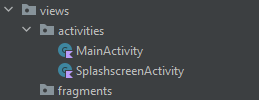
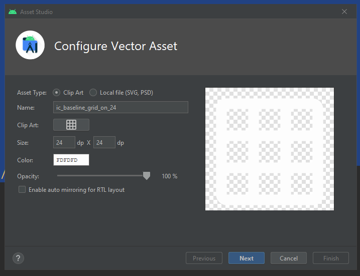

# Fragmentos y Material Design

## Objetivo

En este laboratorio aprenderemos sobre la comunicació de los Activities, el uso de Fragmentos, y un poco sobre reglas de Material Design y de UI en Android.

Para este laboratorio vamos a continuar el desarrollo del Pokedex que hemos venido realizando hasta ahora.

**Nota: Al final de este laboratorio te recomiendo que generes una copia para que en los próximos tengas un punto de comparación sobre lo que se va avanzando.

## Instrucciones

Sigue los pasos descritos en la siguiente práctica, si tienes algún problema no olvides que tus profesores están para apoyarte.

## API
Para este laboratorio estaremos utilizando el API de [PokeAPI](https://pokeapi.co/) los endpoints con los que vamos a comenzar son los siguientes:

```
GET https://pokeapi.co/api/v2/pokemon/?limit=1279
GET https://pokeapi.co/api/v2/pokemon/{number_pokemon}/
```

## Laboratorio
### Paso 1 Preparando los casos de Uso

Hasta ahora nos hemos centrado mucho en el desarrollo de la arquitectura de nuestro pequeño proyecto, la funcionalidad básica nos permite visualizar la lista de todos los Pokemon, pero ya va siendo hora de incrementar el alcance y hacer mejor la experiencia de usuario y de interfaz para quien la vaya a utilizar.

Hasta ahora solo hemos definido el **MainActivity** y como ya debes saber a estas alturas es la **Vista** de nuestra aplicación, pero una aplicación compleja puede no tener solo 1 vista, al contrario se compone de varias vistas.

Como mencionamos en el laboratorio del **RecyclerView** todas las vistas siguen el concepto de **Lista-Detalle** según como interactúan en la aplicación, nuestro **MainActivity** es una **Lista** pues no contiene una interfaz compleja pero se enfoca en todos los cambios del **RecyclerView** que empiezan desde llamar al API hasta dibujarlo en el **ViewHolder**, es más todo lo que hemos hecho ha sido derivado de ello incluyendo el **MVVM** y la **CLEAN Architecture**.

Ahora vamos a empezar creando nuevas vistas, pero antes de hacerlo vamos a definir algunas historias de usuario que nos permitan enfocar lo que queremos hacer puesto que ya tenemos toda la arquitectura necesaria para desarrollar nuestro proyecto.

- Como usuario al entrar a la aplicación quiero ver una vista de inicio antes de usar la aplicación para sentir una experiencia de uso.
- Como usuario quiero poder elegir entre la lista del Pokedex o poder realizar una búsqueda específica por nombre de Pokemon.
- Como usuario quiero ver la lista de Pokemon en 3 columnas para aprovechar mejor el espacio del dispositivo.
- Como usuario quiero ver el detalle de un Pokemon para ver más información del mismo.

Los pasos que realizaremos en este laboratorio son enfocados a estas historias de usuario, pero dentro vienen los conceptos de todo lo que necesitamos del laboratorio que son:

- Comunicación entre Activities
- Menús y fragmentos
- Interfaz con Material Design

### Paso 2 Como usuario al entrar a la aplicación quiero ver una vista de inicio antes de usar la aplicación para sentir una experiencia de uso.

Esta historia de usuario nos hace ver un elemento muy importante en muchas aplicaciones a las que no se les aplica mucho esfuerzo puesto que dura entre 3 y 5 segundos, el **Splashscreen**.

Esta clase va a ser algo muy genérico pero nos va a ayudar a ver un concepto importante, que pasa cuando después de esos 3 a 5 segundos queremos cambiar de vista, ya sea por la interacción del usuario en la interfaz o en para este caso de manera automática.

Dentro de Android hoy en día existen varias formas de hacerlo, si inicias un proyecto con una plantilla pre existente seguramente se crea un folder y archivo **graph** este es una forma, durante algunos años Google lo volvió la forma oficial, y sigue siendo válido.

Otra es mediante el paso de datos mediante clases abstractas con un poco de ligue con Kotlin, un poco más complejo pero totalmente válido.

La vieja escuela usa los llamados **Intent** que son objetos que permiten la llamada a nuevas vistas además de pasar datos nativos como: Strings, Numbers y Booleans. Esta es la forma que ha existido desde siempre, es mi preferencia que conozcas esta forma ya que considero que es la más fácil, el beneficio es que hacerlo cuesta pocas líneas de código, lo malo es que limita el usar las plantillas de Android Studio que son tentadoras y la verdad en ciertos casos son útiles, pero primero aprendamos lo básico antes de que te lances sobre estas plantillas ya trabajadas.

Vamos a comenzar entonces, dentro de nuestro proyecto del Pokedex, vamos a crear un nuevo archivo de interfaz que será una **Activity** como lo haremos usando nuestra ya aplicada arquitectura haremos lo siguiente.

Crearemos un archivo de tipo **class** normal dentro del **package** **framework->views** que se llamará **SplashscreenActivity**


Ahora bien, la teoría nos dice que cada vez que hacemos esto debemos crear todo el protocolo siguiendo nuestra arquitectura, por lo que ahora debemos crear el **ViewModel** correspondiente, por lo tanto en el **package** **framework->viewmodel** vamos a crear el archivo **SplashscreenViewModel**


Ya que tenemos nuestro archivo sigamos aplicando las reglas de teoría que ya vimos previamente.

La primera es que para todo Activity deberíamos tener un archivo **layout** correspondiente. Vamos a crearlo y este se llamará **activity_splashscreen**


Aprovechando que estamos en la interfaz vamos a crear nuestro Splashscreen.

Como siempre vamos a modificar el **ConstraintLayout** que viene por default por un **RelativeLayout**

```
<?xml version="1.0" encoding="utf-8"?>  
<RelativeLayout   
xmlns:android="http://schemas.android.com/apk/res/android"  
    android:layout_width="match_parent"  
    android:layout_height="match_parent">  
  
</RelativeLayout>
```

Dentro de este **RelativeLayout** vamos a declarar un **ImageView** al cual le asignaremos el logo de Pokemon para dar realismo a la app que estamos construyendo.


```
<?xml version="1.0" encoding="utf-8"?>  
<RelativeLayout  
    xmlns:android="http://schemas.android.com/apk/res/android"  
    android:layout_width="match_parent"  
    android:layout_height="match_parent">  
  
    <ImageView        
		android:layout_width="120dp"  
        android:layout_height="120dp"  
        android:src="@mipmap/ic_launcher"  
        android:layout_gravity="center"  
        />  
  
  
</RelativeLayout>
```

Ya que tenemos nuestro **ImageView** vamos a notar en el preview, que la imagen no esta posicionada, para ello vamos a aplicar una de las propiedades del **RelativeLayout** para alinearla **android:layout_centerInParent="true"**.

```
<ImageView  
    android:layout_width="120dp"  
    android:layout_height="120dp"  
    android:src="@mipmap/ic_launcher"  
    android:layout_gravity="center"  
    android:layout_centerInParent="true"  
    />
```

Tan simple como eso se alinea nuestra imagen al centro de la pantalla.


Ahora también notarás que usamos el icono default que viene en Android, no te preocupes usaremos el siguiente logo para estar en igualdad de condiciones.

Para este logo no voy a crear las imágenes para cada resolución por facilidad y para estar en igualdad contigo, pero recuerda que **siempre es recomendable 
generarlas**.


Ya que tengas la imagen vamos a colocarla en la carpeta de drawables del proyecto. Ahora te enseñare como abrirlo desde Android Studio, este paso aplica tanto para Mac, Linux y Windows solo que el nombre puede variar de acuerdo a tu SO.

Desde Android Studio, seleccionando la carpeta **drawable** da clic derecho y busca la opción **Open In** y de acuerdo a tu SO te dirá Finder, File Device, Explorer.


Una vez adentro verás las diferentes carpetas creadas, y date un momento para ver como parte en variedad por ejemplo la **drawable** default y que hay la de **drawable-v24** aquí se agregan las diferentes configuraciones y como te mencioné en clase según cada configuración deberías tener la imagen o el asset correspondiente. Igualmente que si no se encuentra el asset trata de caer en la carpeta default en este caso **drawable** y en caso de no encontrarlo la compilación falla.


Ahora dentro de la carpeta **drawable** colocamos nuestra imagen que debe venir como **7_006.png** por legibilidad vamos a renombrarla a **pokemon_logo.png**


Regresamos a Android Studio y en nuestro **activity_splashscreen** modificamos la propiedad **src** del **ImageView**, como la imagen ya esta agregada se debe detectar automáticamente, pero ojo no vayas a dejar el **@mipmap/** ya que esto hace referencia a la carpeta mipmap que tienes en tus **res** cambialo por **@drawable**, el resultado es algo como lo siguiente.

```
<ImageView  
    android:layout_width="120dp"  
    android:layout_height="120dp"  
    android:src="@drawable/pokemon_logo"  
    android:layout_gravity="center"  
    android:layout_centerInParent="true"  
    />
```


Tenemos nuestro logo, pero se ve un poco desperdiciado el espacio, mucho blanco y muy pequeño, que tal si lo ampliamos un poco.

```
<ImageView  
    android:layout_width="360dp"  
    android:layout_height="120dp"  
    android:src="@drawable/pokemon_logo"  
    android:layout_gravity="center"  
    android:layout_centerInParent="true"  
    />
```


Bastante mejor, pero quizás no lo suficiente. Veamos una imagen de un Pokedex cualquiera.


El Pokedex por default utiliza rojo como su base y puede usar tanto el azul como el amarillo de contrastes, si nos estamos basando en un diseño para generar estos colores entonces sería bueno agregarlos.

De forma resumida te daré los colores:

```
Rojo: #DC0A2D
Azul: #4CA3D9
Amarillo: #FCE44C
```

Ahora es momento de hablar un poco de Material Design y sus colores. Por regla Material nos pide que usemos 2 colores a nuestra aplicación, esto no es limitativo pero por regla de diseño el uso de 2 colores es suficiente para centralizar un diseño de interfaz. Podemos usar algunos otros colores pero de manera muy controlada tratando de no saturar la pantalla.

Otro punto importante de los colores en Material es evitar usarlos para todo, y por esto existe una regla muy simple, en los [generadores de colores de material](https://mui.com/material-ui/customization/color/)

En este generador vamos a introducir el color primario y vamos a seleccionar un color secundario, para mí el primario será el rojo y el secundario el azul. El pre visualizador de la página nos dejara ver como se vería la aplicación.

Ya que vemos que en realidad no se ve tan mal, veamos que Material nos genera 3 colores a partir de nuestros 2 colores seleccionados.

Para el rojo tenemos que los 3 colores nos dan contexto dentro de la aplicación sobre todo para los fondos, en la práctica lo veremos mejor.

Para el color secundario azul, tenemos los 3 colores, pero en este caso es para que nosotros seleccionemos solamente 1, este color se le conoce como**accent color** y es el color para botones que hace contraste dentro de la aplicación, decidir el color ya es elección de cada uno, para mi entonces voy a tener lo siguiente.

```
primaryDark: #9a071f
primary: #DC0A2D
primaryLight: #e33b57

accentColor: #357297
accentColorVariant1: #4CA3D9
accentColorVariant2: #6fb5e0
```

**Nota: para ver con más detalle las reglas de color puedes consultar el siguiente [link](https://m2.material.io/design/color/the-color-system.html#color-usage-and-palettes)**

Algo muy muy importante para los colores y que seguramente te ha pasado es el uso de

```
blanco: #FFFFFF
negro: #000000
```

Una regla básica en diseño de interfaces es **jamás** usar estos hexadecimales. El color blanco ocupa muchos recursos de pantalla y además a los ojos es muy chillante por lo que causa cansancio a la vista, el negro por su parte es muy brillante.

La regla de diseño nos dice que apartir de estos siempre es bueno reducir un poco su contraste, por lo tanto cuando hablemos de estos colores yo usaré lo siguiente:

```
negro: #212121
blanco: Algo cercano o en su defecto el primaryLightColor
```

Regresemos a Android Studio, y vamos a abrir un archivo que hasta el momento no hemos modificado, el **colors** dentro de la carpeta **res->values**.

Por default el archivo trae lo siguiente

```
<?xml version="1.0" encoding="utf-8"?>  
<resources>  
    <color name="purple_200">#FFBB86FC</color>  
    <color name="purple_500">#FF6200EE</color>  
    <color name="purple_700">#FF3700B3</color>  
    <color name="teal_200">#FF03DAC5</color>  
    <color name="teal_700">#FF018786</color>  
    <color name="black">#FF000000</color>  
    <color name="white">#FFFFFFFF</color>  
</resources>
```

Si te preguntabas de donde surge el color morado que trae por default la aplicación al correrla te darás cuenta que es de aquí.

Vamos a definir nuestros colores junto con algunos adicionales que te recomiendo siempre tengas en tus aplicaciones, esto siguen los lineamientos de Material.

```
<?xml version="1.0" encoding="utf-8"?>  
<resources>  
    <color name="primaryDark">#9a071f</color>  
    <color name="primary">#DC0A2D</color>  
    <color name="primaryLight">#e33b57</color>  
    <color name="accent">#357297</color>  
    <color name="accentVariant1">#4CA3D9</color>  
    <color name="accentVariant2">#6fb5e0</color>  
    <color name="textIcons">#212121</color>  
    <color name="secondaryText">#757575</color>  
    <color name="divider">#BDBDBD</color>  
    <color name="semiWhite">#FAFAFA</color>  
  
    <color name="purple_200">#FFBB86FC</color>  
    <color name="purple_500">#FF6200EE</color>  
    <color name="purple_700">#FF3700B3</color>  
    <color name="teal_200">#FF03DAC5</color>  
    <color name="teal_700">#FF018786</color>  
    <color name="black">#FF000000</color>  
    <color name="white">#FFFFFFFF</color>  
</resources>
```

Nota que no modifique ni el black ni el white, y más bien estoy definiendo el **textIcons** y el **semiWhite** como sustitutos.

Ahora vamos a sustituir el color rojo que tenemos por default, pero ¿cómo guiarnos al respecto?, el link anterior que te deje de material te explica de donde vienen los colores y como se aplican en Android, el que nos interesa es este.


Ahora desde Android Studio vamos desde la carpeta de **values** y vamos a abrir el archivo **theme** default.

```
<resources xmlns:tools="http://schemas.android.com/tools">  
    <!-- Base application theme. -->  
    <style name="Theme.PokedexApp" parent="Theme.MaterialComponents.DayNight.DarkActionBar">  
        <!-- Primary brand color. -->  
        <item name="colorPrimary">@color/purple_500</item>  
        <item name="colorPrimaryVariant">@color/purple_700</item>  
        <item name="colorOnPrimary">@color/white</item>  
        <!-- Secondary brand color. -->  
        <item name="colorSecondary">@color/teal_200</item>  
        <item name="colorSecondaryVariant">@color/teal_700</item>  
        <item name="colorOnSecondary">@color/black</item>  
        <!-- Status bar color. -->  
        <item name="android:statusBarColor">?attr/colorPrimaryVariant</item>  
        <!-- Customize your theme here. -->  
    </style>  
  
    <style name="Theme.PokedexApp.NoActionBar">  
        <item name="windowActionBar">false</item>  
        <item name="windowNoTitle">true</item>  
    </style></resources>
```

¿Notas algo en especial? Los valores default de la plantilla son aquí aplicados, si bien puedes definir todas sus clases usando los nombres que vienen, también puedes cambiarlos directamente en interfaz, tal y como harías en css. Los únicos colores recomendados para modificar son los **colorPrimary** y **colorSecondary**, yo voy a realizar la siguiente modificación.

```
<resources xmlns:tools="http://schemas.android.com/tools">  
    <!-- Base application theme. -->  
    <style name="Theme.PokedexApp" parent="Theme.MaterialComponents.DayNight.DarkActionBar">  
        <!-- Primary brand color. -->  
        <item name="colorPrimary">@color/primary</item>  
        <item name="colorPrimaryVariant">@color/primaryDark</item>  
        <item name="colorOnPrimary">@color/semiWhite</item>  
        <!-- Secondary brand color. -->  
        <item name="colorSecondary">@color/accentVariant2</item>  
        <item name="colorSecondaryVariant">@color/accent</item>  
        <item name="colorOnSecondary">@color/textIcons</item>  
        <!-- Status bar color. -->  
        <item name="android:statusBarColor">?attr/colorPrimaryVariant</item>  
        <!-- Customize your theme here. -->  
    </style>  
  
    <style name="Theme.PokedexApp.NoActionBar">  
        <item name="windowActionBar">false</item>  
        <item name="windowNoTitle">true</item>  
    </style></resources>
```

Ahora, como te mencioné en clase, ya no es suficiente con el **theme** default, ya debemos realizar las configuraciones correspondientes para el **night mode** por lo que también vamos a modificar el segundo archivo **theme** a lo siguiente.

```
<resources xmlns:tools="http://schemas.android.com/tools">  
    <!-- Base application theme. -->  
    <style name="Theme.PokedexApp" parent="Theme.MaterialComponents.DayNight.DarkActionBar">  
        <!-- Primary brand color. -->  
        <item name="colorPrimary">@color/primaryLight</item>  
        <item name="colorPrimaryVariant">@color/primaryDark</item>  
        <item name="colorOnPrimary">@color/textIcons</item>  
        <!-- Secondary brand color. -->  
        <item name="colorSecondary">@color/accentVariant1</item>  
        <item name="colorSecondaryVariant">@color/accentVariant1</item>  
        <item name="colorOnSecondary">@color/textIcons</item>  
        <!-- Status bar color. -->  
        <item name="android:statusBarColor">?attr/colorPrimaryVariant</item>  
        <!-- Customize your theme here. -->  
    </style>  
</resources>
```

Con esto ya tenemos configurados los colores base de la aplicación y listos para aplicarlos a las interfaces.

Regresemos entonces a nuestro layout **activity_splashscreen**, vamos a añadir una propiedad que tienen todos los **View** y por tanto todos los componentes llamada background, a la cual se le puede aplicar tanto un color como una imagen, pero ojo si agregas una imagen no puedes modificar sus propiedades, para eso es el ImageView.


```
<?xml version="1.0" encoding="utf-8"?>  
<RelativeLayout  
    xmlns:android="http://schemas.android.com/apk/res/android"  
    android:layout_width="match_parent"  
    android:layout_height="match_parent"  
    android:background="@color/primary"  
    >  
  
    <ImageView        android:layout_width="360dp"  
        android:layout_height="120dp"  
        android:src="@drawable/pokemon_logo"  
        android:layout_gravity="center"  
        android:layout_centerInParent="true"  
        />  
  
  
</RelativeLayout>
```

Ya en esta parte sobra decir, que en gustos se rompen géneros, puede que te guste o no los colores seleccionados, el trabajo del diseñador es elegir el conjunto de colores que más agrade al segmento de usuarios al que va dirigida la aplicación.

Si no tienes un diseñador quizás te toque realizar este rol, pero si sigues las reglas de colores de Material deberías tener tal vez no un diseño ejemplar pero al menos un diseño estándar.

Incluso si no sabes que colores tomar, te dejo esta [página](https://www.materialpalette.com/) con sugerencias básicas y experimenta las posibles combinaciones hasta llegar a algo que sea de tu agrado.

Otra forma de aprender es ver propuestas de interfaz en Internet, para este caso puedo recomendarte Pinterest, que al buscar cosas como UI puedes encontrar cosas bastante interesantes.

Como último consejo sobre diseño es que los mejores diseñadores siguen las reglas de la tendencia que están aplicando, pero un experto es el que rompe las reglas sabiendo aplicarlas, y una leyenda es quien a partir de estas aplicaciones fuera de la caja genera tendencia. No solo aplica para interfaces sino para cualquier diseño como Interiorismo, Moda, Publicidad entre otros.

No vamos a complicarnos más en este aspecto y dejaremos nuestro splashscreen como está para poder pasar al código del **SplashscreenActivity**.

Como parte de nuestro refuerzo de lo que hemos visto necesitamos, hacer la herencia del Activity, pero recuerda es hacia **AppCompatActivity**, también debemos definir el **viewBinding** para conectarlo al **activity_splashscreen** layout y por último conectarlo con nuestro **SplashscreenViewModel**, intenta hacerlo por tu cuenta yo te dejo aquí el resultado.

```
package com.example.kotlin.mypokedexapp.framework.views  
  
import android.content.Intent  
import android.os.Bundle  
import androidx.activity.viewModels  
import androidx.appcompat.app.AppCompatActivity  
import androidx.lifecycle.Observer  
import com.example.kotlin.mypokedexapp.databinding.ActivitySplashscreenBinding  
import com.example.kotlin.mypokedexapp.framework.viewmodel.SplashscreenViewModel  
  
class SplashscreenActivity:AppCompatActivity() {  
  
    private lateinit var binding: ActivitySplashscreenBinding  
    private val viewModel: SplashscreenViewModel by viewModels()  
  
    override fun onCreate(savedInstanceState: Bundle?) {  
        super.onCreate(savedInstanceState)  
  
        initializeBinding()  
  
        viewModel.onCreate()  
  
        initializeObservers()  
    }  
  
    private fun initializeBinding(){  
        binding = ActivitySplashscreenBinding.inflate(layoutInflater)  
        setContentView(binding.root)  
    }  
  
    private fun initializeObservers(){  
    viewModel.finishedLoading.observe(this, Observer {finishedLoading->  
        if(finishedLoading){  
            passViewGoToMain()  
        }  
    })  
} 
}
```

Adicionalmente estoy agregando la llamada a **initViewModel.onCreate()**, este método es del ViewModel, cuando lleguemos a él lo vamos a crear. Igualmente estoy definiendo por adelantado mi Observer que me dirá si estoy esperando al Splashscreen a que termine.

El método que estoy agregando al **Observer** y que está en la línea 33 es el siguiente **passViewGoToMain()**. Esta función nos va a permitir hacer el cambio automático del **SplashscreenActivity** al **MainActivity**.

Este método se define de la siguiente manera.

```
private fun passViewGoToMain() {  
    var intent: Intent = Intent(this, MainActivity::class.java)  
    intent.addFlags(Intent.FLAG_ACTIVITY_SINGLE_TOP)  
    startActivity(intent)  
    finish()  
}
```

Aterricemos este método paso a paso. Primero tenemos la línea

```
var intent: Intent = Intent(this, MainActivity::class.java)  
```

Como te mencionaba al inicio, para realizar el cambio entre vista necesitamos de la clase **Intent** la cual es la que realiza el cambio entre una vista y otra. Al momento de inicializar este objeto observa que recibe 2 parámetros, y aunque se ve un poco raro, la verdad es muy fácil de entender.

Parámetro 1: ¿Dónde estoy?
Parámetro 2: ¿A dónde voy?

Para nuestro ejemplo
Parámetro 1: this (**SplashscreenActivity**)
Parámetro 2: **MainActivity**

La forma rara es la de **MainActivity::class.java**. Esto debemos declararlo así por que no se hace referencia a crear un objeto sino a las clases declaradas dentro del manifest, por eso la llamada contiene el **::class.java**, en ocasiones verás este tipo de llamada, no es muy frecuente pero se suele ver, y pues como es obvio en cada llamada con un Intent se debe usar esta forma.

La siguiente línea es

```
intent.addFlags(Intent.FLAG_ACTIVITY_SINGLE_TOP)  
```

Las banderas son acciones que pasan cuando se hace el cambio de vista, si tienes Android sabrás que al hacer back regresa a la vista anterior, pero este comportamiento tiene todo un flujo desde el stack de vistas y en cierto modo podemos controlarlo con las banderas. Existen un gran número de ellas, revisa la que te sea más acorde de acuerdo a tu situación al declarar el intent, puedes consultar más [aquí](https://developer.android.com/reference/android/content/Intent)

La bandera que estamos definiendo es para borrar el **SplashscreenActivity** del back stack, esto es por que cuando entremos a la aplicación no vamos a querer regresar al splashscreen sino que queremos salir de la aplicación.

La siguiente línea es

```
startActivity(intent)  
```

Bastante lineal en el sentido que es la encargada de iniciar la nueva actividad, recibiendo como parámetro el intent que creamos, pero un punto importante es que en el activity podemos llamarla así, pero que tal que queremos hacer lo mismo desde un **ViewHolder**. ¿Recuerdas el **context**, y ¿recuerdas qué es el **Activity** visto de otro modo?. Pues entonces es válido realizar una llamada como **context.startActivity(intent)**, esto te permitirá inicializar o cambiar vistas en otros lugares fuera del Activity.

```
finish()  
```

Esta última línea es importante ya que aunque la bandera que declaramos debería hacer todo el trabajo, no siempre sucede y esto depende del dispositivo donde esté corriendo la aplicación, el **finish()** termina tajantemente la vista llamando al método **onDestroy0** del Activity de manera segura, y ojo **nunca** llames a **onDestroy()** puesto que esto puede llevar a un crash de tu aplicación.

Un último punto a destacar es este

```
startActivity(intent)  
finish()  
```

El orden de la llamada, si bien **startActivity()**, inicia de inmediato la nueva vista, por atrás esto no se hace hasta que no finaliza el stack del compilador hacia la función que lo corre en este caso hasta que se ejecuta el **finish()**, en ocasiones dependiendo la arquitectura de cada dispositivo el **finish()** es muy rápido y parece que se cierra la aplicación antes de iniciar la vista, esto ya es raro que suceda por la capacidad actual de RAM de los dispositivos, pero antes era algo común y había que hacer alguno que otro ajuste como cambiar el orden de las instrucciones.

Ya entendimos como funciona el paso entre vistas, terminemos de configurar el Splashscreen haciendo las adecuaciones a nuestro **SplashscreenViewModel**

```
package com.example.kotlin.mypokedexapp.framework.viewmodel  
  
import androidx.lifecycle.MutableLiveData  
import androidx.lifecycle.ViewModel  
import androidx.lifecycle.viewModelScope  
import com.example.kotlin.mypokedexapp.utils.Constants  
import kotlinx.coroutines.delay  
import kotlinx.coroutines.launch  
  
class SplashscreenViewModel:ViewModel() {  
    val finishedLoading = MutableLiveData<Boolean>()  
  
	fun onCreate() {  
	    finishedLoading.postValue(false)  
	    viewModelScope.launch {  
	        delay(Constants.SPLASHCREEN_DURATION)  
	        finishedLoading.postValue(true)  
	    }  
	}
}
```

En este solo vamos a definir una variable **LiveData** que es la que usamos como Observer en nuesto Activity, el método **onCreate()** solo para hacer alusión a que es el que se ejecuta sin ninguna interacción, no tiene nada que ver con el **onCreate()** del Activity. 

```
finishedLoading.postValue(true)  
viewModelScope.launch {  
	delay(Constants.SPLASHCREEN_DURATION)  
	finishedLoading.postValue(false)  
} 
```
Dentro del **onCreate()**, pasaremos el observer a true, y de ahí vamos a iniciar una corrutina, esta será sobre el mismo Scope Default, ya que solo es para hacer el tiempo y no importa que se bloquee la interfaz, esto lo necesitamos por la llamada a **delay()** la cual espera unos milisegundos antes de hacer algo, observa que definimos una nueva constante para nuestro archivo de **utils->Constants** y una ves pasado este tiempo de espera avisamos con el **Live data** que dejamos de cargar.

El valor para la constante será el siguiente

```
const val SPLASHCREEN_DURATION = 3000L
```

Ya que hemos entendido como funciona el cambio de vistas, y configurado nuestro ViewModel ahora llego el momento de... ir al **manifest**. 

Antes de ejecutar la aplicación recuerda que el manifest no tiene conocimiento del Splashscreen.

Dentro del **manifest** teníamos definido el **MainActivity** de la siguiente manera.

```
<activity  
    android:name=".framework.views.MainActivity"  
    android:exported="true"  
    android:theme="@style/Theme.PokedexApp.NoActionBar"  
    android:screenOrientation="portrait"  
    >  
    <intent-filter>        <action android:name="android.intent.action.MAIN" />  
        <category android:name="android.intent.category.LAUNCHER" />  
    </intent-filter></activity>
```

Pero si recuerdas el **intent-filter** que se define es especial puesto que solo la primera vista de la aplicación puede tenerlo, entonces aprovechando que esta declarado, vamos a cambiar **android:name=".framework.views.MainActivity"** por **android:name=".framework.views.SplashscreenActivity"**

```
<activity  
    android:name=".framework.views.SplashscreenActivity"  
    android:exported="true"  
    android:theme="@style/Theme.PokedexApp.NoActionBar"  
    android:screenOrientation="portrait"  
    >  
    <intent-filter>        <action android:name="android.intent.action.MAIN" />  
        <category android:name="android.intent.category.LAUNCHER" />  
    </intent-filter></activity>
```

Ahora tenemos como primera vista al Splashcreen, pero ¿qué pasa con Main?, solo necesitamos declararlo nuevamente, pero ahora de la siguiente forma

```
<activity  
    android:name=".framework.views.MainActivity"  
    android:exported="false"  
    android:theme="@style/Theme.PokedexApp.NoActionBar"  
    android:screenOrientation="portrait"  
    />
```

Por último, te dejo el código del **manifest** por si quieres revisar algo.

```
<?xml version="1.0" encoding="utf-8"?>  
<manifest xmlns:android="http://schemas.android.com/apk/res/android"  
    xmlns:tools="http://schemas.android.com/tools">  
  
    <uses-permission android:name="android.permission.INTERNET" />  
  
    <application        android:allowBackup="true"  
        android:dataExtractionRules="@xml/data_extraction_rules"  
        android:fullBackupContent="@xml/backup_rules"  
        android:icon="@mipmap/ic_launcher"  
        android:label="@string/app_name"  
        android:roundIcon="@mipmap/ic_launcher_round"  
        android:supportsRtl="true"  
        android:theme="@style/Theme.PokedexApp"  
        tools:targetApi="31" >  
  
        <activity            android:name=".framework.views.SplashscreenActivity"  
            android:exported="true"  
            android:theme="@style/Theme.PokedexApp.NoActionBar"  
            android:screenOrientation="portrait"  
            >  
            <intent-filter>                <action android:name="android.intent.action.MAIN" />  
                <category android:name="android.intent.category.LAUNCHER" />  
            </intent-filter>        </activity>  
        <activity            android:name=".framework.views.MainActivity"  
            android:exported="false"  
            android:theme="@style/Theme.PokedexApp.NoActionBar"  
            android:screenOrientation="portrait"  
            />  
  
    </application>  
</manifest>
```

Y llegó el momento, ejecuta la aplicación y veremos que sucede.


Y dentro de la vista principal de la lista de Pokemon notaremos un pequeño cambio.


Como modificamos el **theme** ya vemos el rojo definido para la aplicación.

Pues con sto hemos concluido el trabajo de la historia de usuario del **Splashscreen**.

~~- Como usuario al entrar a la aplicación quiero ver una vista de inicio antes de usar la aplicación para sentir una experiencia de uso.~~
- Como usuario quiero poder elegir entre la lista del Pokedex o poder realizar una búsqueda específica por nombre de Pokemon.
- Como usuario quiero ver la lista de Pokemon en 3 columnas para aprovechar mejor el espacio del dispositivo.
- Como usuario quiero ver el detalle de un Pokemon para ver más información del mismo.

## Paso 3 Como usuario quiero poder elegir entre la lista del Pokedex o poder realizar una búsqueda específica por nombre de Pokemon

Para esta historia de usuario, vamos a hacer otro cambio importante dentro de nuestra aplicación, y es que si bien definimos nuestro **MainActivity** y este contiene la lista de datos de los Pokemon, puede ser que a nivel aplicación no sea lo que queremos.

Lo que estoy pensando para esta historia de usuario es hacer una modificación importante pero todo en pro de que uses el formato más conocido de menús y navegación en las aplicaciones, el problema es que esto nos lleva al tema de fragmentos que va a disparar un poco más los archivos que tenemos, pero vamos paso a paso.

Antes de hacer nada vamos a nuestra carpeta de **layouts** y dentro de está vamos a crear un nuevo layout que se llame **main_navbar**, este archivo no es una vista pero si un componente de varias que crearemos más adelante.


Como siempre vamos a sustituir el **ConstraintLayout** por un **LinearLayout**, con orientación **Horizontal** y vamos a modificar su height a **wrap_content**

```
<?xml version="1.0" encoding="utf-8"?>  
<LinearLayout   
xmlns:android="http://schemas.android.com/apk/res/android"  
    android:layout_width="match_parent"  
	android:layout_height="wrap_content"
    android:orientation="horizontal"  
    >  
  
</LinearLayout>
```

Ahora vamos a declarar otros dos **LinearLayout** verticales dentro de este principal, dentro de estos **LinearLayout** vamos a declarar 1 **ImageView** y 1 **TextView** y vamos a hacer que los 2 **LinearLayout** se empujen entre sí. Entre los 2 **LinearLayout** colocar una línea divisora.

El resultado debe verse algo como lo siguiente.


**Antes de ver el código, intenta realizar tu mejor aproximación sin verlo, recuerda que todo, sobre todo las interfaces son más práctica que saberse los parámetros de memoria.**

```
<?xml version="1.0" encoding="utf-8"?>  
<LinearLayout  
    xmlns:android="http://schemas.android.com/apk/res/android"  
    android:layout_width="match_parent"  
    android:layout_height="wrap_content"  
    android:orientation="horizontal"  
    android:background="@color/primary"  
    >  
    <LinearLayout        android:layout_width="match_parent"  
        android:layout_height="56dp"  
        android:layout_weight="0.5"  
        android:orientation="vertical"  
        android:id="@+id/llPokedex"  
        android:layout_gravity="center"  
        android:gravity="center"  
        >  
        <ImageView            android:layout_width="34dp"  
            android:layout_height="34dp"  
            android:src="@drawable/pokemon_logo"  
            android:layout_gravity="center"  
            />  
        <TextView            android:layout_width="match_parent"  
            android:layout_height="wrap_content"  
            android:text="Pokedex"  
            android:textColor="@color/semiWhite"  
            android:textStyle="bold"  
            android:gravity="center"  
            />  
    </LinearLayout>    <View        android:layout_width="2dp"  
        android:background="@color/divider"  
        android:layout_height="56dp"  
        android:layout_marginTop="8dp"  
        android:layout_marginBottom="8dp"  
        />  
    <LinearLayout        android:layout_width="match_parent"  
        android:layout_height="56dp"  
        android:layout_weight="0.5"  
        android:orientation="vertical"  
        android:id="@+id/llSearch"  
        android:layout_gravity="center"  
        android:gravity="center"  
        >  
        <ImageView            android:layout_width="34dp"  
            android:layout_height="34dp"  
            android:src="@drawable/pokemon_logo"  
            android:layout_gravity="center"  
            />  
        <TextView            android:layout_width="match_parent"  
            android:layout_height="wrap_content"  
            android:text="Búsqueda"  
            android:textColor="@color/semiWhite"  
            android:textStyle="bold"  
            android:gravity="center"  
            />  
    </LinearLayout></LinearLayout>
```

Lo siguiente que vamos a hacer es crear 2 nuevos layout el primero se llamará **fragment_pokedex** y el segundo se llamará **fragment_search**.

Para el código del **fragment_pokedex** vamos a copiar lo que tenemos en **activity_main** por que como empezarás a sospechar vamos a migrar del Activity al fragment lo que tenemos del Pokedex.

Por tanto el **fragment_pokedex** debería verse como lo siguiente.

```
<?xml version="1.0" encoding="utf-8"?>  
<RelativeLayout  
    xmlns:android="http://schemas.android.com/apk/res/android"  
    android:layout_width="match_parent"  
    android:layout_height="match_parent"  
    >  
  
    <androidx.recyclerview.widget.RecyclerView        android:layout_width="match_parent"  
        android:layout_height="match_parent"  
        android:id="@+id/RVPokemon"  
        />  
  
</RelativeLayout>
```

El código del **fragment_search** todavía no lo vamos a formatear mucho, de momento con saber que tiene algo es suficiente.

```
<?xml version="1.0" encoding="utf-8"?>  
<RelativeLayout   
xmlns:android="http://schemas.android.com/apk/res/android"  
    android:layout_width="match_parent"  
    android:layout_height="match_parent">  
  
    <TextView        
	    android:layout_width="match_parent"  
        android:layout_height="wrap_content"  
        android:text="Búsqueda"  
        android:layout_centerInParent="true"  
        android:gravity="center"  
        android:textSize="18sp"  
        android:textStyle="bold"  
        />  
</RelativeLayout>
```

Ahora vamos con la parte más importante, actualizar el **activity_main**, este movimiento va a generar errores en el **ActivityMain** así que vamos con cuidado.

Primero que nada vamos a incluir nuestro main navbar, tomando el **RelativeLayout** que ya tenemos, vamos a agregar lo siguiente.

```
<?xml version="1.0" encoding="utf-8"?>  
<RelativeLayout  
    xmlns:android="http://schemas.android.com/apk/res/android"  
    android:layout_width="match_parent"  
    android:layout_height="match_parent"  
    >  
  
    <include        android:id="@+id/app_bar_main"  
        layout="@layout/main_navbar"  
        android:layout_width="match_parent"  
        android:layout_height="wrap_content"   
android:layout_alignParentBottom="true"  
        />  
  
</RelativeLayout>
```

El resultado debería verse como el siguiente.


Aquí vemos que el uso de **include** nos permite agregar pedazos de otros layout, esto nos sirve si necesitamos repetir ciertas funcionalidades, es importante definir el id, ya que de lo contrario no podremos conectarlo con el **viewBinding** más adelante.

Ahora debajo del include vamos a añádir lo siguiente.

```
<fragment  
    android:id="@+id/nav_host_fragment_content_main"  
    android:name="androidx.navigation.fragment.NavHostFragment"  
    android:layout_width="match_parent"  
    android:layout_height="match_parent"  
    android:layout_above="@+id/app_bar_main"  
    />
```

La siguiente línea debería aparecerte en rojo

```
 android:name="androidx.navigation.fragment.NavHostFragment"  
```

Esto es por que necesitamos una librería adicional, puedes intentar agregarla como hacemos con los imports, colocando el cursor sobre la línea dando **alt+enter** y luego en el menú **add dependency**.

Si el preview te manda error lo ignoraremos de momento.

Ya tenemos todo nuestro cambio preparado, es hora de empezar a migrar el **MainActivity** al nuevo archivo que debemos crear y este es **PokedexFragment**, pero antes de hacer nada necesitamos 2 nuevos **packages**, pues aunque el Fragment es por definición una vista, siempre es bueno distinguir entre **activities** y **fragments** por lo que serán los que necesitamos dentro de **framework->views**.

Creando solo estos **packages** y arrastrando nuestros archivos Activities actuales a su correspondiente nos debe quedar algo como lo siguiente.



Ahora vamos a empezar a crear los archivos de los Fragmentos, de tipo **class** normal, que serán **PokedexFragment** y **SearchFragment**.


Para empezar a hablar de los Fragmentos, ya hemos avanzado un poco estableciendo que son como los Activities, en el sentido que tienen un archivo layout xml correspondiente, para el caso del MVVM, también tienen su propio ViewModel.

Dentro del ciclo de vida que tienen vamos a recordar nuevamente el diagrama


Ya que trabajamos con las Activities, de momento solo hemos usado el método **onCreate()** pero de entrada veremos que un Fragmento tiene un ciclo de vida un poco más largo, esto es ya que se inicializa dentro de un Activity, necesita cargar los recursos necesarios.

Ahora, donde se coloca el Fragment, dentro del **activity_main** debajo del include del nav bar, definimos el **fragment** contenedor, aquí es donde se carga tal cual y cuando hay un cambio no se hace cambio de vista sino de fragmento.

Vamos a definir el código del **PokedexFragment** para que quede más claro. Lo primero es declarar la herencia a la clase **Fragment()**

```
class PokedexFragment: Fragment() {
```

Lo siguiente es declarar nuestras variables globales que serán:

```
private var _binding: FragmentPokedexBinding? = null  
  
// This property is only valid between onCreateView and  
// onDestroyView.  
private val binding get() = _binding!!  
  
private lateinit var viewModel: PokedexViewModel  
  
private lateinit var recyclerView: RecyclerView  
private val adapter : PokemonAdapter = PokemonAdapter()  
private lateinit var data:ArrayList<PokemonBase>
```

Vamos explicando por partes

```
private var _binding: FragmentPokedexBinding? = null  
  
// This property is only valid between onCreateView and  
// onDestroyView.  
private val binding get() = _binding!!  
```

Son 2 variables que nos van a servir para el **viewBinding** pero a diferencia del Activity, debemos tener cuidado con el Fragment, ya que en el caso del Activity este es independiente y maneja el estado actual de la aplicación, en cambio el Fragment puede cambiar sin haber lanzado el mismo el cambio ya que es dependiente del Activity, esto puede llevar a crasheos raros por lo mismo, uno muy común por ejemplo es girar el dispositivo de portrait a landscape.

```
private lateinit var viewModel: PokedexViewModel  
```

Después declaramos nuestro **ViewModel** correspondiente, aún no existe pero lo crearemos un poco más adelante.

```
private lateinit var recyclerView: RecyclerView  
private val adapter : PokemonAdapter = PokemonAdapter()  
private lateinit var data:ArrayList<PokemonBase>
```

Por último están las variables de nuestro **MainActivity** el adapter y el ArrayList para los datos, y además estamos agregando una variable **recyclerView**, esto es más o menos similar a lo del **binding** donde vamos a necesitar guardar de manera persistente la referencia al **RecyclerView** para evitar situaciones extrañas.

Ahora vamos a definir el método **onCreateView()** que es exclusivo del Fragment, para poder cargar el estado inicial del fragmento, este sería el equivalente al **onCreate()** del Activity solo por el hecho de que por aquí pasa el archivo xml ya preparado.

```
override fun onCreateView(  
    inflater: LayoutInflater,  
    container: ViewGroup?,  
    savedInstanceState: Bundle?  
): View {  
    viewModel = ViewModelProvider(this)[PokedexViewModel::class.java]  
  
    _binding = FragmentPokedexBinding.inflate(inflater, container, false)  
    val root: View = binding.root  
  
    data = ArrayList()  
  
    initializeComponents(root)  
    initializeObservers() 
    viewModel.getPokemonList() 
  
    return root  
}
```

Vamos a desglosar el método.

```
 viewModel = ViewModelProvider(this)[PokedexViewModel::class.java]  
```

La inicialización del **ViewModel**, pero checa la diferencia con la forma de inicializarlo en el **MainActivity** ya que varía entre uno y otro.

```
_binding = FragmentPokedexBinding.inflate(inflater, container, false)  
    val root: View = binding.root
```

Esta es la inicialización del binding, nuevamente bastante diferente a la forma del **MainActivity**, pero observa que si se hace la llamada a **fragment_pokedex**, también revisa como se hace el **binding** dentro de nuestro **Adapter** y verás que ya tenemos 3 formas diferentes de hacerlo, aunque quizás las que más se parecen son el Fragment y el Adapter.

```
data = ArrayList()  
```

Como recomendación siempre inicializar el arreglo de datos para evitar problemas de **nullPointerException** sobretodo si el API no está validado de errores.

```
initializeComponents(root)  
initializeObservers()  
viewModel.getPokemonList()
```

El método **initializeComponents()** inicializará nuestro **RecyclerView** y el que ya conocemos es el **initializeObservers()** que seguirá siendo el mismo ya que manejará los estados de los Observers del **ViewModel**.

Ahora necesitamos agregar otro método que es el **onDestroyView()** esto es para borrar la referencia a nuestro **binding** y liberar recursos.

Recuerda que lo más importante de usar Fragments es el reducir el manejo de recursos.

```
override fun onDestroyView() {  
    super.onDestroyView()  
    _binding = null  
}
```

Y ahora podemos agregar el método **initializeComponents()** que como dijimos, inicializa nuestro **RecyclerView**, observa el uso del viejo y confiable método **findViewById()**.

```
private fun initializeComponents(root:View){  
    recyclerView = root.findViewById(R.id.RVPokemon)  
}
```

Al hacer uso de **findViewById()** se recibe el id de nuestro **RecyclerView** en el **fragment_pokedex**, pero para accederlo debemos usar la forma:

```
R.id.RVPokemon
```

La variable **R** es un reducido de la carpeta de **res**, por lo que con esta misma podemos acceder a otras propiedades como

```
R.id...
R.layout...
R.string...
R.dimen...
R.drawable...
```

Ahora bien, no todas las llamdas son directas, por ejemplo **R.string** si nos regresa el String directamente, pero **R.drawable** nos regresa la dirección de memoria del asset por lo que hay que transformarlo primero.

```
ContextCompat.getDrawable(context,R.drawable.pokemon_logo)
```

Sería un ejemplo de como aplicarlo.

Por último el método **initializeObservers()** que deberá el copy paste del observer del **MainActivity**, pero incluso aquí verás que la declaración varía un poco.

```
private fun initializeObservers() {  
    viewModel.pokedexObjectLiveData.observe(viewLifecycleOwner) { poxedexObject ->  
        setUpRecyclerView(poxedexObject.results)  
    }  
}
```

Nuevamente haremos un copy paste del método **setUpRecyclerView()** del **MainActivity**, haciendo por supuesto las adecuaciones para usar nuestro ya declarado **RecyclerView**

```
private fun setUpRecyclerView(dataForList:ArrayList<PokemonBase>){  
    recyclerView.setHasFixedSize(true)  
    val linearLayoutManager = LinearLayoutManager(  
        requireContext(),  
        LinearLayoutManager.VERTICAL,  
        false)  
    recyclerView.layoutManager = linearLayoutManager  
    adapter.PokemonAdapter(dataForList,requireContext())  
    recyclerView.adapter = adapter  
}
```

Un adicional a notar es que ya no podemos usar **this** para obtener el **context** ya que aunque la Activity es lo mismo, en caso del Fragment no sucede así, lo bueno es que tenemos el método **requireContext()** que básicamente toma el **context** del padre, en este caso el Activity que almacena el Fragment.

Con esto el código del **PokedexFragment** queda de la siguiente forma

```
package com.example.kotlin.mypokedexapp.framework.views.fragments  
  
import android.os.Bundle  
import android.view.LayoutInflater  
import android.view.View  
import android.view.ViewGroup  
import androidx.fragment.app.Fragment  
import androidx.lifecycle.ViewModelProvider  
import androidx.recyclerview.widget.LinearLayoutManager  
import androidx.recyclerview.widget.RecyclerView  
import com.example.kotlin.mypokedexapp.R  
import com.example.kotlin.mypokedexapp.data.network.model.PokemonBase  
import com.example.kotlin.mypokedexapp.databinding.FragmentPokedexBinding  
import com.example.kotlin.mypokedexapp.framework.adapters.PokemonAdapter  
  
class PokedexFragment: Fragment() {  
    private var _binding: FragmentPokedexBinding? = null  
  
    // This property is only valid between onCreateView and  
    // onDestroyView.    private val binding get() = _binding!!  
  
    private lateinit var viewModel: PokedexViewModel  
  
    private lateinit var recyclerView: RecyclerView  
    private val adapter : PokemonAdapter = PokemonAdapter()  
    private lateinit var data:ArrayList<PokemonBase>  
  
    override fun onCreateView(  
        inflater: LayoutInflater,  
        container: ViewGroup?,  
        savedInstanceState: Bundle?  
    ): View {  
        viewModel = ViewModelProvider(this)[PokedexViewModel::class.java]  
  
        _binding = FragmentPokedexBinding.inflate(inflater, container, false)  
        val root: View = binding.root  
  
        data = ArrayList()  
  
        initializeComponents(root)  
        initializeObservers()  
        viewModel.getPokemonList()
  
        return root  
    }  
  
    override fun onDestroyView() {  
        super.onDestroyView()  
        _binding = null  
    }  
  
    private fun initializeComponents(root:View){  
        recyclerView = root.findViewById(R.id.RVPokemon)  
    }  
  
    private fun initializeObservers() {  
        viewModel.pokedexObjectLiveData.observe(viewLifecycleOwner) { poxedexObject ->  
            setUpRecyclerView(poxedexObject.results)  
        }  
    }  
  
    private fun setUpRecyclerView(dataForList:ArrayList<PokemonBase>){  
        recyclerView.setHasFixedSize(true)  
        val linearLayoutManager = LinearLayoutManager(  
            requireContext(),  
            LinearLayoutManager.VERTICAL,  
            false)  
        recyclerView.layoutManager = linearLayoutManager  
        adapter.PokemonAdapter(dataForList,requireContext())  
        recyclerView.adapter = adapter  
    }  
}
```

Lo único que debe marcarte como error es el **ViewModel**, pero no pasa nada, vamos a crearlo de una vez. Crearemos el archivo **PokedexViewModel** dentro de nuestro **package**de **viewmodels**, aquí no necesitamos distinguir, ya que los **ViewModel** son iguales.

Es más son tan iguales que copiaremos tal cual el contenido del **MainViewModel** dentro de **PokedexViewModel**.

```
package com.example.kotlin.mypokedexapp.framework.viewmodel  
  
import android.util.Log  
import androidx.lifecycle.MutableLiveData  
import androidx.lifecycle.ViewModel  
import androidx.lifecycle.viewModelScope  
import com.example.kotlin.mypokedexapp.data.network.model.PokedexObject  
import com.example.kotlin.mypokedexapp.domain.PokemonListRequirement  
import com.example.kotlin.mypokedexapp.utils.Constants  
import kotlinx.coroutines.CoroutineScope  
import kotlinx.coroutines.Dispatchers  
import kotlinx.coroutines.launch  
  
class PokedexViewModel:ViewModel() {  
      
    val pokedexObjectLiveData = MutableLiveData<PokedexObject>()  
    private val pokemonListRequirement = PokemonListRequirement()  
  
    fun getPokemonList(){  
        viewModelScope.launch(Dispatchers.IO) {  
            val result: PokedexObject? = pokemonListRequirement(Constants.MAX_POKEMON_NUMBER)  
            Log.d("Salida", result?.count.toString())  
            CoroutineScope(Dispatchers.Main).launch {  
                pokedexObjectLiveData.postValue(result!!)  
            }  
        }    }  
}
```

Si regresamos a **PokedexFragment** y agregamos el import faltante ya no debería marcar ningún error.

Felicidades acabas de migrar una actividad a un fragmento, y aunque el proceso es un poco engorroso, sobre todo por que apenas hicimos la configuración de los contenedores, observa que no tuvimos que mover nada de la capa de **domain** ni de **data**, esto es el poder que tenemos en nuestra arquitectura.

Pensando que ya tuviéramos pruebas automatizadas, las pruebas de **domain** y de **data** se seguirían respetando, y solo necesitaríamos adecuar las pruebas de UI del **MainActivity** y agregar las del **PokedexFragment**.

Pero terminemos de trabajar con **MainActivity** para poder ejecutar la aplicación y ver realmente el cambio.

Dentro de **MainActivity** vamos a eliminar todo lo que tiene que ver con el Pokedex ya que no lo necesitamos más, esto es el método **setUpRecyclerView()** así como las variables **data** y **adapter**. También vamos a eliminar lo que contiene el método **initializeObservers()**, el resultado final será el siguiente.

```
package com.example.kotlin.mypokedexapp.framework.views.activities  
  
import android.os.Bundle  
import com.example.kotlin.mypokedexapp.databinding.ActivityMainBinding  
import com.example.kotlin.mypokedexapp.framework.viewmodel.MainViewModel  
import androidx.activity.viewModels  
import androidx.appcompat.app.AppCompatActivity  
  
class MainActivity: AppCompatActivity() {  
  
    private lateinit var binding: ActivityMainBinding  
  
    private val viewModel: MainViewModel by viewModels()  
  
    override fun onCreate(savedInstanceState: Bundle?) {  
        super.onCreate(savedInstanceState)  
  
        initializeBinding()  
        initializeObservers()  
        viewModel.getPokemonList()  
  
    }  
  
    private fun initializeBinding() {  
        binding = ActivityMainBinding.inflate(layoutInflater)  
        setContentView(binding.root)  
    }  
  
    private fun initializeObservers(){  
          
    }  
}
```

Ahora vayamos con el tema más delicado de este laboratorio, que es cargar los fragmentos, sin esto nada de lo que hemos hecho funcionará, así que nuevamente vamos paso a paso.

Primero vamos a definir el siguiente método al final de la clase.

```
private fun exchangeCurrentFragment(newFragment:Fragment){  
    currentFragment = newFragment  
  
    supportFragmentManager.beginTransaction()  
        .replace(R.id.nav_host_fragment_content_main,currentFragment)  
        .commit() 
}
```

Este método nos permite cargar un nuevo fragmento y sustituir el que está activo.

Cuando hablamos de cambiar Vistas entre sí o Activities, lo hacemos a través de un Intent. En el caso de los fragmentos es diferente ya que no existe propiamente un stack o un control de recursos, esto queda más de parte del programador, pero al menos su sintaxis más básica es la que podemos ver en el método.

El algoritmo para llevarlo a cabo es:

1. Inicializar el objeto del nuevo fragmento
2. Usar la clase **supportFragmentManager** que es exclusiva de los Activity y llamar al método **beginTransaction()**, después de eso en cadena se dice donde se reemplazará el nuevo fragmento que es el id de nuestro contenedor de fragmento, esto no lo hacemos con el binding para asegurar que existe, y con cuidado por que **si no lo hacemos bien aquí es donde empiezan los errores**.

Al declarar esté método nos aparece la variable **currentFragment**, esta es una variable global que declaramos de la siguiente forma.

```
private lateinit var currentFragment: Fragment
```

Dentro del **onCreate()** vamos a borrar la línea **viewModel.getPokemonList()**
y vamos a sustituirla por la llamada a **exchangeCurrentFragment()**

```
exchangeCurrentFragment(PokedexFragment())
```

**Nota: Aunque definimos nuestros fragmentos, recuerda que no es necesario declararlos en el manifest a diferencia de los Activities**

Antes de cualquier otra cosa ya podemos borrar el contenido de **MainViewModel** y dejarlo de la siguiente forma.

```
package com.example.kotlin.mypokedexapp.framework.viewmodel  
  
import androidx.lifecycle.ViewModel  
  
class MainViewModel: ViewModel() {  
  
  
}
```

Y vamos a tratar de ejecutar la aplicación.


El resultado es la carga de nuestro Pokedex ahora con una barra de navegación simple, que no usa la plantilla de google.

Ahora que sabemos que funciona vamos a terminar de conectar el otro fragmento, para ello deberemos de hace uso de uno de los métodos más comunes en cuestión de interfaz en Android, el **clickListener()**, este método pensarás que es parte solo de un Botón por el nombre, pero la verdad es que es parte de la clase **View** lo que significa que todos los componentes lo tienen, haciéndonos la vida más simple.

Primero vamos a nuestro **MainActivity** y en el **onCreate()** debajo de la llamada a **initializeObservers()** haz una llamada a **initializeListeners()**, así como los Observers son la salida, los listeners son la entrada de información por parte del usuario.

```
override fun onCreate(savedInstanceState: Bundle?) {  
    super.onCreate(savedInstanceState)  
  
    initializeBinding()  
    initializeObservers()  
    initializeListeners()  
    exchangeCurrentFragment(PokedexFragment())  
  
}
```

Ahora si definimos el **initializeListeners()** vamos a tener lo siguiente

```
private fun initializeListeners(){  
      
}
```

Vamos un listener a la vez, primero el del pokedex, recuerdas, que te dije que en el include del menú, era importante agregarle un id, ahora verás por qué.

```
binding.appBarMain.llPokedex.setOnClickListener {   
      
}
```

Observa el camino desde el binding para alcanzar el linear layout de la opción del Pokedex. **binding.appBarMain.llPokedex**, una vez alcanzado declaramos el **clickListener** y la diferencia con este método es que al ser un listener tiene un callback, por eso usamos las llaves **{ }**, esto significa que hasta que no se le haga clic no pasará nada y quedará esperando.

Ahora vamos a agregar el listener del search.

```
binding.appBarMain.llSearch.setOnClickListener {   
      
}
```

Bastante similar, solo haciendo el cambio en el id correspondiente.

Como ahora necesitamos que se cargue un fragmento según lo que elegimos de opción podemos llamar directamente el **exchangeCurrentFragment()**, pero aquí hay algo que quizás no veas de inicio y es importante, si declaramos el **exchangeCurrentFragment()**. ¿Qué pasa cuando apretamos la opción Pokedex, varias veces seguidas?, ¿ves hacia donde voy?, se crearán múltiples fragmentos de lo mismo, y ¿Qué pasaría si aplicamos una prueba de estrés presionando la opción muchas veces seguidas?. En un teléfono de gama alta quizás no pase nada, pero en uno de gama baja casi te garantizo que la app tendrá un crash. Y esto es por que se quedará sin recursos. Esto parece bobo pero si no bloqueamos esto puede llevarnos a un dolor de cabeza, y recuerda el usuario puede sorprendernos en ocasiones con sus formas de manipular el dispositivo y la aplicación.

Por esto vamos a declarar 2 constantes nuevas en nuestro archivo **Constants**.

```
const val MENU_POKEDEX = "POKEDEX"  
const val MENU_SEARCH = "SEARCH"
```

Después en nuestro **MainActivity** debajo de nuestra variable global **currentFragment** vamos a declarar lo siguiente.

```
private var currentMenuOption:String?= null
```

Los datos nativos no pueden inicializarse como tipo **lateinit**, por lo que asignaremos **null** de inicio.

Dentro de nuestra llamada a

```
exchangeCurrentFragment(PokedexFragment())
```

Vamos a modificarla por lo siguiente

```
exchangeCurrentFragment(PokedexFragment(), Constants.MENU_POKEDEX)
```

Y dentro de la función vamos a hacer la siguiente adecuación.

```
private fun exchangeCurrentFragment(newFragment: Fragment, newMenuOption:String){  
    currentFragment = newFragment  
  
    supportFragmentManager.beginTransaction()  
        .replace(R.id.nav_host_fragment_content_main,currentFragment)  
        .commit()  
      
    currentMenuOption = newMenuOption  
}
```

Ahora ya tenemos el estado actual de la opción seleccionada.

Solo basta verificar en nuestros listeners para evitar duplicar un fragmento. Vamos a crear una función para trabajar ambos listeners y evitar duplicar código.

```
private fun selectMenuOption(menuOption:String){  
    if(menuOption == currentMenuOption){  
        return  
    }  
      
    when(menuOption){  
        Constants.MENU_POKEDEX -> exchangeCurrentFragment(PokedexFragment(),Constants.MENU_POKEDEX)  
        Constants.MENU_SEARCH -> exchangeCurrentFragment(SearchFragment(),Constants.MENU_SEARCH)  
    }  
}
```

Usamos un if para verificar si es la misma opción, en cuyo caso evitamos hacer anidamiento que hace feo el código. En caso de que no sea la misma opción verificamos que opción es para cargar el fragmento correspondiente.

Ahora dentro de nuestros listeners solo hace falta mandar llamar el correspondiente.

```
private fun initializeListeners(){  
    binding.appBarMain.llPokedex.setOnClickListener {  
        selectMenuOption(Constants.MENU_POKEDEX)  
    }  
  
    binding.appBarMain.llSearch.setOnClickListener {  
        selectMenuOption(Constants.MENU_SEARCH) 
    }  
}
```

Con esto terminamos de trabajar con el **MainActivity**, pero ahora seguramente te debe estar marcando un error aquí. 

```
Constants.MENU_SEARCH -> exchangeCurrentFragment(SearchFragment(),Constants.MENU_SEARCH)
```

Esto es normal ya que no hemos configurado el **SearchFragment**, vamos a ello de forma rápida, ya que conoces el proceso.

Hacemos los cambios necesarios en el código de **SearchFragment**

```
package com.example.kotlin.mypokedexapp.framework.views.fragments  
  
import android.os.Bundle  
import android.view.LayoutInflater  
import android.view.View  
import android.view.ViewGroup  
import androidx.fragment.app.Fragment  
import androidx.lifecycle.ViewModelProvider  
import com.example.kotlin.mypokedexapp.databinding.FragmentSearchBinding  
import com.example.kotlin.mypokedexapp.framework.viewmodel.SearchViewModel  
  
class SearchFragment: Fragment() {  
    private var _binding: FragmentSearchBinding? = null  
  
    // This property is only valid between onCreateView and  
    // onDestroyView.    private val binding get() = _binding!!  
  
    private lateinit var viewModel: SearchViewModel  
  
    override fun onCreateView(  
        inflater: LayoutInflater,  
        container: ViewGroup?,  
        savedInstanceState: Bundle?  
    ): View {  
        viewModel = ViewModelProvider(this)[SearchViewModel::class.java]  
  
        _binding = FragmentSearchBinding.inflate(inflater, container, false)  
        val root: View = binding.root  
  
        return root  
    }  
  
    override fun onDestroyView() {  
        super.onDestroyView()  
        _binding = null  
    }  
}
```

Como siempre, nos hace falta crear el **ViewModel** por lo que crearemos el archivo tipo **class** normal **SearchViewModel**.

```
package com.example.kotlin.mypokedexapp.framework.viewmodel  
  
import androidx.lifecycle.ViewModel  
  
class SearchViewModel:ViewModel() {  
  
}
```

Finalmente, hacemos el import faltante en **SearchFragment** y terminamos.

Nuevamente vamos a ejecutar la aplicación, al correrla si hacemos clic en la opción de **Búsqueda** nos debería salir la vista.


Hemos terminado nuestra historia de Usuario, sigamos con la tercera.

~~- Como usuario al entrar a la aplicación quiero ver una vista de inicio antes de usar la aplicación para sentir una experiencia de uso.~~
- ~~Como usuario quiero poder elegir entre la lista del Pokedex o poder realizar una búsqueda específica por nombre de Pokemon.~~
- Como usuario quiero ver la lista de Pokemon en 3 columnas para aprovechar mejor el espacio del dispositivo.
- Como usuario quiero ver el detalle de un Pokemon para ver más información del mismo.

## Paso 4 Como usuario quiero ver la lista de Pokemon en 3 columnas para aprovechar mejor el espacio del dispositivo.

Esta historia de usuario es muy simple, puesto que involucra solo modificar nuestro **RecyclerView** y en todo caso mejorar la interfaz de la celda del Pokemon.

Empecemos hablando en el cambio de lista, ya que como menciona la historia de usuario, tenemos mucho espacio en blanco, el cual podemos aprovechar para tratar de carga en pantalla al menos 9 Pokemon a la vez, 12 si la pantalla es grande.

Pasar de una lista a una especie de tabla conocida como grid, es muy fácil. Vamos a empezar por abrir el archivo **PokedexFragment**. Dentro de este vamos a irnos al método de **setUpRecyclerView()**. El código de ve de la siguiente forma actualmente.

```
private fun setUpRecyclerView(dataForList:ArrayList<PokemonBase>){  
    recyclerView.setHasFixedSize(true)  
    val linearLayoutManager = LinearLayoutManager(  
        requireContext(),  
        LinearLayoutManager.VERTICAL,  
        false)  
    recyclerView.layoutManager = linearLayoutManager  
    adapter.PokemonAdapter(dataForList,requireContext())  
    recyclerView.adapter = adapter  
}
```

Vamos a comentar todo lo referente al **linearLayoutManager** para que si en algún momento quieres volver a la lista lo tengas a la mano y vamos a realizar el siguiente cambio.

```
private fun setUpRecyclerView(dataForList:ArrayList<PokemonBase>){  
    recyclerView.setHasFixedSize(true)  
    /*val linearLayoutManager = LinearLayoutManager(  
        requireContext(),        LinearLayoutManager.VERTICAL,        false)*/    val gridLayoutManager = GridLayoutManager(  
        requireContext(),  
        3,  
        GridLayoutManager.VERTICAL,  
        false    )  
    recyclerView.layoutManager = gridLayoutManager  
    adapter.PokemonAdapter(dataForList,requireContext())  
    recyclerView.adapter = adapter  
}
```

Bastante similar el **gridLayoutManager** al **linearLayoutManager** la única diferencia es que el **grid** recibe cuantas columnas quieres visualizar, de ahí en fuera todo se encarga el **RecyclerView**.

**Nota: cuida muy bien cuantos elementos a mostrar, ya que recuerda que entre más celdas más recursos se consumen, si tus celdas son complejas esto te puede llevar a falta de memoria en dispositivos de gama baja.**

Si ejecutamos la aplicación el resultado es el siguiente.


El resultado es el esperado, pero tanto los nombres como las imágenes ya no se ven muy bien, esto significa que debemos modificar nuestra interfaz y por tanto el **layout** de **item_pokemon**.

El código actual es el siguiente.

```
<?xml version="1.0" encoding="utf-8"?>  
<LinearLayout  
    xmlns:android="http://schemas.android.com/apk/res/android"  
    android:layout_width="match_parent"  
    android:layout_height="wrap_content"  
    android:orientation="vertical"  
    android:padding="16dp"  
    >  
  
    <ImageView        android:layout_width="120dp"  
        android:layout_height="120dp"  
        android:src="@mipmap/ic_launcher"  
        android:layout_gravity="center"  
        android:id="@+id/IVPhoto"  
        />  
    <TextView        android:layout_width="match_parent"  
        android:layout_height="wrap_content"  
        android:textSize="18sp"  
        android:textColor="@color/black"  
        android:gravity="center"  
        android:layout_marginTop="16dp"  
        android:text="Nombre"  
        android:id="@+id/TVName"  
        />  
</LinearLayout>
```

Las modificaciones son mas a ojo de buen cubero, puesto que depende donde estemos probando, pero lo que haremos de inicio es cambiar los tamaños y aprovechando que estamos aquí vamos a poner todas las letras de los nombres en mayúscula.

```
<?xml version="1.0" encoding="utf-8"?>  
<LinearLayout  
    xmlns:android="http://schemas.android.com/apk/res/android"  
    android:layout_width="match_parent"  
    android:layout_height="wrap_content"  
    android:orientation="vertical"  
    android:padding="16dp"  
    >  
  
    <ImageView        android:layout_width="80dp"  
        android:layout_height="80dp"  
        android:src="@mipmap/ic_launcher"  
        android:layout_gravity="center"  
        android:id="@+id/IVPhoto"  
        />  
    <TextView        android:layout_width="match_parent"  
        android:layout_height="wrap_content"  
        android:textSize="14sp"  
        android:textColor="@color/black"  
        android:gravity="center"  
        android:layout_marginTop="16dp"  
        android:text="Nombre"  
        android:id="@+id/TVName"  
        android:textAllCaps="true"  
        />  
</LinearLayout>
```

El resultado es el siguiente.


Bastante mejor, pero el tamaño de la letra todavía no es el adecuado, vamos a reducirlo.

```
android:textSize="8sp"
```


Mucho, mejor, pero ahora tenemos el blanco del fondo, quizás sería bueno mejorar un poco el look and feel.

Vamos a añadir un elemento a nuestra celda, el **CardView**, lanzado como parte de **Material Design** desde su primera versión, el card view da esa vista como de carta añadiendo sombra y efecto a los elementos, en las celdas es muy utilizado para hacer la diferenciación.

Haciendo la modificación, nuestra celda quedará de la siguiente forma.

```
<?xml version="1.0" encoding="utf-8"?>  
<LinearLayout xmlns:android="http://schemas.android.com/apk/res/android"  
    android:layout_width="wrap_content"  
    android:layout_height="wrap_content"  
    xmlns:card_view="http://schemas.android.com/apk/res-auto"  
    android:orientation="vertical"  
    android:layout_gravity="center"  
    android:gravity="center"  
    android:padding="4dp"  
    >  
  
    <androidx.cardview.widget.CardView        android:layout_width="wrap_content"  
        android:layout_height="wrap_content"  
        card_view:cardCornerRadius="8dp"  
        >  
        <LinearLayout            android:layout_width="wrap_content"  
            android:layout_height="wrap_content"  
            android:orientation="vertical"  
            >  
            <ImageView                android:layout_width="88dp"  
                android:layout_height="88dp"  
                android:src="@mipmap/ic_launcher"  
                android:layout_gravity="center"  
                android:id="@+id/IVPhoto"  
                />  
            <TextView                android:layout_width="match_parent"  
                android:layout_height="wrap_content"  
                android:textSize="8sp"  
                android:textColor="@color/black"  
                android:gravity="center"  
                android:layout_marginTop="16dp"  
                android:layout_marginBottom="8dp"  
                android:text="Nombre"  
                android:id="@+id/TVName"  
                android:textAllCaps="true"  
                />  
        </LinearLayout>    </androidx.cardview.widget.CardView></LinearLayout>
```

Revisa las propiedades específicas del dentro de la llamada a **card_view:**, si ejecutamos la aplicación tal vez no se note mucho el cambio debido a que el fondo sigue siendo blanco y el card view también es blanco.

Por lo tanto vamos a abrir el **layout** **fragment_pokedex** y vamos a añadirle un background al **RelativeLayout**

```
<?xml version="1.0" encoding="utf-8"?>  
<RelativeLayout  
    xmlns:android="http://schemas.android.com/apk/res/android"  
    android:layout_width="match_parent"  
    android:layout_height="match_parent"  
    android:background="@color/primary"  
    >  
  
    <androidx.recyclerview.widget.RecyclerView        android:layout_width="match_parent"  
        android:layout_height="match_parent"  
        android:id="@+id/RVPokemon"  
        />  
  
</RelativeLayout>
```


Suficiente por el momento, experimenta un poco con la interfaz y obtén un resultado que a ti te guste.

Esto finalizaría nuestra historia de usuario, pero aprovechando que estamos aquí vamos a cambiar los iconos del menú que ahora solo tienen el logo de Pokemon.

Si recuerdas en clase te mencioné que se pueden usar vectores en la aplicación siempre y cuando no abusemos de ellos por la capacidad de procesamiento.

Pues ahora vamos a usarlos y es más vamos a tomar lo que Android nos ofrece.

Vamos a ubicarnos en la carpeta **res** y luego en la carpeta **drawable**, haciendo clic derecho y en **new** vamos a buscar la opción **Vector Asset**.


La ventana que nos mostrará nos permitirá seleccionar de una librería actualizada el asset que necesitamos, dando clic en **clip art** nos abrirá las opciones.


Esperamos a que nos carguen las opciones y filtraremos usando la palabra **grid** y seleccionaremos el **gridIcon**, cambiamos a un blanco que no sea puro damos clic en **Next** y luego en **Finish**. La configuración final es la siguiente.



Vamos a repetir este mismo paso de la creación del vector, pero esta vez buscando el icono **search**.


Al final deberás tener los 2 vectores en tu carpeta **drawable**


Como son vectores especiales se crean en formato xml.

Ahora dentro de nuestro **layout** **main_navbar** vamos a sustituir por estos nuevos vectores.

Si ejecutamos la aplicación, entonces tendremos algo como lo siguiente.


~~- Como usuario al entrar a la aplicación quiero ver una vista de inicio antes de usar la aplicación para sentir una experiencia de uso.~~
- ~~Como usuario quiero poder elegir entre la lista del Pokedex o poder realizar una búsqueda específica por nombre de Pokemon.~~
- ~~Como usuario quiero ver la lista de Pokemon en 3 columnas para aprovechar mejor el espacio del dispositivo.~~
- Como usuario quiero ver el detalle de un Pokemon para ver más información del mismo.

## Paso 5 Como usuario quiero ver el detalle de un Pokemon para ver más información del mismo.

Esta última historia de usuario dentro del laboratorio la vamos a cubrir parcialmente, lo que vamos a tomar de alcance es el pasar información de una vista a otra. Pero  la configuración completa de la actividad, la interfaz, el viewmodel y todo lo demás ya deberás realizarlo por tu cuenta para practicar todo lo que hemos visto hasta este punto.

Con eso dicho vamos a ello.

Como hablamos del detalle de un Pokemon, retomemos el concepto de lista-detalle, ahora que tenemos la lista implementada, es bastante lineal que sucede. Cuando estamos buscando un Pokemon y encontramos sobre uno que queremos del que queremos saber más entonces damos clic en la celda del Pokemon, y lo que esperamos es que nos lleve a su detalle.

Este detalle debe regresarnos la información completa del Pokemon para darnos más características concretas del mismo, como estadísticas, habilidades, entre otros.

Para este detalle vamos a necesitar crear una nueva vista, entonces recuerda los pasos:

1. Crear archivo Activity
2. Crear layout xml
3. Declararlo en el Manifest

Entonces de manera rápida haremos lo siguiente.

1. Creamos el archivo tipo **class** normal que se llamará PokemonDetailActivity
2. Creamos su layout correspondiente que se llamará activity_pokemon_detail
3. Y lo agregamos en el manifest.

```
package com.example.kotlin.mypokedexapp.framework.views.activities  
  
import android.app.Activity  
import android.os.Bundle  
import com.example.kotlin.mypokedexapp.databinding.ActivityPokemonDetailBinding  
  
class PokemonDetailActivity: Activity() {  
    private lateinit var binding: ActivityPokemonDetailBinding  
  
    override fun onCreate(savedInstanceState: Bundle?) {  
        super.onCreate(savedInstanceState)  
  
        initializeBinding()  
    }  
  
    private fun initializeBinding(){  
        binding = ActivityPokemonDetailBinding.inflate(layoutInflater)  
        setContentView(binding.root)  
    }  
}
```

```
<?xml version="1.0" encoding="utf-8"?>  
<RelativeLayout  
    xmlns:android="http://schemas.android.com/apk/res/android"  
    android:layout_width="match_parent"  
    android:layout_height="match_parent">  
  
    <TextView        android:layout_width="match_parent"  
        android:layout_height="wrap_content"  
        android:text="Detalle Pokemon"  
        android:layout_centerInParent="true"  
        android:gravity="center"  
        android:textSize="18sp"  
        android:textStyle="bold"  
        />  
  
</RelativeLayout>
```

Y para el Manifest

 ```
 <activity  
    android:name=".framework.views.activities.PokemonDetailActivity"  
    android:exported="false"  
    android:theme="@style/Theme.PokedexApp.NoActionBar"  
    android:screenOrientation="portrait"  
    />
```


Ahora  vamos a hacer el paso desde el Pokemon seleccionado hasta el detalle. Recuerda que nuestro **RecyclerView** es controlado por el **PokemonAdapter** y pintado en el **PokemonViewHolder**. Quién contiene todos los detalles de la vista es el **PokemonViewHolder** y así como en los botones del menú solo hace basta con identificar la celda, que puede ser o el **LinearLayout** o el **CardView** de **item_pokemon**. Vamos a agregar este id como **llPokemon**

```
<?xml version="1.0" encoding="utf-8"?>  
<LinearLayout xmlns:android="http://schemas.android.com/apk/res/android"  
    android:layout_width="wrap_content"  
    android:layout_height="wrap_content"  
    xmlns:card_view="http://schemas.android.com/apk/res-auto"  
    android:orientation="vertical"  
    android:layout_gravity="center"  
    android:gravity="center"  
    android:padding="4dp"  
    android:id="@+id/llPokemon"  
    >  
  
    <androidx.cardview.widget.CardView        android:layout_width="wrap_content"  
        android:layout_height="wrap_content"  
        card_view:cardCornerRadius="8dp"  
        >  
        <LinearLayout            android:layout_width="wrap_content"  
            android:layout_height="wrap_content"  
            android:orientation="vertical"  
            >  
            <ImageView                android:layout_width="88dp"  
                android:layout_height="88dp"  
                android:src="@mipmap/ic_launcher"  
                android:layout_gravity="center"  
                android:id="@+id/IVPhoto"  
                />  
            <TextView                android:layout_width="match_parent"  
                android:layout_height="wrap_content"  
                android:textSize="8sp"  
                android:textColor="@color/black"  
                android:gravity="center"  
                android:layout_marginTop="16dp"  
                android:layout_marginBottom="8dp"  
                android:text="Nombre"  
                android:id="@+id/TVName"  
                android:textAllCaps="true"  
                />  
        </LinearLayout>    </androidx.cardview.widget.CardView></LinearLayout>
```

Ahora vamos al **PokemonViewHolder**, en el método **bind()** agregaremos nuestro nuevo click listener.

```
fun bind(item: PokemonBase, context:Context){  
    binding.TVName.text = item.name  
    getPokemonInfo(item.url,binding.IVPhoto,context)  
      
    binding.llPokemon.setOnClickListener {  
        passViewGoToPokemonDetail(item.url,context)  
    }  
}
```

Bastante sencillo con lo que hemos hecho hasta ahora, y la función que vamos a definir es la siguiente.

```
passViewGoToPokemonDetail(item.url,context)  
```

Al hacer el cambio de vista necesitamos pasar información del Pokemon al detalle y la forma más simple es pasar la url que traemos desde el API.

Vamos a declarar la función de la siguiente forma siguiendo la misma raíz de como lo hicimos en el Splashscreen.

```
private fun passViewGoToPokemonDetail(url: String,context:Context){  
    var intent: Intent = Intent(context, PokemonDetailActivity::class.java)  
    intent.addFlags(Intent.FLAG_ACTIVITY_SINGLE_TOP)  
    context.startActivity(intent)  
}
```

A diferencia de el intent que creamos en el Splashscreen tenemos algunas pequeñas diferencias.

En primer lugar eliminamos el **finish()**, esto para evitar que se borre del stack nuestra vista actual del Pokedex, y en caso de que demos back con el dispositivo nos regrese a esta vista.

La otra es el uso del context, para iniciar la actividad y pasarlo como parámetro del Intent, recuerda que te dije que estos 2 pasos son exclusivos del Activity, por lo que usarlos con el context es la forma más normal de hacerlo, y nosotros que no tenemos acceso al activity desde el ViewHolder es la única forma que tenemos de hacerlo.

**Nota: evita pasar el activity como parámetro de ser posible, preferentemente usa el context a menos que no quede otra opción, esto como buena práctica.**

Ahora nos falta agregar el paso del mensaje lo cual lo haremos de la siguiente manera.

```
intent.putExtra(Constants.URL_POKEMON,url)
```

El método **putExtra()** añade como un tipo Hash, donde el primer parámetro es como identificamos el valor y el segundo es el valor que queremos mandar como tal.

Los tipos de datos que podemos enviar son datos nativos: String, Numbers, Booleans.

Lo que no podemos enviar sob objetos completos, y en lo general intenta no mandar mucha información, por eso no se permiten objetos para evitar el retraso por uso excesivo de recursos.

Con esto tuvimos que declarar una nueva constante que tendrá el siguiente valor

```
const val URL_POKEMON = "URL_POKEMON"
```

Nuevamente vamos a ejecutar la aplicación y veamos que sucede.


Si todo quedo como lo acabamos de hacer, y das clic en algún Pokemon deberías ver el detalle del mismo.

Aunque de momento todo funciona, el **PokemonDetailActivity** aún no recibe la url, pese a que el ViewHolder ya la manda. Para recibirla abrimos el **PokemonDetailActivity** y vamos a crear el método **manageIntent()** que se verá de la siguiente manera.

```
private fun manageIntent(){  
    if(intent != null){  
        pokemonUrl = intent.getStringExtra(Constants.URL_POKEMON)  
        Log.d("Salida",pokemonUrl.toString())
    }  
}
```

El intent, está disponible en cualquier momento desde el Activity, por lo que podemos tomarlo sin problema. Es importante validarlo de cualquier **null** esto por que en ocasiones la app puede crashear, pero su primer instinto es regresar a donde estaba, por lo que no viene propiamente del **ViewHolder**, para evitar esto lo checamos. Después vamos a usar una variable global para almacenar el String, y usando el método **getStringExtra()** obtenemos el valor a partir de la constante que declaramos. Cada tipo de dato nativo tiene su equivalente get...Extra, experimenta un poco para ver como funcionan.

Ahora declaramos nuestra variable global

```
private var pokemonUrl:String? = null
```

Por último en el **onCreate()** vamos a llamar a **manageIntent()** antes de incluso llamara a **initializeBinding()**.

Si volvemos a ejecutar el proyecto y revisamos en nuestro logcat al momento de abrir el detalle de Pokemon.


Ya tenemos comunicación entre nuestras vistas, ahora cada vez que seleccionemos un Pokemon diferente la url va a cambiar de manera correspondiente.

~~- Como usuario al entrar a la aplicación quiero ver una vista de inicio antes de usar la aplicación para sentir una experiencia de uso.~~
- ~~Como usuario quiero poder elegir entre la lista del Pokedex o poder realizar una búsqueda específica por nombre de Pokemon.~~
- ~~Como usuario quiero ver la lista de Pokemon en 3 columnas para aprovechar mejor el espacio del dispositivo.~~
- ~~Como usuario quiero ver el detalle de un Pokemon para ver más información del mismo.~~

Hemos finalizado nuestras historias de usuario ahora tienes los siguientes retos para realizar como práctica de todo lo que hemos realizado.

1. Crear la interfaz del detalle del Pokemon, revisa la información que ofrece el API y define cual sería la mejor visualización de información, ya puedes implementar desde componentes básicos hasta listas.
2. Crear el viewmodel del detalle y hacer la conexión para obtener la info del pokemon con el requirement que ya tenemos creado.
3. Implementar la vista completa de búsqueda que queda pendiente en la aplicación.
4. Mejorar los detalles para hacer la aplicación tuya.